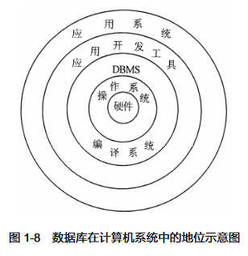
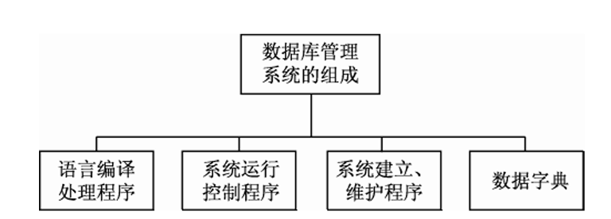
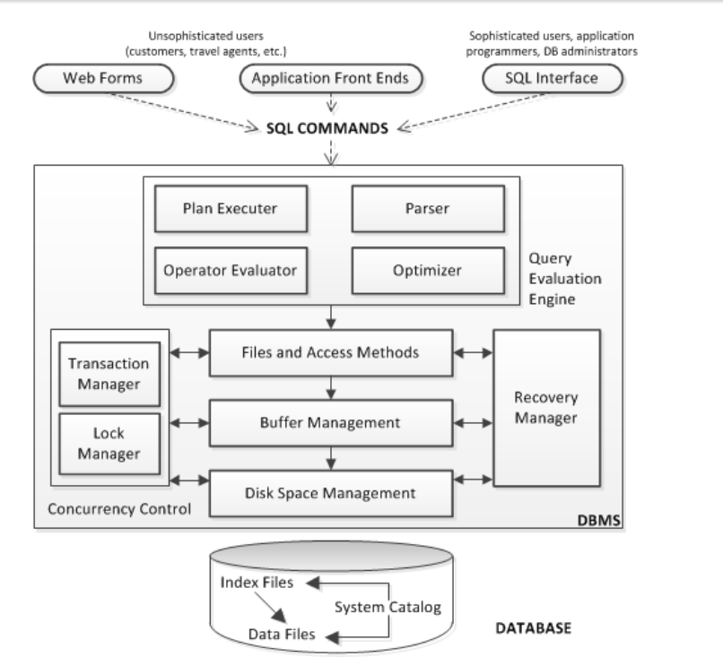

## 数据与信息

信息 = 数据 + 语义。数据表示了信息，而信息只有通过数据形式表示出来才能被人们理解和接受。

数据处理是将数据转换成信息的过程，包括对数据的收集、管理、加工利用乃至信息输出等一系列活动。

### 为什么要学习 DS

为什么要学习 Database？

- Shift from computation to information

  - Always been true for corporate computing
  - The Web made this point for personal computing
  - More so true for scientific computing

- Big Data (Volume 体积, Variety 种类, Velocity 速度, Veracity 真实性)

  - Digital libraries, life science projects
  - Multimedia databases, social web (Facebook, Twitter, You Tube)
  - Semantic annotations(语义注释), sensor data(感知数据), uncertain data

### 四种数据模型

目前，在数据库领域中常用的数据模型主要有层次模型（Hierarchical Model）、网状模型（Network Model）、关系模型（Relational Model）和面向对象模型（Object-oriented Model）四种。

#### 层次模型

1. 每棵树有且仅有一个结点没有双亲，该结点就是根结点。
2. 根结点以外的其他结点有且仅有一个双亲结点。
3. 父子结点之间的联系是一对多（1:n）的联系。父结点中的一个记录值可能对应 n 个子结点中的记录值，而子结点中的一个记录值只能对应父结点中一个记录值。因此，任何一个给定的记录值只有按其路径查看时，才能显出它的全部意义，没有一个子女记录值能够脱离双亲记录值而独立存在。

#### 网状模型

层次模型只能有一个根结点，根结点以外的其他结点有且仅有一个双亲结点。而网状模型中取消了层次模型的这两个限制，它允许多个结点没有双亲结点，允许结点可以有多个双亲结点。因此，网状模型是采用有向图结构表示记录型与记录型之间联系的数据模型，它可以更直接地描述现实世界，层次模型实际上是网状模型的一个特例。

#### 关系模型

关系模型是发展较晚的一种模型。关系模型的数据结构是一张规范化的二维表，它由表名、表头和表体三部分构成。表名即二维表的名称，表头决定了二维表的结构（即表中列数及每列的列名、类型等），表体即二维表中的数据。每个二维表又可称为关系。

## 数据库

### 什么是数据库

A **database** is a very large, intergrated(集成) and commonly used collection of data.

数据库（Database，简称 DB）是长期储存在计算机内、有组织的、可共享的大量数据的集合。

### 数据库的特点

1. 集成性。将某特定应用环境中的各种应用相关的数据及其数据之间的联系全部集中地并按照一定的结构形式进行存储，或者说，把数据库看成为若干个性质不同的数据文件的联合和统一的数据整体。
2. 共享性。数据库中的数据可为多个不同的用户所共享，即多个不同的用户可使用多种不同的语言，为了不同的应用目的，而同时存取数据库，甚至同时存取数据库中的同一数据。

### 数据模型

数据模型：A collection of concepts for describing data

Schema: An abstract description of database using the given data model

schema 是元数据的一个抽象集合。模式（Schema）是数据库中全体数据的逻辑结构和特征的描述。

- Physical schema：物理存储结构
- Logical schema：如 Data Definition Language (DDL) 等数据定义方式
- External schema：如 Data Manipulation Language (DML)

## 数据库系统

### 数据库组成

数据库系统（DataBase System，DBS）是指在计算机系统中引入数据库后的系统。它主要由数据库（DB）、数据库用户、计算机硬件系统和计算机软件系统等几部分组成。

#### 数据库

A **database** is a very large, intergrated(集成) and commonly used collection of data.

数据库（Database，简称 DB）是长期储存在计算机内、有组织的、可共享的大量数据的集合。

#### 用户

用户是指使用数据库的人，他们可对数据库进行存储、维护和检索等操作。用户分为以下三类：

1. 第一类用户：即最终用户（End User）。最终用户主要是使用数据库的各级管理人员、工程技术人员和科研人员，一般为非计算机专业人员。他们主要利用已编写好的应用程序接口使用数据库。
2. 第二类用户：即应用程序员（Application Programmer）。应用程序员负责为最终用户设计和编写应用程序，并进行调试和安装，以便最终用户利用应用程序对数据库进行存取操作。
3. 第三类用户：即数据库管理员（DataBase Administrator，DBA）。数据库管理员是负责设计、建立、管理和维护数据库以及协调用户对数据库要求的个人或工作团队。DBA 应熟悉计算机的软硬件系统，具有较全面的数据处理知识，熟悉最终用户的业务、数据及其流程。

其中的 DBA 的主要职责：

1. 参与数据库设计的全过程，决定整个数据库的结构和信息内容。
2. 决定数据库的存储结构和存取策略，以获得较高的存取效率和存储空间利用率。
3. 帮助应用程序员使用数据库系统，如培训、解答应用程序员日常使用数据库系统时遇到的问题等。
4. 定义数据的安全性和完整性约束条件，负责分配各个应用程序对数据库的存取权限，确保数据的安全性和完整性。
5. 监控数据库的使用和运行，定义和实施适当的数据库备份和恢复策略；当数据库的结构需要改变时，完成对数据结构的修改。
6. 改进和重构数据库，监视数据库系统运行期间的空间利用率、处理效率等性能指标，不断提高系统的性能；根据用户需求情况的变化，对数据库进行重新构造。

#### 软件系统

软件（Software）系统主要包括操作系统（Operating System，OS）、数据库管理系统（DBMS）及应用开发工具和应用系统等。DBMS 是数据库系统的核心软件。

#### 硬件系统

硬件（Hardware）系统指存储和运行数据库系统的硬件设备，包括 CPU、内存、大容量的存储设备、输入|输出设备和外部设备等。

### 数据管理系统的功能

**数据由数据管理系统统一管理和控制。**

数据库管理系统提供下述 4 个方面的数据控制功能。

1. 数据的安全性（Security）控制：防止不合法使用数据库造成数据的泄露和破坏，使每个用户只能按规定对某些数据进行某种或某些操作和处理，保证数据的安全。
2. 数据的完整性（Integrity）控制：系统通过设置一些完整性规则等约束条件，确保数据的正确性、有效性和相容性。
   1. 正确性是指数据的合法性，如年龄属于数值型数据，只能含有 0，1，…，9，不能含有字母或特殊符号。
   2. 有效性是指数据是否在其定义的有效范围，如月份只能用 1 ～ 12 的正整数表示。
   3. 相容性是指表示同一事实的两个数据应相同，否则就不相容，如一个人不能有两个性别。
3. 并发（Concurrency）控制：多个用户同时存取或修改数据库时，系统可防止由于相互干扰而提供给用户不正确的数据，并防止数据库受到破坏。
4. 数据恢复（Recovery）：由于计算机系统的硬件故障、软件故障、操作员的误操作及其他故意的破坏等原因，造成数据库中的数据不正确或数据丢失时，系统有能力将数据库从错误状态恢复到最近某一时刻的正确状态。

### 数据库系统的特点

- 数据结构化
- 数据的共享性高，冗余度低且易扩充
- 数据独立性高
- 数据由数据库管理系统统一管理和控制
- 易扩展

## 数据库模式结构

> 逻辑数据库与物理数据库一般不一样，操作者负责弄清逻辑数据库的数据存放，操作系统负责衔接逻辑数据库与物理数据库的关系，将数据存储在硬盘上。

### 数据库系统的三级模式结构

1. 模式。模式也称为概念模式，是数据库中全体数据的逻辑结构和特征的描述，处于三级模式结构的中间层，不涉及数据的物理存储细节和硬件环境，与具体的应用程序、所使用的应用开发工具及高级程序设计语言无关。一个数据库只有一个模式，因为它是整个数据库数据在逻辑上的视图，即是数据库的整体逻辑。
2. 外模式。外模式（External Schema）又称为子模式（Subschema）或用户模式（User Schema），外模式是三级结构的最外层，是数据库用户能看到并允许使用的那部分数据的逻辑结构和特征的描述，是与某一应用有关的数据的逻辑表示，也是数据库用户的数据视图，即用户视图。可见，外模式一般是模式的子集，一个数据库可以有多个外模式。由于不同用户的需求可能不同，因此，不同用户对应的外模式的描述也可能不同。外模式是保证数据库安全性的一个有力措施。
3. 内模式。内模式（Internal Schema）又称存储模式（Storage Schema）或物理模式（Physical Schema），是三级结构中的最内层，也是靠近物理存储的一层，即与实际存储数据方式有关的一层。它是对数据库存储结构的描述，是数据在数据库内部的表示方式。例如，记录以什么存储方式存储（顺序存储、B+ 树存储等）、索引按照什么方式组织、数据是否压缩、是否加密等，它不涉及任何存储设备的特定约束，如磁盘磁道容量和物理块大小等。

数据库系统的三级模式是数据的三个抽象级别，它使用户能逻辑地处理数据，而不必关心数据在计算机内部的存储方式，把数据的具体组织交给 DBMS 管理。为了能够在内部实现这三个抽象层次的联系和转换，DBMS 在三级模式之间提供了二级映像功能。正是这两级映像保证了数据库系统中的较高的数据独立性，即 **逻辑独立性** 与 **物理独立性**。

### 数据库的二级映射

1. 外模式|模式映射。模式描述的是数据的全局逻辑结构，外模式描述的是数据的局部逻辑结构。数据库中的同一模式可以有任意多个外模式，对于每一个外模式，都存在一个外模式|模式映射。它确定了数据的局部逻辑结构与全局逻辑结构之间的对应关系。例如，在学生的逻辑结构（学号，姓名，性别）中添加新的属性“出生日期”时，学生的逻辑结构变为（学号，姓名，性别，出生日期），由数据库管理员对各个外模式|模式映射作相应改变，这一映射功能保证了数据的局部逻辑结构不变（即外模式保持不变）。由于应用程序是依据数据的局部逻辑结构编写的，所以应用程序不必修改，从而保证了数据与程序间的逻辑独立性。
2. 模式|内模式映射。数据库中的模式和内模式都只有一个，所以模式|内模式映射是唯一的。它确定了数据的全局逻辑结构与存储结构之间的对应关系。存储结构变化时，如采用了更先进的存储结构，由数据库管理员对模式|内模式映射作相应变化，使其模式仍保持不变，即把存储结构的变化影响限制在模式之下，这使数据的存储结构和存储方法较高地独立于应用程序，通过映射功能保证数据存储结构的变化不影响数据的全局逻辑结构的改变，从而不必修改应用程序，即确保了数据的物理独立性。

这样存放数据的模式的优点：

1. 保证数据的独立性。将模式和内模式分开，保证了数据的物理独立性；将外模式和模式分开，保证了数据的逻辑独立性。
2. 简化了用户接口。按照外模式编写应用程序或输入命令，而不需了解数据库内部的存储结构，方便用户使用系统。
3. 有利于数据共享。在不同的外模式下可由多个用户共享系统中的数据，减少了数据冗余。
4. 有利于数据的安全保密。在外模式下根据要求进行操作，只能对限定的数据操作，保证了其他数据的安全。

## 数据库建立与基本流程

1. 需求分析
   根据不同需求采用合理数据架构，建立合适且足够多的数据表空间
2. 概念设计
   设计主键等各个表之间的联系，创建各数据表之间的关系及关系表，各表对应关系也需要存储
3. 逻辑设计
   将数据按照日常逻辑合理展示为总表，以更符合人性的方式整理展示数据表（映射）
4. 转换成逻辑模型
   按照上一步的实际需求转换模型
5. 物理模型
   考虑索引、聚簇等细节

## DBMS

### 什么是 DBMS

> DBMS 是位于用户和操作系统之间的一个系统软件。

DBMS 是由许多程序所组成的一个大型软件系统，每个程序都有自己的功能，共同完成 DBMS 的一个或几个工作。

一个完整的 DBMS 通常应由语言编译处理程序、系统运行控制程序及系统建立、维护程序和数据字典等部分组成。

### DBMS 的功能

1. **数据定义功能**：DBMS 提供数据定义语言（Data Define Language，DDL），定义数据的模式、外模式和内模式三级模式结构，定义模式|内模式和外模式|模式二级映像，定义有关的约束条件。
2. **数据操纵功能**：DBMS 提供数据操纵语言（Data Manipulation Language，DML）实现对数据库的基本操作，包括检索、更新（包括插入、修改和删除）等。因此，DBMS 也应包括 DML 的编译程序或解释程序。
3. **数据库运行管理功能**：对数据库的运行进行管理是 DBMS 运行的核心部分。DBMS 通过对数据库的控制以确保数据正确有效和数据库系统的正常运行。
4. **数据库的建立和维护功能**：数据库的建立包括数据库的初始数据的装入与数据转换等，数据库的维护包括数据库的转储、恢复、重组织与重构造、系统性能监视与分析等。
5. **数据通信接口**：DBMS 提供与其他软件系统进行通信的功能，实现用户程序与 DBMS、DBMS 与 DBMS、DBMS 与文件系统之间的通信。
6. **数据组织、存储和管理**：DBMS 负责对数据库中需要存放的各种数据（如数据字典、用户数据、存取路径等）的组织、存储和管理工作，确定以何种文件结构和存取方式物理地组织这些数据，以提高存储空间利用率和对数据库进行增、删、查、改的效率。

