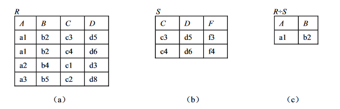

Relational schema: The simplest yet most important data model.

- Information systems deal with storage and retrieval of data 信息系统处理数据的存储和检索
- Databases represent a whole collection of elements 数据库是所有元素的集合
- Relations are sets of tuples 关系的元组集
  - suitable to represent collections of data of any size
  - can be illustrated(说明) by tables

## 关系的形式化定义

> A relation schema provides an abstract description of the tuples(元组) in a relation 关系架构提供关系中的元组的抽象描述

### 域（Domain）

域是一组具有相同数据类型的值的集合，又称为值域（用 D 表示）。例如，整数、实数和字符串的集合都是域。

域中所包含的值的个数称为域的基数（用 m 表示）。在关系中就是用域来表示属性的取值范围的。

### 笛卡儿积（Cartesian Product）

给定一组域 $D_1, D_2, …, D_n$（它们可以包含相同的元素，既可以完全不同，也可以部分或全部相同），则 $D_1, D_2, …, D_n$ 的笛卡儿积为：

$$
D_1 × D_2 × … × D_n = \{(d_1, d_2, …, d_n) | d_i ∈ D_i, i=1, 2, …, n\}
$$

由定义可以看出，笛卡儿积也是一个集合，**一个二维表**。其中：

1. 每一个元素 $(d1, d2, … , dn)$ 中的每一个值 $d_i$ 叫做一个分量（Component），分量来自相应的域（$d_i ∈ D_i$）。
2. 每一个元素 $(d1, d2, … , dn)$ 叫做一个 n 元组（n-Tuple），简称元组（Tuple）。但元组是有序的，相同分量 $d_i$ 的不同排序所构成的元组不同。如，以下三个元组是不同的，$(1, 2, 3) ≠ (2, 3, 1) ≠ (1, 3, 2)$。
3. 若 $D_i (i=1, 2, … , n)$ 为有限集，$D_i$ 中的集合元素个数称为 $D_i$ 的基数，用 $m_i (i=1, 2, … , n)$ 表示，则笛卡儿积 $D_1×D_2×…×D_n$ 的基数 M［即元组 $(d1, d2, …, dn)$ 的个数］为所有域的基数的累乘之积，即 $M = ∏^n_{i=1} m_i$ 。

> 换句话说就是 A 表每一项与 B 表相接。

### 关系（Relation）

笛卡儿积 $D_1 × D_2 × … × D_n$ 的任一子集称为定义在域 $D_1, D_2, …, D_n$ 上的 n 元关系（Relation），可用 $R(D_1, D_2, …, D_n)$ 表示。其中，R 表示关系的名字，n 是关系的目或度（Degree）。

1. 在关系 R 中，当 $n=1$ 时，称为单元关系。当 $n=2$ 时，称为二元关系，以此类推。

2. 关系中的每个元素是关系中的元组，通常用 t 表示，关系中元组个数是关系的基数。

   > 如果一个关系的元组个数是无限的，则称为无限关系；如果一个关系的元组个数是有限的，则称为有限关系。由于计算机存储系统的限制，我们一般不去处理无限关系，而只考虑有限关系。

3. 由于关系是笛卡儿积的子集，因此，也可以把关系看成一个二维表。其中：

   - 表的框架由域 $D_i (i=1, 2, … , n)$ 构成，即表的每一列对应一个域；
   - 表的每一行对应一个元组；
   - 由于不同域（列）的取值可以相同，为了加以区别，必须对每个域（列）起一个名字，称为属性（Attribute），n 元关系必有 n 个属性，属性的名字唯一；属性的取值范围称为值域，等价于对应域 $D_i (i=1, 2, … , n)$ 的取值范围；
   - 具有相同关系框架的关系称为同类关系。

4. 在数学上，关系是笛卡儿积的任意子集，但在实际应用中，关系是笛卡儿积中所取的有意义的子集。

   > 定义在域 $D_1, D_2, …, D_n$ （不要求完全相异）上的关系由关系头（Heading）和关系体（Body）组成。
   >
   > - 关系头由属性名 $A_1, A_2, …, A_n$ 的集合组成，每个属性 $A_i$ 对应一个域 $D_i (i=1, 2, … , n)$。关系头（关系框架）是关系的数据结构的描述，它是固定不变的。
   > - 关系体是指关系结构中的内容或者数据，它随元组的插入、删除或修改而变化。

### 关系的性质

1. 列是同质的，即每一列中的分量必须来自同一个域，必须是同一类型的数据。
2. 不同的属性可来自同一个域，但不同的属性必须有不同的名字。
3. 列的顺序可以任意交换。但交换时，应连同属性名一起交换，否则将得到不同的关系。
4. 关系中元组的顺序（即行序）可任意，在一个关系中可以任意交换两行的次序。因为关系是以元组为元素的集合，而集合中的元素是无序的，所以作为集合元素的元组也是无序的。

   > 根据关系的这个性质，可以改变元组的顺序使其具有某种排序，然后按照顺序查询数据，这样可以提高查询速度，如按照学号对元组进行排序等。

5. 关系中不允许出现相同的元组。因为数学上集合中没有相同的元素，而关系是元组的集合，所以作为集合元素的元组应该是唯一的。
6. 关系中每一分量必须是不可分的数据项，或者说所有属性值都是原子的，即是一个确定的值，而不是值的集合。属性值可以为空值，表示“未知”或“不可使用”，但不可“表中有表”。满足此条件的关系称为规范化关系，否则称为非规范化关系。

### 关系模式

关系的描述称为关系模式（Relation Schema）。它可以形式化地表示为：

$$
R (U, D, DOM, F)
$$

其中，$R$ 为关系名；$U$ 为组成该关系的属性名集合；$D$ 为属性组 $U$ 中属性所来自的域；$DOM$ 为属性向域的映像集合；$F$ 为属性间数据的依赖关系集合。在书写过程中，一般用下划线表示出关系中的主码。

由于属性间的数据依赖 $F$ 将在后面中进行讨论，而域名 $D$ 及属性向域的映像 $DOM$ 常常直接说明为属性的类型、长度。因此，关系模式通常还可简记为：

$$
R(U)\ or\ R(A_1, A_2, ..., A_n)
$$

其中，R 为关系名；U 为属性名的集合；$A_1, A_2, ..., A_n$ 为各属性名。

### 关系数据库与关系数据库模式

在关系模型中，实体以及实体间的联系都是用关系来表示的。在一个给定的应用领域中，所有**实体以及实体之间联系所对应的关系的集合**构成一个关系数据库。

关系数据库的型称为关系数据库模式，**是对关系数据库的描述**，它包括若干域的定义以及在这些域上定义的若干关系模式。因此，关系数据库模式是对关系数据库结构的描述，或者说是对关系数据库框架的描述。

## 关系的码与关系的完整性

### 候选码（Candidate Key）与超码（Superkey）

候选码：能唯一标识关系中元组的一个属性或属性集，称为候选码，也称候选关键字或候选键。如“学生关系”中的学号能唯一标识每一个学生，则属性“学号”是学生关系的候选码。在“选课关系”中，**只有属性的组合“学号+课程号”才能唯一地区分每一条选课记录，则属性集“学号+课程号”是选课关系的候选码。**

设关系 $R$ 有属性 $A1, A2, ..., An$，其属性集 $K=(A_i, A_j, ..., A_k)$，当且仅当满足下列条件时，$K$ 被称为候选码。

1. 唯一性（Uniqueness），关系 R 的任意两个不同元组，其属性集 K 的值是不同的。

2. 最小性（Minimum），组成关系键的属性集 $(Ai, Aj, ..., Ak)$ 中，任一属性都不能从属性 集 $K$ 中删掉，否则将破坏唯一性的性质。

例如“学生关系”中的每个学生的学号是唯一的，“选课关系”中“学号+课程号”的组合也是唯一的。在属性集“学号+课程号”满足最小性，从中去掉任一属性，都无法唯一标识选课记录。

超码：A superkey over a relation schema(关系模式) R is a finite subset $K ⊆ R$ of R. An R-relation r is said to satisfy the superkey K over R if every pair of distinct tuples $t_1, t_2 ∈ r$ deviates on at least one attribute of K, that is, $t_1(A) \ne t_2 (A)$ for some $A ∈ K$.

> 在关系型数据库中，超码（Superkey）是指能够唯一标识一个元组的属性集合，而**候选码（Candidate Key）是最小的超码**，即不存在真子集是超码。主码（Primary Key）则是在所有候选键中选择的一个**用于唯一标识关系中的元组的特定超码**。
>
> 因此，候选键和超码都是可以唯一标识关系中的元组的属性集合，但是候选键是最小的超码，而超码可以包含不必要的冗余属性。主键是从候选键中选择出来的一个作为主要标识符使用的特定超码。

### 主码（Primary Key）

如果一个关系中有多个候选码，可以从中选择一个作为查询、插入或删除元组的操作变量，被选用的候选码称为主码，或称为主关系键、主键、关系键、关键字等。

例如，假设在学生关系中没有重名的学生，则“学号”和“姓名”都可作为学生关系的候选码。如果选定“学号”作为数据操作的依据，则“学号”为主码。如果选定“姓名”作为数据操作的依据，则“姓名”为主码。

主码是关系模型中的一个重要概念。每个关系必须选择一个主码，选定以后，不能随意改变。因为关系的元组无重复，因此关系的所有属性的组合可以唯一标识每个元组，但通常用属性数量少的属性组合作为主码。

### 主属性（Prime Attribute）与非主属性（Non-Prime Attribute）

主属性（Prime Attribute）：**包含在主码中**的各个属性称为主属性。

非主属性（Non-Prime Attribute）：不包含在任何候选码中的属性称为非主属性（或非码属性）。

### 外码（外部关系键）

如果关系 $R_2$ 的一个或一组属性 $X$ 不是 $R_2$ 的主码，而是另一关系 $R_1$ 的主码，则该属性或属性组 $X$ 称为关系 $R_2$ 的外码（Foreign key）或外部关系键（在后续章节中统一称为外码），并称关系 R2 为参照关系（Referencing Relation），关系 R1 为被参照关系（Referenced Relation）。

如之前提到的选课关系中，“学号”属性与学生关系的主码“学号”相对应，“课程外号”属性与课程关系的主码“课程号”相对应。因此，“学号”和“课程号”属性是选课关系的码。学生关系和课程关系为被参照关系，选课关系为参照关系。

由外码的定义可知，被参照关系的主码和参照关系的外码必须定义在同一个域上。

Example:

Foreign keys on Director(id, title, year) are:

- $[id] ⊆ Person[id]$:
  the id of a director identifies a unique person
- $[title,year] ⊆ Movie[title,year]$:
  the title and year of a director identify a unique movie

Movie(title, year, country) with key {title, year};
Actor(id, title, year, role) with:

- key {id, title, year, role} and
- foreign key $[title, year] ⊆ Movie[title, year]$

（反例）The foreign key **does not permit** the same databases as the two inclusion dependencies:

- $[title] ⊆ Movie[title]$ and
- $[year] ⊆ Movie[year]$

### 关系的完整性

关系模型中，有三类完整性约束，即**实体完整性**、**参照完整性**和**用户自定义的完整性**。其中，实体完整性和参照完整性是关系模型必须满足的完整性约束条件，被称作关系的两个不变性。任何关系数据库系统都应该支持这两类完整性。

**实体完整性（Entity Integrity）**：实体完整性是指**主码的值不能为空或部分为空**。

如学生关系中的主码“学号”不能为空，选课关系中的主码“学号+课程号”不能部分为空，即“学号”和“课程号”两个属性都不能为空。

**参照完整性（Referential Integrity）**：如果关系 $R_2$ 的外码 $X$ 与关系 $R_1$ 的主码相符，则 $X$ 的每个值或者等于 $R_1$ 中主码的某一个值或者取空值。

它指的是**在关系型数据库中，一个表中的外键必须引用另一个表的主键，而且这种引用必须是有效的。**具体地说，这意味着如果两个表之间有外键约束，那么在插入、更新和删除数据时必须遵守一些规则：

1. 插入：插入数据时，必须确保外键引用的主键数据已经存在。
2. 更新：更新包含外键的记录时，必须确保新值是有效的主键值。否则，更新就会失败。
3. 删除：删除包含主键的记录时，必须确保在关联表中没有相应的外键，否则删除操作就会失败。

参照完整性可以帮助确保数据的一致性和完整性，避免了在关联表之间不一致的情况发生。

**用户自定义完整性（User-defined Integrity）**：用户自定义完整性是针对某一具体关系数据库的约束条件，它反映某一具体应用所涉及的数据必须满足的语义要求。

关系模型应该提供定义和检验这类完整性的机制，以便用统一的、系统的方法处理它们，而不要由应用程序承担这一功能。

Integrity constraints greatly determine the design of a database schema

- to process most common queries(查询) efficiently, and
- to process most common updates efficiently, but
- in many cases compromises(妥协) are necessary

## 关系代数

讲这个前，请允许我插入一个概念。

> 关系数据库的三种基本操作和语言：
>
> - 关系代数
> - 关系演算
> - SQL 查询语句
>
> 展开来说：
>
> - 关系代数和关系演算是两种操作关系数据库的数学表示方法。关系代数是通过一组操作来描述数据查询和转换的数学理论，如并、交、差、选择和投影等。
> - 关系演算则是通过描述需要从关系中获取什么样的数据来进行查询。它可以分为元组关系演算和域关系演算两种形式。
> - SQL（Structured Query Language）是一种通用的关系数据库管理系统（RDBMS）的查询语言，被广泛应用于各种类型的关系型数据库。它包括数据查询、数据插入、更新和删除等多种操作。

早期的关系操作能力通常用代数方式或逻辑方式来表示，分别称为关系代数和关系演算。

- 关系代数用对关系的运算来表达查询要求。
- 关系演算用谓词来表达查询要求。关系演算又可按谓词变元的基本对象是元组变量还是域变量分为元组关系演算和域关系演算。

三种运算语言在表达能力上是等价的。

### 关系代数的分类及其运算符

关系代数是一种抽象的查询语言，是关系数据操纵语言的一种传统表达方式，它是由关系的运算来表达查询的。任何一种运算都是将一定的运算符作用于一定的运算对象上，得到预期的运算结果。所以，运算对象、运算符和运算结果是运算的三大要素。

关系代数的运算对象是关系，运算结果也是关系。关系代数用到的运算符主要包括以下四类：

1. 集合运算符：$∪$（并）、$-$（差）、$∩$（交）、$×$（广义笛卡儿积）。
2. 专门的关系运算符：$σ$（选取）、$∏$（投影）、 $\bowtie_{XθY}$（θ 连接）、$\bowtie$（自然连接）、$÷$（除）。
3. 算术比较运算符：$>$（大于）、$≥$（大于等于）、$<$（小于）、$≤$（小于等于）、$=$（等于）、 $≠$（不等于）。
4. 逻辑运算符有：$∧$（与）、$∨$（或）、$┐$（非）。

关系代数的运算按运算符的不同主要分为以下两类：

1. 传统的集合运算：该类运算把关系看成元组的集合，以元组作为集合中的元素来进行运算，其运算是从关系的“水平”方向即行的角度进行的。它包括并、差、交和笛卡儿积等运算。（翻译：高中学过的那些运算）
2. 专门的关系运算：该类运算不仅涉及行运算（水平方向），也涉及列运算（垂直方向），这 种运算是为数据库的应用而引进的特殊运算。它包括选取、投影、连接和除法等运算。（翻译：后面新学的运算）

### 传统的集合运算

设给定两个关系 R，S，若满足：

- 具有相同的列数（或称度数）n；
- R 中第 i 个属性和 S 中第 i 个属性必须来自同一个域（列同质）。

则说关系 R，S 是相容的。除笛卡儿积运算外，**其他的集合运算要求参加运算的关系必须满足上述的相容性定义**。

1. **并（Union）**

   关系 R 和关系 S 的并运算结果由属于 R 或属于 S 的元组组成，即 R 和 S 的所有元组合并，删去重复元组，组成一个新关系，其结果仍为 n 元关系。记作：

   $$
   R∪S = \{t | t∈R∨t∈S \}
   $$

   上式中，“∪”为并运算符；t 为元组变量；“∨”为逻辑或运算符。对于关系数据库，记录的插入和添加可通过并运算实现。

2. **差（Difference）**

   关系 R 与关系 S 的差运算结果由属于 R 而不属于 S 的所有元组组成，即 R 中删去与 S 中相同的元组，组成一个新关系，其结果仍为 n 元关系。记作：

   $$
   R−S = \{ t | t∈R∧┐t∈S \}
   $$

   上式中，“−”为差运算符；t 为元组变量；“∧”为逻辑与运算符；“┐”为逻辑非运算符。通过差运算，可实现关系数据库记录的删除。

3. **交（Intersection）**

   关系 R 与关系 S 的交运算 结果由既属于 R 又属于 S 的元组（即 R 与 S 中相同的元组）组成一个新关系，其结果仍为 n 元关系。记作：

   $$
   R∩S = \{t | t∈R∧t∈S \}
   $$

   上式中，“∩”为交运算符；t 为元组变量；“∧”为逻辑与运算符。 如果两个关系没有相同的元组，那么它们的交为空。 两个关系的并和差运算为基本运算（即不能用其他运算表达的运算），而**交运算为非基本运算**，交运算可以用差运算来表示： R∩S = R − (R −S)

4. **广义笛卡儿积（Extended Cartesian Product）**

   个分别为 n 元和 m 元的关系 R 和 S 的广义笛卡儿积是一个（n+m）列的元组的集合，元组的前 n 列是关系 R 的一个元组，后 m 列是关系 S 的一个元组。若 R 有 k1 个元组，S 有 k2 个元组，则关 系 R 和关系 S 的广义笛卡儿积有 k1×k2 个元组，记作：

   $$
   R×S = \{ tr \frown ts| tr∈R∧ts∈S \}
   $$

   关系的广义笛卡儿积可用于两关系的连接操作（连接操作将在下一节中介绍）。

### 专门的关系运算

由于传统的集合运算，只是从行的角度进行，而要灵活地实现关系数据库多样的查询操作，必须引入专门的关系运算。

1. **选取（Selection）**

   选取运算是单目运算，它根据一定的条件从关系 R 中选择若干个元组，组成一个新关系，记作：

   $$
   σ_F(R) = \{ t | t∈R∧F(t) = \text{'真'} \}
   $$

   其中，σ 为选取运算符；F 为选取的条件，它是由运算对象（属性名、常数、简单函数）、算术比较运算符（＞、≥、＜、≤、=、≠）和逻辑运算符（∨、∧、┐）连接起来的逻辑表达式，结果为逻辑值“真”或“假”。

   选取运算实际上是从关系 R 中选取使逻辑表达式 F 为真的元组，是从行的角度进行的运算。

   如：查询计算机系的全体学生（其中 5 为属性 Dept 的序号）。

   $$
   σ_{Dept=\text{'计算机'}}(S) \\
   \text{或：} σ_{5=\text{'计算机'}}(S)
   $$

   | SNo | SN   | Sex | Age | Dept   |
   | --- | ---- | --- | --- | ------ |
   | S1  | 赵亦 | 女  | 17  | 计算机 |
   | S5  | 周武 | 男  | 19  | 计算机 |

   又如：查询工资高于 1000 元（不包括 1000 元）的男教师。

   $$
   σ_{(Sal>1000)∧ (Sex= \text{'男'})}(T)
   $$

   | TNo | TN   | Sex | Age | Prof | Sal  | Comm | Dept   |
   | --- | ---- | --- | --- | ---- | ---- | ---- | ------ |
   | T1  | 李力 | 男  | 47  | 教授 | 1500 | 3000 | 计算机 |

2. **投影（Projection）**

   投影运算也是单目运算，关系 R 上的投影是从 R 中选择出若干属性列，组成新的关系，即对关系在垂直方向进行的运算，从左到右按照指定的若干属性及顺序取出相应列，删去重复元组。记作：

   $$
   Π_A(R)= \{ t[A] | t∈R \}
   $$

   如：查询讲授 C5 课程的教师号。

   $$
   Π_{TNo}(σ_{CNo='C5'}(TC))
   $$

   本例中采用选取运算和投影运算相结合的方式，先在授课表 TC 中选取满足条件的元组，然后在 TNo 属性上进行投影。

   | No  |
   | --- |
   | T2  |
   | T3  |
   | T5  |

3. **θ 连接（θJoin）**（这个好像不要求掌握）

   θ 连接运算是二目运算，是从两个关系的笛卡儿积中选取满足连接条件的元组，组成新的关系。

   设有两个关系 $R(A1, A2, \cdots, An)$ 及 $S(B1, B2, \cdots, Bm)$，连接属性集 $X$ 包含于 ${A1, A2, \cdots, An}$，$Y$ 包含于 ${B1, B2, \cdots, Bm}$，$X$ 与 $Y$ 中属性列数目相等，且对应属性有共同的域。

   若 $Z={A1, A2, \cdots, An}/X$（/X 表示去掉 X 之外的属性）及 $W={B1, B2, \cdots, Bm}/Y$，则 R 及 S 可表示为 $R(Z, X)$，$S(W, Y)$；关系 R 和 S 在连接属性 X 和 Y 上的 θ 连接，就是在 R×S 笛卡儿积中，选取 X 属性 列上的分量与 Y 属性列上的分量满足 θ 比较条件的那些元组，也就是在 R×S 上选取在连接属性 X， Y 上满足 θ 条件的子集组成新的关系。新关系的列数为 n+m，记作：

   $$
   R \bowtie_{XθY} S = \{ t_r\frown t_s | t_r∈R∧t_s∈S∧t_r [X]θt_s[Y] \text{为真} \}
   $$

   其中， $\bowtie$ 是连接运算符；θ 为算术比较运算符，也称 θ 连接。

   XθY 为连接条件，其中：

   - θ 为“=”时，称为等值连接；
   - θ 为“＜”时，称为小于连接；
   - θ 为“＞”时，称为大于连接。

4. **自然连接**

   在连接运算中，一种最常用的连接是自然连接。所谓自然连接就是在等值连接的情况下，当连接属性 X 与 Y 具有相同属性组时，把在连接结果中重复的属性列去掉。即如果 R 与 S 具有相同的属性组 Y，则自然连接可记作：

   $$
   R \bowtie S = \{ t_r\frown t_s | t_r∈R∧t_s∈S∧t_r[Y] = t_s[Y]\}
   $$

   自然连接是在广义笛卡儿积 R×S 中选出同名属性上符合相等条件的元组，再进行投影，去掉重复的同名属性，组成新的关系。

   等值连接与自然连接的区别：

   1. 等值连接中不要求相等属性值的属性名相同，而自然连接要求相等属性值的属性名必须相同，即两关系只有同名属性才能进行自然连接。
   2. 在连接结果中，等值连接不将重复属性去掉，而**自然连接去掉重复属性**，也可以说，自然连接是去掉重复列的等值连接。

5. **除法（Division）**

   除法运算是二目运算，设有关系 R（X，Y）与关系 S（Y，Z），其中 X，Y，Z 为属性集合，R 中的 Y 与 S 中的 Y 可以有不同的属性名，但对应属性必须出自相同的域。关系 R 除 以关系 S 所得的商是一个新关系 P（X），P 是 R 中满足下列条件的元组在 X 上的投影：元组在 X 上 分量值 x 的像集 $Y_x$ 包含 S 在 Y 上投影的集合。记作：

   $$
   R÷S = \{ t_r[X]\ |\ t_r∈R∧Π_y(S)⊆Y_x \}
   $$

   其中，$Y_x$ 为 x 在 R 中的像集，$x=t_r[X]$。

   如：已知关系 R 和 S，如图 2-11（a）和图 2-11（b）所示，则 R÷S 如图 2-11（c）所示。

   

   与除法的定义相对应，本题中 $X=\{A, B\}=\{(a1,b2), (a2,b4), (a3,b5)\}$，$Y=\{C, D\}=\{(c3,d5), (c4,d6)\}$，$Z=\{F\}=\{f3,f4\}$。其中，元组在 X 上各个分量值的像集分别为：

   - $(a1,b2)$ 的像集为 $\{(c3,d5), (c4,d6)\}$

   - $(a2,b4)$ 的像集为 $\{(c1,d3)\}$
   - $(a3,b5)$ 的像集为 $\{(c2,d8)\}$
   - S 在 Y 上的投影为 ${(c3,d5), (c4,d6)}$

   显然只有 $(a1,b2)$ 的像集包含 S 在 Y 上的投影，所以 $R÷S=\{(a1,b2)\}$。

   除法运算同时从行和列的角度进行运算，适合于包含“全部”之类的短语的查询。

   又如：查询选修了全部课程的学生学号和姓名。

   $$
   Π_{SNo,CNo}(SC) ÷ Π_{CNo}(C) \bowtie Π_{SNo,SN}(S)
   $$

## 关系演算

关系演算是一种非过程查询语言，它告诉系统要检索哪些数据但不告诉如何检索它。关系演算是以数理逻辑中的谓词演算为基础，通过谓词形式来表示查询表达式。根据谓词变元的不同，可将关系演算分为元组关系演算和域关系演算。

> [数据库学习摘记 —— 关系代数和关系演算 - 咕~咕咕 - 博客园 (cnblogs.com)](https://www.cnblogs.com/ruaa/p/12540253.html)
>
> 关系运算的安全限制：
>
> **无限关系**：当元组变元 t 中某一属性的定义域是无限时，如表示所有不在关系 R 中的元组的集合 $\{t | ┐R(t)\}$。
>
> **无穷验证过程**：t 的取值范围为无限，如验证 $(∀t)(ω(t))$ 为真的过程。
>
> **安全表达式**：不产生无限关系和无穷验证过程的表达式。
>
> **安全限制**：为保证所有表达式都是安全表达式所采取的限制措施。
>
> **关系代数运算是安全的**：当给定的所有关系是有限时，其运算的有限次复合不会出现无限关系和无穷验证。
>
> **等价**：关系代数、安全的元组关系演算和安全的域关系演算的表达能力是等价的，可以相互转换。

### 元组关系演算（TRC）

参考自 [Tuple Relational Calculus (TRC) in DBMS - GeeksforGeeks](https://www.geeksforgeeks.org/tuple-relational-calculus-trc-in-dbms/)，有删改。

Tuple Relational Calculus (元组关系演算，也可以简称 TRC) is a non-procedural query language(非过程查询语言) used in relational database management systems (关系数据库管理系统 RDBMS) to retrieve data(检索数据) from tables. TRC is based on the concept of tuples(基于元组的概念), which are ordered sets of attribute values(是一组有序的属性值) that represent a single row or record in a database table.

TRC is a declarative language, meaning that it specifies what data is required from the database, rather than how to retrieve it. TRC queries are expressed as logical formulas that describe the desired tuples. TRC 是一种声明性语言，这意味着它指定需要从数据库中获取哪些数据，而不是如何检索这些数据。TRC 查询表示为描述所需元组的逻辑公式。

The basic syntax(基本语法) of TRC is as follows:

$$
\{ t | P(t) \}
$$

where t is a tuple variable and P(t) is a logical formula that describes the conditions that the tuples in the result must satisfy(描述结果中的元组必须满足的条件的逻辑公式). The curly braces {} are used to indicate(指示) that the expression is a set of tuples. 其中 t 是元组变量，P(t) 是描述结果中的元组必须满足的条件的逻辑公式。花括号 {} 用于指示表达式是一组元组。

It also uses quantifiers(量词):

$$
∃ t ∈ r (Q(t))
$$

It means ”there exists” a tuple in t in relation r such that predicate Q(t) is true. And $∀ t ∈ r (Q(t)) = Q(t)$ is true “for all” tuples in relation r.

For example, let’s say we have a table called “Employees” with the following attributes:

- EmployeeID
- Name
- Salary
- DepartmentID

To retrieve(检索) the names of all employees who earn more than $50,000 per year, we can use the following TRC query:

$$
\{ t | Employees(t) ∧ t.Salary > 50000 \}
$$

In this query, the “Employees(t)” expression specifies(指定) that the tuple variable t represents a row in the “Employees” table. The “∧” symbol is the logical AND operator, which is used to combine the condition “t.Salary > 50000” with the table selection. 在此查询中，“Employees(t)”表达式指定元组变量 t 表示“Employees”表中的一行。 “∧”符号是逻辑与运算符，用于将条件“t.Salary > 50000”与表选择结合起来。

The result of this query will be a set of tuples, where each tuple contains the Name attribute of an employee who earns more than $50,000 per year. 此查询的结果将是一组元组，其中每个元组包含年收入超过 50,000 美元的员工的 Name 属性。

TRC can also be used to perform more complex queries, such as joins and nested queries, by using additional logical operators and expressions. 通过使用额外的逻辑运算符和表达式，TRC 还可用于执行更复杂的查询，例如连接和嵌套查询。

While TRC is a powerful query language, it can be more difficult to write and understand than other SQL-based query languages, such as Structured Query Language (SQL). However, it is useful in certain applications, such as in the formal verification of database schemas and in academic research. 虽然 TRC 是一种功能强大的查询语言，但它比其他基于 SQL 的查询语言（例如结构化查询语言 (SQL)）更难编写和理解。但是，它在某些应用程序中很有用，例如数据库模式的形式验证和学术研究。

Tuple Relational Calculus is a **non-procedural query language** unlike relational algebra. Tuple Calculus provides only the description of the query but it does not provide the methods to solve it. Thus, it explains what to do but not how to do. 与关系代数不同，元组关系演算是一种非过程查询语言。元组微积分仅提供查询的描述，但不提供解决问题的方法。因此，它解释了做什么而不是如何做。

> 如：
>
> | First_Name | Last_Name | Age |
> | ---------- | --------- | --- |
> | Ajeet      | Singh     | 30  |
> | Chaitanya  | Singh     | 31  |
> | Rajeev     | Bhatia    | 27  |
> | Carl       | Pratap    | 28  |
>
> 1. 查询来显示年龄大于 30 岁的学生的姓氏。
>
>    $$
>    \{ \text{t.Last\_Name}\ |\ \text{Student(t)}\ \ AND\ \ \text{t.age} > 30 \}
>    $$
>
>    | Last_Name |
>    | --------- |
>    | Singh     |
>
> 2. 查询来显示姓氏为`"Singh"`的学生的所有详细信息。
>
>    $$
>     \{ \text{t}\ |\ \text{Student(t)}\ \ AND\ \ \text{t.Last\_Name} > 30 \}
>    $$
>
>    | First_Name | Last_Name | Age |
>    | ---------- | --------- | --- |
>    | Ajeet      | Singh     | 30  |
>    | Chaitanya  | Singh     | 31  |

### 域关系演算（DRC）

在域关系演算中，记录基于域进行过滤。

**Domain Relational Calculus** is a non-procedural query language equivalent in power to Tuple Relational Calculus. Domain Relational Calculus provides only the description of the query but it does not provide the methods to solve it. In Domain Relational Calculus, a query is expressed as, 域关系演算是一种非过程查询语言，其功能等同于元组关系演算。域关系演算仅提供查询的描述，但不提供解决问题的方法。在域关系演算中，查询表示为，
$$
\{ < x1, x2, x3, ..., xn > | P (x1, x2, x3, ..., xn ) \}
$$

where, $< x1, x2, x3, …, xn >$ represents resulting domains variables(结果域变量) and $P (x1, x2, x3, …, xn )$ represents the condition or formula equivalent to the Predicate calculus(Predicate 演算的条件或公式).

**Predicate Calculus Formula 谓词演算公式：**

1. Set of all comparison operators 所有比较运算符的集合
2. Set of connectives(连接词) like and, or, not
3. Set of quantifiers 量词集

如：

Loan 表：

| Loan number | Branch name | Amount |
| :---------: | :---------: | :----: |
|     L01     |    Main     |  200   |
|     L03     |    Main     |  150   |
|     L10     |     Sub     |   90   |
|     L08     |    Main     |   60   |

Borrower 表：

| Customer name | Loan number |
| :-----------: | :---------: |
|     Ritu      |     L01     |
|    Debomit    |     L08     |
|    Soumya     |     L03     |

1. Find the loan number, branch, amount of loans of greater than or equal to 100 amount.

   $$
   \{<l> |\ ∃ b, a (<l, b, a> ∈ loan ∧ (a ≥ 150)\}
   $$

   | Loan number | Branch name | Amount |
   | :---------: | :---------: | :----: |
   |     L01     |    Main     |  200   |
   |     L03     |    Main     |  150   |

2. Find the names of all customers having a loan at the “Main” branch and find the loan amount.

   $$
   \{≺c, a≻ |\ ∃ l (≺c, l≻ ∈ borrower ∧ ∃ b (≺l, b, a≻ ∈ loan ∧ (b = \text{“Main”})))\}
   $$

   | Customer Name | Amount |
   | :-----------: | :----: |
   |     Ritu      |  200   |
   |    Debomit    |   60   |
   |    Soumya     |  150   |

The domain variables(域变量) those will be in resulting relation(结果关系) must appear before | within < and > and all the domain variables must appear in which order they are in original relation or table 所有域变量必须按照它们在原始关系或表中的顺序出现.

### Difference between TRC and DRC

参考自 [Difference between Tuple Relational Calculus (TRC) and Domain Relational Calculus (DRC) - GeeksforGeeks](https://www.geeksforgeeks.org/difference-between-tuple-relational-calculus-trc-and-domain-relational-calculus-drc/)，有删改。

1. **[Tuple Relational Calculus (TRC)](https://www.geeksforgeeks.org/tuple-relational-calculus-trc-in-dbms/)**:

   A tuple relational calculus is a non-procedural query language(非过程查询语言) that specifies to select of the tuples in a relation. It can select the tuples with a range of values or tuples for certain attribute values(某些属性值) etc. The resulting relation can have one or more tuples.

   公式：

   $$
   \{T | P (T)\}\ \ \text{or}\ \  \{T | Condition (T)\}
   $$

   where T is the resulting tuples and P(T) is a condition used to fetch T.

2. **[Domain Relational Calculus (DRC)](https://www.geeksforgeeks.org/domain-relational-calculus-in-dbms/)**:

   A domain relational calculus uses the list of attributes(属性列表) to be selected from the relation based on the condition. It is the same as TRC but differs by selecting the attributes rather than selecting whole tuples.

   公式：

   $$
   \{ <a1, a2, a3, ..., an> | P (a1, a2, a3, ..., an) \}
   $$

一图流表格：

|          Basis of Comparison          |                                                                                                       Tuple Relational Calculus (TRC)                                                                                                        |                                                                                                           Domain Relational Calculus (DRC)                                                                                                            |
| :-----------------------------------: | :------------------------------------------------------------------------------------------------------------------------------------------------------------------------------------------------------------------------------------------: | :---------------------------------------------------------------------------------------------------------------------------------------------------------------------------------------------------------------------------------------------------: |
|            **Definition**             | The Tuple Relational Calculus (TRC) is used to select tuples from a relation. The tuples with specific range values, tuples with certain attribute values, and so on can be selected. 可以选择具有特定范围值的元组、具有特定属性值的元组等。 | The Domain Relational Calculus (DRC) employs a list of attributes from which to choose based on the condition. It’s similar to TRC, but instead of selecting entire tuples, it selects attributes. 它类似于 TRC，但它不是选择整个元组，而是选择属性。 |
| **Representation(表示) of variables** |                                                                            In TRC, the variables represent the tuples from specified relations(指定关系中的元组).                                                                            |                                                                             In DRC, the variables represent the value drawn from a specified domain(从指定域中提取的值).                                                                              |
|           **Tuple/ Domain**           |                                                                                   A tuple is a single element of relation. In database terms, it is a row.                                                                                   |                                                             A domain is equivalent to column data type and any constraints on the value of data. 域等同于列数据类型和对数据值的任何约束。                                                             |
|             **Filtering**             |                                                                                 This filtering variable uses a tuple of relations. 此过滤变量使用关系元组。                                                                                  |                                                                                This filtering is done based on the domain of attributes. 这种过滤是基于属性域完成的。                                                                                 |
|           **Return Value**            | The predicate expression condition associated with the TRC is used to test every row using a tuple variable and return those tuples that met the condition. 与 TRC 关联的谓词表达式条件用于使用元组变量测试每一行并返回满足条件的那些元组。  |             DRC takes advantage of domain variables and, based on the condition set, returns the required attribute or column that satisfies the criteria of the condition. DRC 利用域变量，并根据条件集返回满足条件条件的所需属性或列。              |
|       **Membership condition**        |                                                                         The query cannot be expressed using a membership condition. 不能使用成员资格条件来表达查询。                                                                         |                                                                               The query can be expressed using a membership condition. 可以使用成员资格条件来表达查询。                                                                               |
|          **Query Language**           |                                                                                        The QUEL or Query Language is a query language related to it.                                                                                         |                                                                                             The QBE or Query-By-Example is query language related to it.                                                                                              |
|            **Similarity**             |                                                                            It reflects traditional pre-relational file structures. 它反映了传统的前关系文件结构。                                                                            |                                                                                It is more similar to logic as a modeling language. 作为一种建模语言，它更类似于逻辑。                                                                                 |
|              **Syntax**               |                                                                                                     {T \| P (T)} or {T \| Condition (T)}                                                                                                     |                                                                                                     { a1, a2, a3, …, an \| P (a1, a2, a3, …, an)}                                                                                                     |
|              **Example**              |                                                                                                    {T \| EMPLOYEE (T) AND T.DEPT_ID = 10}                                                                                                    |                                                                                                           { \| < EMPLOYEE > DEPT_ID = 10 }                                                                                                            |
|               **Focus**               |                                                                                                 Focuses on selecting tuples from a relation                                                                                                  |                                                                                                      Focuses on selecting values from a relation                                                                                                      |
|             **Variables**             |                                                                                                        Uses tuple variables (e.g., t)                                                                                                        |                                                                                                 Uses scalar variables(标量变量) (e.g., a1, a2, …, an)                                                                                                 |
|          **Expressiveness**           |                                                                                                               Less expressive                                                                                                                |                                                                                                                    More expressive                                                                                                                    |
|            **Ease of use**            |                                                                                                      Easier to use for simple queries.                                                                                                       |                                                                                                       More difficult to use for simple queries.                                                                                                       |
|             **Use case**              |                                          Useful for selecting tuples that satisfy a certain condition or for retrieving a subset of a relation. 对于选择满足特定条件的元组或检索关系的子集很有用。                                           |                                         Useful for selecting specific values or for constructing more complex queries that involve multiple relations. 对于选择特定值或构建涉及多个关系的更复杂的查询很有用。                                         |

## Summary

- Relational DBMSs are based on the relational data model
- The relational data model is formally defined, its properties can be proven, explained and justified, and formal query languages such as relational calculus and algebra have been defined on it.
- The most important concepts in the relational data model are:
  - syntactic level: attributes, relation schemata, database schemata
  - semantic level: domains, tuples, relations, databases
- Integrity constraints play an important part in schema design
  - determine efficiency of updates
  - determine efficiency of queries
  - DBMSs offer support for enforcement of some constraints
    - domain constraints, key constraints, foreign key constraints
