SQL 是 Structured Query Language 的缩写，中文翻译为"结构化查询语言"。它是一种标准的关系型数据库管理系统（RDBMS）的语言，用于存储、管理和检索数据。尽管它被称为查询语言，但其功能包括数据查询、数据定义、数据操纵和数据控制四部分。

## SQL 的基本概念与特点

### SQL 历史发展

1. 历史悠久的前身阶段（1960-1970）：在关系型数据库之前，主要使用网络和层次数据库管理系统。这个时期的数据库查询语言还要针对特定数据库编写相应的语言，没有标准化的统一语言。

2. 标准化阶段（1970-1986）：关系型数据库得到了广泛的应用，IBM 公司推出了一种被称为 SEQUEL 的数据库语言。后来，SEQUEL 被更名为 SQL，并在 1986 年成为 ISO 的国际标准。

3. 发展阶段（1986-至今）：SQL 成为各种关系型数据库的标准语言，并且被广泛地应用于企业级数据管理系统中。SQL 标准持续发展，并且被越来越多的应用到数据分析和数据科学领域中。

除了标准的 SQL，也有许多针对特定数据库或应用的语言或标准，如 MySQL 的 MySQL Query Language（MySQL 的方言）、Microsoft 的 Transact-SQL（T-SQL）等。

### SQL 的基本概念

1．基本表（Base Table）

一个关系对应一个基本表。基本表是独立存在的表，不是由其他表导出的。一个或多个基本表对应一个存储文件。

2．视图（View）

视图是从一个或几个基本表导出的表，是一个虚表。数据库中只存放视图的定义而不存放视图对 应的数据，这些数据仍存放在导出视图的基本表中。当基本表中的数据发生变化时，从视图查询出来的数据也随之改变。

> **SQL 语句后面的分号？**
>
> 某些数据库系统要求在每条 SQL 命令的末端使用分号。分号是在数据库系统中分隔每条 SQL 语句的标准方法，这样就可以在对服务器的相同请求中执行一条以上的语句。
>
> 如果您使用的是 MS Access 和 SQL Server 2000，则不必在每条 SQL 语句之后使用分号，不过某些数据库软件要求必须使用分号。
>
> **SQL 中的大小写？**
>
> SQL 不区分关键字的大小写。例如，不管写成 SELECT 还是 select，解释都是一样的。表名和列名也是如此。
>
> 虽然可以根据个人喜好选择大写还是小写（或大小写混杂），但为了理解起来更加容易，可以用以下规则来书写 SQL 语句。
>
> - 关键字大写
> - 表名的首字母大写
> - 其余（列名等）小写

## 数据库/表的创建与使用

### 一些重要的 SQL 命令

DDL（Data Definition Language，数据定义语言）用来创建或者删除存储数据用的数据库以及数据库中的表等对象。DDL 包含以下几种指令。

- `CREATE DATABASE`：创建新数据库
- `ALTER DATABASE`：修改数据库
- `CREATE TABLE`：创建新表
- `ALTER TABLE`：变更（改变）数据库表
- `DROP TABLE`：删除表
- `CREATE INDEX`：创建索引（搜索键）
- `DROP INDEX`：删除索引

DML（Data Manipulation Language，数据操纵语言）用来查询或者变更表中的记录。DML 包含以下几种指令。

- `INSERT INTO`：向数据库中插入新数据
- `UPDATE`：更新数据库中的数据
- `SELECT`: 从数据库中提取数据
- `DELETE`：从数据库中删除数据

DCL（Data Control Language，数据控制语言） 用来确认或者取消对数据库中的数据进行的变更。除此之外，还可以对 RDBMS 的用户是否有权限操作数据库中的对象（数据库表等）进行设定。DCL 包含以下几种指令。

- `COMMIT`：确认对数据库中的数据进行的变更
- `ROLLBACK`：取消对数据库中的数据进行的变更
- `GRANT`：赋予用户操作权限
- `REVOKE`：取消用户的操作权限

### 数据类型

在 MySQL 中，有三种主要的类型：文本、数字和日期/时间类型。

Text 类型：

| 数据类型               | 描述                                                                                                                                                                                     |
| :--------------------- | :--------------------------------------------------------------------------------------------------------------------------------------------------------------------------------------- |
| CHAR(_size_)           | 保存固定长度的字符串（可包含字母、数字以及特殊字符）。在括号中指定字符串的长度。最多 255 个字符。                                                                                        |
| VARCHAR(_size_)        | 保存可变长度的字符串（可包含字母、数字以及特殊字符）。在括号中指定字符串的最大长度。最多 255 个字符。注释：如果值的长度大于 255，则被转换为 TEXT 类型。                                  |
| TINYTEXT               | 存放最大长度为 255 个字符的字符串。                                                                                                                                                      |
| TEXT                   | 存放最大长度为 65,535 个字符的字符串。                                                                                                                                                   |
| BLOB                   | 用于 BLOBs (Binary Large OBjects)。存放最多 65,535 字节的数据。                                                                                                                          |
| MEDIUMTEXT             | 存放最大长度为 16,777,215 个字符的字符串。                                                                                                                                               |
| MEDIUMBLOB             | 用于 BLOBs (Binary Large OBjects)。存放最多 16,777,215 字节的数据。                                                                                                                      |
| LONGTEXT               | 存放最大长度为 4,294,967,295 个字符的字符串。                                                                                                                                            |
| LONGBLOB               | 用于 BLOBs (Binary Large OBjects)。存放最多 4,294,967,295 字节的数据。                                                                                                                   |
| ENUM(_x_,_y_,_z_,etc.) | 允许你输入可能值的列表。可以在 ENUM 列表中列出最大 65535 个值。如果列表中不存在插入的值，则插入空值。注释：这些值是按照你输入的顺序存储的。可以按照此格式输入可能的值：ENUM('X','Y','Z') |
| SET                    | 与 ENUM 类似，SET 最多只能包含 64 个列表项，不过 SET 可存储一个以上的值。                                                                                                                |

Number 类型：

| 数据类型            | 描述                                                                                                         |
| :------------------ | :----------------------------------------------------------------------------------------------------------- |
| TINYINT(_size_)     | -128 到 127 常规。0 到 255 无符号\*。在括号中规定最大位数。                                                  |
| SMALLINT(_size_)    | -32768 到 32767 常规。0 到 65535 无符号\*。在括号中规定最大位数。                                            |
| MEDIUMINT(_size_)   | -8388608 到 8388607 普通。0 to 16777215 无符号\*。在括号中规定最大位数。                                     |
| INT(_size_)         | -2147483648 到 2147483647 常规。0 到 4294967295 无符号\*。在括号中规定最大位数。                             |
| BIGINT(_size_)      | -9223372036854775808 到 9223372036854775807 常规。0 到 18446744073709551615 无符号\*。在括号中规定最大位数。 |
| FLOAT(_size_,_d_)   | 带有浮动小数点的小数字。在括号中规定最大位数。在 d 参数中规定小数点右侧的最大位数。                          |
| DOUBLE(_size_,_d_)  | 带有浮动小数点的大数字。在括号中规定最大位数。在 d 参数中规定小数点右侧的最大位数。                          |
| DECIMAL(_size_,_d_) | 作为字符串存储的 DOUBLE 类型，允许固定的小数点。                                                             |

> 这些整数类型拥有额外的选项 UNSIGNED。通常，整数可以是负数或正数。如果添加 UNSIGNED 属性，那么范围将从 0 开始，而不是某个负数。

Date 类型：

| 数据类型    | 描述                                                                                                                                                                                    |
| :---------- | :-------------------------------------------------------------------------------------------------------------------------------------------------------------------------------------- |
| DATE()      | 日期。格式：YYYY-MM-DD 注释：支持的范围是从 '1000-01-01' 到 '9999-12-31'                                                                                                                |
| DATETIME()  | \*日期和时间的组合。格式：YYYY-MM-DD HH:MM:SS 注释：支持的范围是从 '1000-01-01 00:00:00' 到 '9999-12-31 23:59:59'                                                                       |
| TIMESTAMP() | \*时间戳。TIMESTAMP 值使用 Unix 纪元('1970-01-01 00:00:00' UTC) 至今的描述来存储。格式：YYYY-MM-DD HH:MM:SS 注释：支持的范围是从 '1970-01-01 00:00:01' UTC 到 '2038-01-09 03:14:07' UTC |
| TIME()      | 时间。格式：HH:MM:SS 注释：支持的范围是从 '-838:59:59' 到 '838:59:59'                                                                                                                   |
| YEAR()      | 2 位或 4 位格式的年。注释：4 位格式所允许的值：1901 到 2155。2 位格式所允许的值：70 到 69，表示从 1970 到 2069。                                                                        |

> 即便 DATETIME 和 TIMESTAMP 返回相同的格式，它们的工作方式很不同。在 INSERT 或 UPDATE 查询中，TIMESTAMP 自动把自身设置为当前的日期和时间。TIMESTAMP 也接受不同的格式，比如 YYYYMMDDHHMMSS、YYMMDDHHMMSS、YYYYMMDD 或 YYMMDD。

### 示例

```sql
-- 创建数据库
CREATE DATABASE shop;

-- 创建表
CREATE TABLE Product(
    product_id CHAR(4) NOT NULL,
    product_name VARCHAR(100) NOT NULL,
    product_type VARCHAR(32) NOT NULL,
    sale_price INTEGER,
    purchase_price INTEGER,
    regist_date DATE,
    PRIMARY KEY (product_id));
    -- 第 12 行也可以合并到第 6 行：
    -- product_id CHAR(4) PRIMARY KEY NOT NULL
```

该语法清楚地描述了我们要创建一个包含 `列名 1`、`列名 2`、 ……的名称为 <表名> 的表，非常容易理解。每一列的数据类型（后述）是必须要指定的，还要为需要的列设置约束（后述）。约束可以在定义列的时候进行设置，也可以在语句的末尾进行设置。

命名规则上：我们只能使用半角英文字母、数字、下划线（\_）作为数据库、表和列的名称。例如，不能将 product_id 写成 product-id，因为标准 SQL 并不允许使用连字符作为列名等名称。`$`、`#`、`?` 这样的符号同样不能作为名称使用。

```sql
-- 修改（添加）列
-- DB2 PostgreSQL MySQL
ALTER TABLE Product ADD COLUMN product_name_pinyin VARCHAR(100);
-- Oracle
ALTER TABLE Product ADD (product_name_pinyin VARCHAR2(100));
-- SQL Server
ALTER TABLE Product ADD product_name_pinyin VARCHAR(100);

-- 删除列
-- SQL Server DB2 PostgreSQL MySQL
ALTER TABLE Product DROP COLUMN product_name_pinyin;
-- Oracle
ALTER TABLE Product DROP (product_name_pinyin);

-- 删除表
DROP TABLE Product;
```

插入数据：

```sql
-- SQL Server PostgreSQL
BEGIN TRANSACTION;
-- MySQL
START TRANSACTION;

INSERT INTO Product VALUES('0001', 'T恤衫', '衣服', 1000, 500, '2009-09-20');
INSERT INTO Product VALUES('0002', '打孔器', '办公用品', 500, 320, '2009-09-11');
INSERT INTO Product VALUES('0003', '运动T恤', '衣服', 4000, 2800, NULL);
INSERT INTO Product VALUES('0004', '菜刀', '厨房用具', 3000, 2800, '2009-09-20');
INSERT INTO Product VALUES('0005', '高压锅', '厨房用具', 6800, 5000, '2009-01-15');
INSERT INTO Product VALUES('0006', '叉子', '厨房用具', 500, NULL, '2009-09-20');
INSERT INTO Product VALUES('0007', '擦菜板', '厨房用具', 880, 790, '2008-04-28');
INSERT INTO Product VALUES('0008', '圆珠笔', '办公用品', 100, NULL, '2009-11-11');
COMMIT;
```

### 定义数据表的约束

数据的完整性是指保护数据库中数据的正确性、有效性和相容性，防止错误的数据进入数据库造成无效操作。SQL Server 提供的数据完整性机制主要包括：约束（Constraint）、默认（Default）、规则（Rule）、触发器（Trigger）、存储过程（Stored Procedure）等。本节只介绍约束。

约束是 SQL Server 自动强制数据库完整性的方式，约束定义了列中允许的取值。在 SQL Server 中，对于数据表的约束分为列约束和表约束。其中，列约束是对某一个特定列的约束，包含在列定义中，直接跟在该列的其他定义之后，用空格分隔，不必指定列名；表约束与列定义相互独立，不包括在列定义中，通常用于对多个列一起进行约束，与列定义用“，”分隔，定义表约束时必须指出要约束的列的名称。完整性约束的基本语法格式为：`CONSTRAINT <约束名> (约束类型)`

约束名：约束不指定名称时，系统会给定一个名称。

约束类型：在定义完整性约束时必须指定完整性约束的类型。在 SQL Server 中可以定义 5 种类 型的完整性约束，下面分别加以介绍。

1. **NULL / NOT NULL 约束**

   NULL 值不是 0，也不是空白，更不是填入字符串“NULL”，而是表示“不知道”“不确定”或“没有数据”的意思。当某一字段的值一定要输入值才有意义的时候，则可以设置为 NOT NULL。例如，主键列就不允许出现空值，否则就失去了唯一标识一条记录的作用。

   如：

   ```sql
   CREATE TABLE S(
   	SNo VARCHAR(6) CONSTRAINT S_CONS NOT NULL
   	SN NVARCHAR(10),
       Sex NCHAR(1),
       Age INT,
       Dept NVARCHAR(20));
   ```

   其中，S_CONS 为指定的约束名称（也可以不加约束名称，加是为了更好的维护约束规则）。有了 NOT NULL 约束，在 S 表中录入数据，当 SNo 为空时，系统给出错误信息。无 NOT NULL 约束时，系统缺省为 NULL。

2. **UNIQUE 约束（唯一约束）**

   UNIQUE 约束用于指明基本表在某一列或多个列的组合上的取值必须唯一。定义了 UNIQUE 约束的那些列称为唯一键，系统自动为唯一键建立唯一索引，从而保证了唯一键的唯一性。唯一键允许为空，但系统为保证其唯一性，最多只可以出现一个 NULL 值。

   在建立 UNIQUE 约束时，需要考虑以下几个因素：

   - 使用 UNIQUE 约束的字段允许为 NULL 值。
   - 一个表中可以允许有多个 UNIQUE 约束。
   - 可以把 UNIQUE 约束定义在多个字段上。
   - UNIQUE 约束用于强制在指定字段上创建一个 UNIQUE 索引，缺省为非聚集索引。

   UNIQUE 既可用于列约束，也可用于表约束。

3. **PRIMARY KEY 约束（主键约束）**

   PRIMARY KEY 约束用于定义基本表的主键，起唯一标识作用，**其值不能为 NULL，也不能重复**，以此来保证实体的完整性。

   PRIMARY KEY 与 UNIQUE 约束类似，通过建立唯一索引来保证基本表在主键列取值的唯一性，但它们之间存在着很大的区别。

   - 在一个基本表中只能定义一个 PRIMARY KEY 约束，但可定义多个 UNIQUE 约束。
   - 对于指定为 PRIMARY KEY 的一个列或多个列的组合，其中任何一个列都不能出现 NULL 值，而对于 UNIQUE 所约束的唯一键，则允许为 NULL。
   - 不能为同一个列或一组列，既定义 UNIQUE 约束，又定义 PRIMARY KEY 约束。

4. **FOREIGN KEY 约束（外键约束）**

   FOREIGN KEY 约束指定某一列或几列作为外部键。其中，**包含外部键的表称为从表**，包含外部键所引用的主键或唯一键的表称为主表。系统保证从表在外部键上的取值是主表中某一个主键值或唯一键值，或者取空值，以此保证两表间的参照完整性。

   FOREIGN KEY 既可用于列约束，也可用于表约束，其语法格式为：

   ```sql
   CONSTRAINT (约束名) FOREIGN KEY REFERENCES <主表名>(<列名>[{,<列名>}])
   ```

   如：建立一个 SC 表，定义 SNo、CNo 为 SC 的外部键。

   ```sql
   CREATE TABLE SC(
   	SNo VARCHAR(6) NOT NULL CONSTRAINT S_Fore
       	FOREIGN KEY REFERENCES S(SNo),
   	CNo VARCHAR(6) NOT NULL CONSTRAINT C_Fore
       	FOREIGN KEY REFERENCES C(CNo),
   	Score NUMERIC(4,1),
   	CONSTRAINT S_C_Prim PRIMARY KEY(SNo, CNo));
   ```

5. **CHECK 约束**

   CHECK 约束用来检查字段值所允许的范围，如一个字段只能输入整数，而且限定在 0 ～ 100 的整数，以此来保证域的完整性。

   在建立 CHECK 约束时，需要考虑以下几个因素：

   - 一个表中可以定义多个 CHECK 约束。
   - 每个字段只能定义一个 CHECK 约束。
   - 在多个字段上定义的 CHECK 约束必须为表约束。
   - 当执行 INSERT、UPDATE 语句时，CHECK 约束将验证数据。

   CHECK 既可用于列约束，也可用于表约束。

   如：

   ```sql
   -- 建立一个 SC 表，定义 Score 的取值范围为 0～100 之间。
   CREATE TABLE SC(
       SNo VARCHAR(6),
       CNo VARCHAR(6),
       Score NUMERIC(4,1) CONSTRAINT Score_Chk CHECK(Score>=0 AND Score <=100))

   -- 建立包含完整性定义的学生表 S。
   CREATE TABLE S(
       SNo VARCHAR(6) CONSTRAINT S_Prim PRIMARY KEY,
       SN NVARCHAR(10) CONSTRAINT SN_Cons NOT NULL,
       Sex NCHAR(1) CONSTRAINT Sex_Cons NOT NULL DEFAULT '男',
       Age INT CONSTRAINT Age_Cons NOT NULL
       	CONSTRAINT Age_Chk CHECK (Age BETWEEN 15 AND 50),
       Dept NVARCHAR(20) CONSTRAINT Dept_Cons NOT NULL));
   ```

### 修改表

1. ADD 方式

   如：在 S 表中增加一个班号列和住址列。

   ```sql
   ALTER TABLE S ADD
       Class_No VARCHAR(6),
       Address NVARCHAR(20);
   ```

2. ALTER 方式

   如：把 S 表中的 SN 列加宽到 12 个字符。

   ```sql
   ALTER TABLE S ALTER
   	COLUMN SN NVARCHAR(12)
   ```

   注意：使用此方式有如下一些限制：

   - 不能改变列名。
   - 不能将含有空值的列的定义修改为 NOT NULL 约束。
   - 若列中已有数据，则不能减少该列的宽度，也不能改变其数据类型。
   - 只能修改 NULL/NOT NULL 约束，其他类型的约束在修改之前必须先将约束删除，然后再重新添加修改过的约束定义。

3. DROP 方式

   如：删除 S 表中的主键。

   ```sql
   ALTER TABLE S DROP
   	CONSTRAINT S_Prim
   ```

> 参考：[看完这篇文章保证你学会 sql 的增删改 - 知乎 (zhihu.com)](https://zhuanlan.zhihu.com/p/162696033)，有删改。
>
> ### 约束条件都有什么用
>
> - 约束是在表上强制执行的数据检验规则；
> - 用来保证创建的表的数据完整和正确；
> - 当表中数据有相互依赖性时，可以保护相关的数据不被删除。
>
> 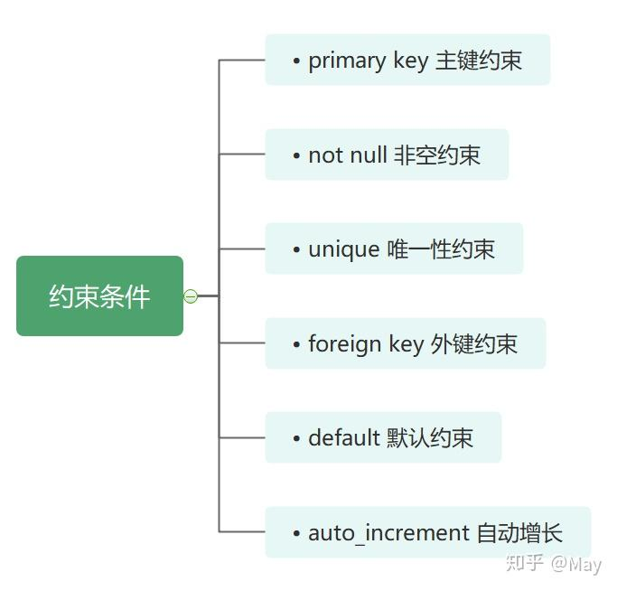
>
> **主键（primary key）**：一个表格只能有一个主键，但可以是数据表中一列或多列的组合，可以是单字段主键，也可以是多字段联合主键。
>
> - 主键约束要求主键列的数据必须是唯一的，并且不允许为空。
>
> - 使用主键，能够惟一地标识表中的一条记录，并且可以结合外键来定义不同数据表之间的关系，还可以加快数据库查询的速度。
>
> **非空约束（not null）**：指的是字段的值不能为空：多个空值不代表重复，代表未知。
>
> **唯一性约束（unique）**：要求该列的值必须是唯一的。
>
> - 一个表中可以有多个字段声明为唯一的；
>
> - 唯一约束确保数据表的一列或几列不出现重复值。
>
> **外键（foreign key）**：用来在两个表的数据之间建立链接。
>
> - 一个数据表可以有一个或多个外键；
> - 外键对应的是参照完整性，其值可以是空值，若不为空值，则每一个外键值必须等于另一个表中主键的某个值；
> - 主表：主键所在的表；从表：外键所在的表。
>
> **默认约束（Default）**：指定某个字段的默认值，默认值的类型与字段类型一致。
>
> **自增字段（auto_increment）**，在数据库应用中，希望主键列的值自动生成：
>
> - 和主键结合在一起用；
>
> - 只能是数值类型；
>
> - 将其设为自动增长列，列值由系统自动生成，每次加 1；
>
> - 只能有一个列设为自动增长列，且该字段必须是主键的一部分。
>
> 可以删除的约束：非空、默认、自动增长
>
> 无法删除的约束：键值约束包括主键约束、唯一约束、外键约束。
>
> ### 建
>
> ```sql
> -- 创建学生表
> CREATE TABLE stu(
> s_id VARCHAR(10) PRIMARY KEY,
> s_name VARCHAR(10) NOT NULL,
> s_age DATE NOT NULL,
> s_sex VARCHAR(10) DEFAULT "未知");
> -- 课程表
> CREATE TABLE co(
> c_id VARCHAR(10),
> c_name VARCHAR(10) NOT NULL,
> t_id VARCHAR(10) NOT NULL,
> PRIMARY KEY(c_id));
> -- 教师表
> CREATE TABLE te(
> t_id VARCHAR(10) PRIMARY KEY,
> t_name VARCHAR(10) NOT NULL);
> -- 成绩表
> CREATE TABLE sc(
> s_id VARCHAR(10) NOT NULL,
> c_id VARCHAR(10) NOT NULL,
> score INT NOT NULL);
> ```
>
> ### 增
>
> ```sql
> -- 学生表添加数据
> INSERT into stu VALUES
> ('01' , '赵雷' , '1989-01-01' , '男'),
> ('02' , '钱电' , '1990-12-21' , '男'),
> ('03' , '孙风' , '1990-05-20' , '男'),
> ('04' , '李云' , '1990-08-06' , '男'),
> ('05' , '周梅' , '1991-12-01' , '女'),
> ('06' , '吴兰' , '1992-03-01' , '女'),
> ('07' , '郑竹' , '1992-04-21' , '女'),
> ('08' , '王菊' , '1990-01-20' , '女');
> -- 课程表添加数据
> INSERT into co VALUES
> ('01' , '语文' , '02'),
> ('02' , '数学' , '01'),
> ('03' , '英语' , '03');
> -- 教师表添加数据
> INSERT into te VALUES
> ('01' , '张三'),
> ('02' , '李四'),
> ('03' , '王五');
> -- 课程表添加数据
> INSERT into sc VALUES
> ('01' , '01' , 80),
> ('01' , '02' , 90),
> ('01' , '03' , 99),
> ('02' , '01' , 70),
> ('02' , '02' , 60),
> ('02' , '03' , 80),
> ('03' , '01' , 80),
> ('03' , '02' , 80),
> ('03' , '03' , 80),
> ('04' , '01' , 50),
> ('04' , '02' , 30),
> ('04' , '03' , 20),
> ('05' , '01' , 76),
> ('05' , '02' , 87),
> ('06' , '01' , 31),
> ('06' , '03' , 34),
> ('07' , '02' , 89),
> ('07' , '03' , 98);
> ```
>
> 查看数据：
>
> ```sql
> DESC stu;
> ```
>
> 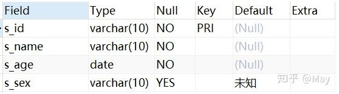
>
> ```sql
> DESC co;
> ```
>
> 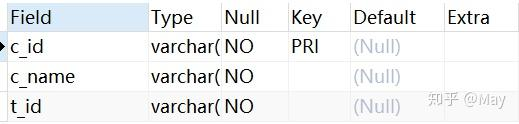
>
> ```sql
> DESC te;
> ```
>
> 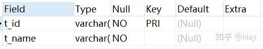
>
> 查看表的内容：
>
> ```sql
> SELECT*FROM stu;
> ```
>
> 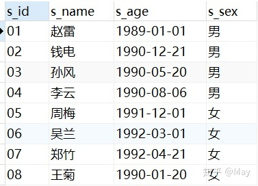
>
> ```sql
> SELECT*FROM co;
> ```
>
> 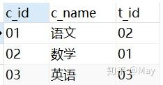
>
> ```sql
> SELECT*FROM te;
> ```
>
> 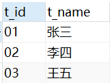
>
> ```sql
> SELECT*FROM sc;
> ```
>
> 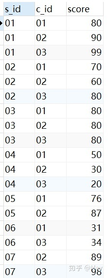
>
> 查看表的行数：
>
> ```sql
> select count(*) from co;
> select count(*) from sc;
> select count(*) from stu;
> select count(*) from te;
> ```
>
> ### 删
>
> 删除表格（drop table）：
>
> ```sql
> DROP TABLE stu;
> DROP TABLE sc;
> DROP TABLE co;
> DROP TABLE te;
> ```
>
> 删除字段内容：
>
> ```sql
> DELETE FROM stu;
> DELETE FROM co;
> DELETE FROM te;
> DELETE FROM sc;
> ```
>
> ### 改
>
> 修改表名称：`rename`
>
> ```sql
> ALTER TABLE stu rename student;
> SHOW TABLES;
> ```
>
> 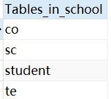
>
> 修改字段类型：`modify`
>
> ```sql
> ALTER TABLE student MODIFY s_id VARCHAR(50);
> DESC student;
> ```
>
> 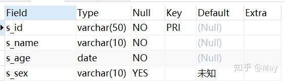
>
> 修改字段名称：`change`
>
> ```sql
> ALTER TABLE student CHANGE s_id stu_id VARCHAR(20);
> DESC student;
> ```
>
> 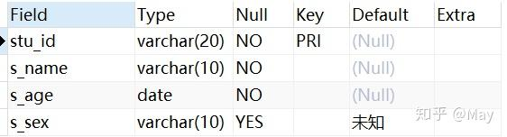
>
> 增加字段：`add`
>
> ```sql
> ALTER TABLE student add s_weight FLOAT FIRST;
> DESC student;
> ```
>
> 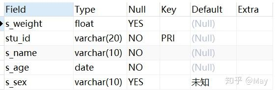
>
> 更改字段顺序：`modify` 配合 `after/before`
>
> ```sql
> ALTER TABLE student MODIFY s_weight FLOAT AFTER stu_id;
> DESC student;
> ```
>
> 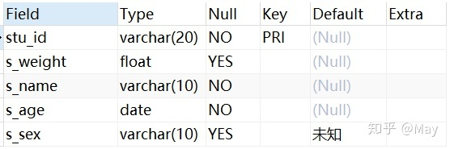
>
> 删除字段：`drop`
>
> ```sql
> ALTER TABLE student DROP s_weight, MODIFY stu_id VARCHAR(100);
> DESC student;
> ```
>
> > 多个步骤是**没有先后关系**的。
>
> 删除和增加键值约束：drop 和 add
>
> 删除主键：`DROP PRIMARY KEY`
>
> ```sql
> ALTER TABLE student DROP PRIMARY KEY;
> DESC student;
> ```
>
> 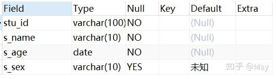
>
> 增加主键：`ADD PRIMARY KEY()`
>
> ```sql
> ALTER TABLE student ADD PRIMARY KEY(stu_id);
> DESC student;
> ```
>
> 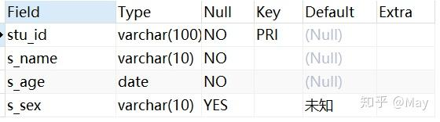
>
> 增加外键：`sc ADD FOREIGN KEY()`
>
> ```sql
> ALTER TABLE sc ADD FOREIGN KEY(s_id) REFERENCES student(stu_id);
> DESC sc;
> ```
>
> 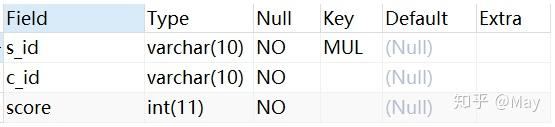
>
> > 怎么删除带外键的主键？
> >
> > ```sql
> > ALTER TABLE student DROP PRIMARY KEY;
> > DESC student;
> > ```
> >
> > 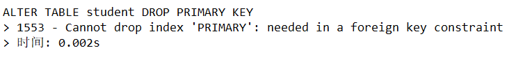
> >
> > 查找外键名称
> >
> > ```sql
> > SHOW CREATE TABLE sc;
> > ```
> >
> > 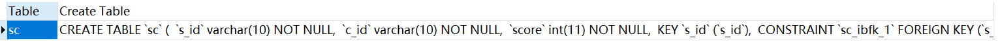
> >
> > 删除外键
> >
> > ```sql
> > ALTER TABLE sc DROP FOREIGN KEY sc_ibfk_1;
> > ```
> >
> > 再删除主键
> >
> > ```sql
> > ALTER TABLE student DROP PRIMARY KEY;
> > DESC student;
> > ```
> >
> > 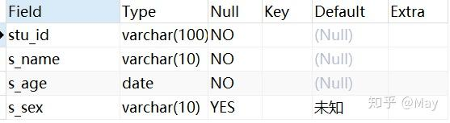
>
> 修改唯一约束：`unique`
>
> ```sql
> alter table student add unique(stu_id); -- 增加唯一约束
> alter table student add constraint abc unique(stu_id); -- constraint：给名称
> alter table student drop index abc; -- 删除唯一约束
> ```
>
> 修改和删除数据：`update` 不加 table
>
> ```sql
> UPDATE student set s_name='朱一旦' where stu_id='01';
> SELECT * FROM student;
> ```
>
> 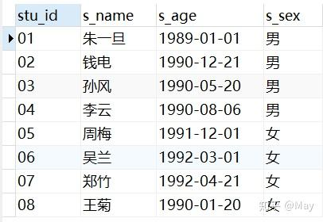

## 单关系（表）的数据查询

数据查询是数据库中最常用的操作。SQL 提供 SELECT 语句，通过查询操作可得到所需的信息。

关系（表）的 SELECT 语句的一般格式为：

```sql
SELECT [ALL|DISTINCT][TOP N [PERCENT][WITH TIES]]
	<列名>(AS 别名 1) [{,<列名>(AS 别名 2)}]
	FROM <表名>(AS 表别名)
	[WHERE <检索条件>]
	[GROUP BY <列名 1> [HAVING <条件表达式>]]
	[ORDER BY <列名 2> [ASC|DESC]]
```

查询的结果仍是一个表。SELECT 语句的执行过程是，根据 WHERE 子句的检索条件，从 FROM 子句指定的基本表中选取满足条件的元组，再按照 SELECT 子句中指定的列，投影得到结果表。如果有 GROUP 子句，则将查询结果按照与 `<列名 1>` 相同的值进行分组。如果 GROUP 子句后有 HAVING 短语，则只输出满足 HAVING 条件的元组。如果有 ORDER 子句，查询结果还要按照 ORDER 子句中 `<列名 2>` 的值进行排序。

可以看出，WHERE 子句相当于关系代数中的选取操作，SELECT 子句则相当于投影操作，但 SQL 查询不必规定投影、选取连接的执行顺序，它比关系代数更简单、功能更强大。

### 无条件查询

无条件查询是指只包含 `SELECT ... FROM` 的查询，这种查询最简单，相当于只对关系（表） 进行投影操作。如：

```sql
-- 查询全体学生的姓名、学号和年龄。
SELECT SNo, SN, Age
	FROM S

SELECT * FROM S
-- 用“*”表示 S 表的全部列名，而不必逐一列出。

-- 使用关键字 DISTINCT 能消去重复行：
SELECT DISTINCT SNo FROM SC
```

### 条件查询

当要在表中找出满足某些条件的行时，则需使用 WHERE 子句指定查询条件。WHERE 子句中，条件通常通过三部分来描述：

1. 列名。
2. 比较运算符。
3. 列名、常数。

其中常用的比较运算符：

| 运算符                  | 含义     |
| ----------------------- | -------- |
| =、>、<、>=、<=、!=、<> | 比较大小 |
| AND、OR、NOT            | 多重条件 |
| BETWEEN                 | AND      |
| IN                      | 确定集合 |
| LIKE                    | 字符匹配 |
| IS                      | NULL     |

1. **比较大小**

   如：

   ```sql
   -- 查询选修课程号为 C1 的学生的学号和成绩。
   SELECT SNo,Score FROM SC
   	WHERE CNo = 'C1'
   ```

2. **多重条件查询**

   当 WHERE 子句需要指定一个以上的查询条件时，则需要使用逻辑运算符 AND、OR 和 NOT 将其连接成复合的逻辑表达式。其优先级由高到低为：NOT、AND、OR，用户可以使用括号改变优先级。如：

   ```sql
   -- 查询选修 C1 或 C2 且分数大于等于 85 分学生的学号、课程号和成绩。
   SELECT SNo, CNo, Score FROM SC
   	WHERE (CNo = 'C1' OR CNo = 'C2') AND (Score >= 85)
   ```

3. **确定范围**

   如：

   ```sql
   -- 查询选修 C1 或 C2 且分数大于等于 85 分学生的学号、课程号和成绩。
   SELECT TNo, TN, Prof FROM T
   	WHERE Sal BETWEEN 1000 AND 1500
   -- 等价于：
   SELECT TNo, TN, Prof FROM T
   	WHERE Sal>=1000 AND Sal<=1500

   SELECT TNo, TN, Prof FROM T
   	WHERE Sal NOT BETWEEN 1000 AND 1500
   ```

   > 在 SQL Server 中，`BETWEEN ... AND ...` 的条件包含等号；在有些 DBMS 中，这样的条件不包含等号。

4. **确定集合**

   利用“IN”操作可以查询属性值属于指定集合的元组。

   ```sql
   -- 查询选修 C1 或 C2 的学生的学号、课程号和成绩。
   SELECT SNo, CNo, Score FROM SC
   	WHERE CNo IN('C1'，'C2')
   -- 此语句也可以使用逻辑运算符“OR”实现：
   SELECT SNo, CNo, Score FROM SC
   	WHERE CNo = 'C1' OR CNo = 'C2'

   -- 查询没有选修 C1，也没有选修 C2 的学生的学号、课程号和成绩。
   SELECT SNo, CNo, Score FROM SC
   	WHERE CNo NOT IN('C1'，'C2')
   -- 等价于：
   SELECT SNo, CNo, Score FROM SC
   	WHERE (CNo <> 'C1') AND (CNo <> 'C2')
   ```

5. **部分匹配查询**

   以上各例均属于完全匹配查询，当不知道完全精确的值时，用户还可以使用 LIKE 或 NOT LIKE 进行部分匹配查询（也称模糊查询）。LIKE 定义的一般格式为：

   `<属性名> LIKE <字符串常量>`

   其中，属性名必须为字符型，字符串常量中的字符可以包含通配符，利用这些通配符，可以进行模糊查询。

   字符串中的通配符及其功能：

   | 通配符       | 功能                   | 实例   | 含义                     |
   | ------------ | ---------------------- | ------ | ------------------------ |
   | %            | 代表 0 个或多个字符    | ab%    | 'ab'后可接任意字符串     |
   | \_（下划线） | 代表一个字符           | a_b    | 'a'与'b'之间可有一个字符 |
   | [ ]          | 表示在某一范围的字符   | [0-9]  | 0~9 之间的字符           |
   | [^ ]         | 表示不在某一范围的字符 | [^0-9] | 不在 0~9 之间的字符      |

   如：

   ```sql
   -- 查询所有姓张的教师的教师号和姓名。
   SELECT TNo, TN FROM T
      WHERE TN LIKE '张%'

   -- 查询姓名中第二个汉字是“力”的教师号和姓名。
   SELECT TNo, TN FROM T
      WHERE TN LIKE'_力%'
   ```

6. 空值查询

   某个字段没有值称为具有空值（NULL）。通常没有为一个列输入值时，该列的值就是空值。空值不同于零和空格，它不占任何存储空间。

   如：

   ```sql
   -- 查询没有考试成绩的学生的学号和相应的课程号。
   SELECT SNo, CNo FROM SC
   	WHERE Score IS NULL
   ```

   > 这里的空值条件为 Score IS NULL，不能写成 Score=NULL。

### 常用库函数及统计汇总查询

SQL 提供了许多库函数，增强了基本检索能力。常用的库函数：

| 函数名称 | 功能             |
| -------- | ---------------- |
| AVG      | 按列计算平均值   |
| SUM      | 按列计算值的总和 |
| MAX      | 求一列中的最大值 |
| MIN      | 求一列中的最小值 |
| COUNT    | 按列值统计个数   |

如：

```sql
-- 求学号为 S1 的学生的总分和平均分。
SELECT SUM(Score) AS TotalScore,
	AVG(Score) AS AvgScore
	FROM SC WHERE (SNo = 'S1')
```

查询结果：

| TotalScore | AvgScore |
| ---------- | -------- |
| 175        | 87.5     |

上述查询语句中 AS 后面的 TotalScore 和 AvgScore 是别名，别名会显示在查询结果中，让使用者能清楚地知道查询内容所表示的含义。

> 在使用库函数进行查询时，通常要给查询的每一项内容加别名，否则查询结果中就不显示列名。

如：

```sql
-- 求选修 C1 号课程的最高分、最低分及之间相差的分数。
SELECT MAX(Score) AS MaxScore,
	MIN(Score) AS MinScore,
	MAX(Score)－MIN(Score) AS Diff
	FROM SC WHERE (CNo = 'C1')

-- 求计算机系学生的总数。
SELECT COUNT（SNo）FROM S
	WHERE Dept= '计算机'

-- 求学校中共有多少个系。
SELECT COUNT(DISTINCT Dept) AS DeptNum FROM S

-- 利用特殊函数 COUNT(*)求计算机系学生的总数。
SELECT COUNT(*) FROM S WHERE Dept='计算机'
```

> 加入关键字 `DISTINCT` 后表示消去重复行，可计算字段“Dept”不同值的数目。`COUNT` 函数对空值不计算，但对 0 进行计算。
>
> `COUNT(*)` 用来统计元组的个数，不消除重复行，不允许使用 `DISTINCT` 关键字。

### 分组查询

分组查询 `GROUP BY` 子句可以将查询结果按属性列或属性列组合在行的方向上进行分组，每组在属性列或属性列组合上具有相同的值。

如：

```sql
-- 查询每个教师的教师号及其任课的门数。
SELECT TNo, COUNT(*) AS C_Num
	FROM TC GROUP BY TNo
```

`GROUP BY` 子句按 TNo 的值分组，所有具有相同 TNo 的元组为一组，对每一组使用函数 `COUNT` 进行计算，统计出各位教师任课的门数。查询结果如下：

| TNo | C_Num |
| --- | ----- |
| T1  | 2     |
| T2  | 2     |
| T3  | 2     |
| T4  | 2     |
| T5  | 2     |

若在分组后还要按照一定的条件进行筛选，则需使用 `HAVING` 子句。

如：

```sql
-- 查询选修两门以上（含两门）课程的学生的学号和选课门数。
SELECT SNo, COUNT(*) AS SC_Num -- 新列 SNo、SC_Num
	FROM SC
	GROUP BY SNo -- 按学号分组
	HAVING (COUNT(*) >= 2) -- 条件：计数大于等于2
```

查询结果如下：

| SNo | SC_Num |
| --- | ------ |
| S1  | 2      |
| S2  | 4      |
| S3  | 3      |
| S4  | 3      |

`GROUP BY` 子句按 SNo 的值分组，所有具有相同 SNo 的元组为一组，对每一组使用函数 COUNT 进行计算，统计出每个学生选课的门数。HAVING 子句去掉不满足 COUNT(\*)>=2 的组。

当在一个 SQL 查询中同时使用 `WHERE` 子句，`GROUP BY` 子句和 `HAVING` 子句时，其顺序是 `WHERE`、`GROUP BY`、`HAVING`。`WHERE` 与 `HAVING` 子句的根本区别在于作用对象不同。WHERE 子句作用于基本表或视图，从中选择满足条件的元组；`HAVING` 子句作用于组，选择满足条件的组， 必须用在 `GROUP BY` 子句之后，但 `GROUP BY` 子句可没有 HAVING 子句。

### 查询结果的排序

当需要对查询结果排序时，应该使用 `ORDER BY` 子句，`ORDER BY` 子句必须出现在其他子句之后。排序方式可以指定：`DESC` 为降序，`ASC` 为升序，缺省时为升序。

如：

```sql
-- 查询选修 C1 的学生学号和成绩，并按成绩降序排列。
SELECT SNo, Score FROM SC WHERE (CNo = 'C1')
	ORDER BY Score DESC
```

## 多关系（表）的连接查询

数据库中的各个表中存放着不同的数据，用户往往需要用多个表中的数据来组合、提炼出所需要的信息。如果一个查询需要对多个表进行操作，就称为连接查询。连接查询的结果集或结果表称为表之间的连接。连接查询实际上是通过各个表之间共同列的关联性来查询数据的，数据表之间的联系是通过表的字段值来体现的，这种字段称为连接字段。连接操作的目的就是通过加在连接字段上的条件将多个表连接起来，以便从多个表中查询数据。

当查询同时涉及两个及两个以上的表时，称为连接查询。

多关系（表）的连接查询结构表的连接方法有以下两种：

1. 表之间满足一定条件的行进行连接时，FROM 子句指明进行连接的表名，WHERE 子句指明 连接的列名及其连接条件：

   ```sql
   SELECT [ALL|DISTINCT] [TOP N [PERCENT][WITH TIES]]
   	〈列名〉[AS 别名 1] (，列名2 [AS 别名 2])
   	FROM〈表名 1〉[AS 表 1 别名] (，〈表名 2〉[AS 表 2 别名,...])
   	[WHERE〈检索条件〉]
   	[GROUP BY <列名 1> [HAVING <条件表达式>]]
   	[ORDER BY <列名 2> [ASC|DESC]]
   ```

2. 利用关键字 JOIN 进行连接。

具体的连接方法分为以下几种：

- INNER JOIN（内连接）显示符合条件的记录，此为默认值。
- LEFT（OUTER）JOIN 称为左（外）连接，用于显示符合条件的数据行以及左边表中不符合条件的数据行。此时右边数据行会以 NULL 来显示。
- RIGHT（OUTER）JOIN 称为右（外）连接，用于显示符合条件的数据行以及右边表中不符合条件的数据行。此时左边数据行会以 NULL 来显示。
- FULL（OUTER）JOIN 显示符合条件的数据行以及左边表和右边表中不符合条件的数据行。此时缺乏数据的数据行会以 NULL 来显示。
- CROSS JOIN 将一个表的每一个记录和另一表的每个记录匹配成新的数据行。

当将 JOIN 关键词放于 FROM 子句中时，应有关键词 ON 与之对应，以表明连接的条件。

```sql
SELECT [ALL|DISTINCT][TOP N [PERCENT][WITH TIES]]
	列名 1 [AS 别名 1] (, 列名 2 [ AS 别名 2]...)
	[INTO 新表名]
	FROM 表名 1 [[AS] 表 1 别名]
	[INNER|RIGHT|FULL|OUTER|CROSS] JOIN 表名 2 [[AS] 表 2 别名]
	ON 条件
```

下面介绍几种表的连接操作。

> [SQL 多表查询：SQL JOIN 连接查询各种用法总结 - 知乎 (zhihu.com)](https://zhuanlan.zhihu.com/p/68136613)
>
> ### 写在前面
>
> 在实际应用中，大多的查询都是需要多表连接查询的，但很多初学 SQL 的小伙伴总对各种 JOIN 有些迷糊。回想一下，初期很长一段时间，我常用的似乎也就是等值连接 WHERE 后面加等号，对各种 JOIN 也是不求甚解，今天索性就来个 JOIN 的小总结。
>
> 首先，设定两张表，作为下面例子的操作对象。
>
> 表 1 学生信息表：
>
> 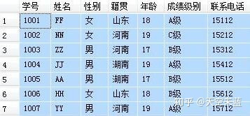
>
> 表 2 专业班级表：
>
> 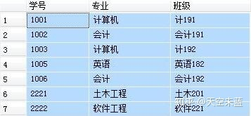
>
> 再来个 SQL JOIN 连接查询各种用法的大合影，先预热一下。
>
> 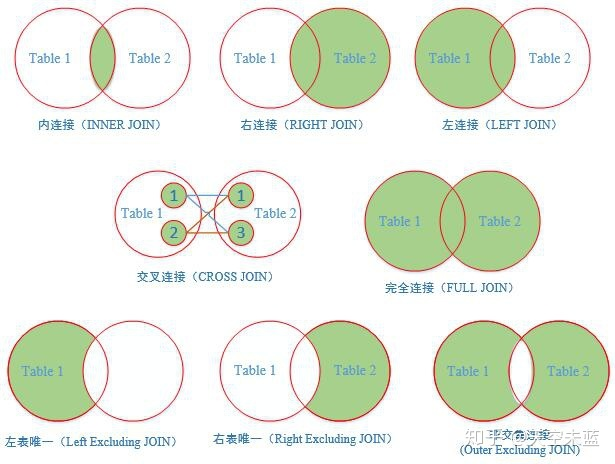
>
> ### No.1 【INNER JOIN】内连接
>
> 这是最常用的，获取两个表中指定字段满足匹配关系的记录。
>
> 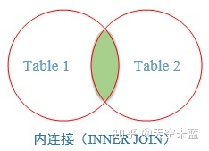
>
> 内连接通常有两种情况：
>
> **等值连接**：查找两个表中连接字段相等的记录。
>
> ```sql
> -- 查询每个学生的学号、姓名、籍贯、年龄、专业、班级
> -- 涉及到 student 和 major 两张表，用共有字段“学号”为连接字段
>
> -- 写法1：使用 INNER JOIN
> SELECT A.学号, A.姓名, A.籍贯, A.年龄, B.专业, B.班级
> 	FROM student A
> 	INNER JOIN major B
> 	ON  A.学号=B.学号
>
> -- 写法2：省去了 INNER，直接写 JOIN，与 INNER JOIN 没有区别
> SELECT A.学号, A.姓名, A.籍贯, A.年龄, B.专业, B.班级
>     FROM student A
>     JOIN major B
>     ON A.学号=B.学号
>
> -- 写法3：使用 WHERE，已经逐渐被淘汰
> SELECT A.学号, A.姓名, A.籍贯, A.年龄, B.专业, B.班级
>     FROM student A, major B
>     WHERE A.学号 = B.学号
>
> -- 上面三种写法的结果都是一样的，推荐使用写法2
> ```
>
> 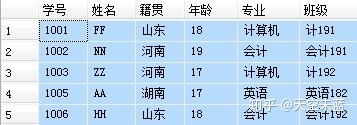
>
> **自身连接**：就是和自己进行连接查询，给一张表取两个不同的别名，然后附上连接条件。
>
> ```sql
> -- 要在学生表里查询与 HH 同龄且籍贯也相同的学生信息
>
> SELECT B.学号, B.姓名, B.性别, B.籍贯, B.年龄
>     FROM student A
>     JOIN student B
>     ON A.年龄=B.年龄 AND A.籍贯=B.籍贯 AND A.姓名='HH'
> ```
>
> 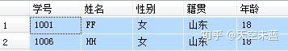
>
> ### No.2 【LEFT JOIN】左连接
>
> 获取左表中的所有记录，即使在右表没有对应匹配的记录。
>
> 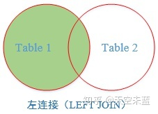
>
> ```sql
> -- 左连接：显示左表student所有记录，如右表中没有与之
> -- 匹配的项则以NULL值代替。
>
> SELECT A.学号, A.姓名, A.籍贯, A.年龄, B.专业, B.班级
>     FROM student A LEFT JOIN major B
>     ON  A.学号 = B.学号
> ```
>
> 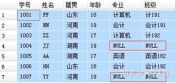
>
> ### No.3 【RIGHT JOIN】右连接
>
> 用于获取右表中的所有记录，即使左表没有对应匹配的记录。
>
> 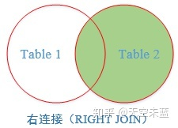
>
> ```sql
> -- 右连接：显示右表 major 所有记录，如左表中没有与之
> -- 匹配的项则以NULL值代替。
>
> SELECT A.学号, A.姓名, A.籍贯, A.年龄, B.专业, B.班级
>     FROM student A RIGHT JOIN major B
>     ON A.学号=B.学号
> ```
>
> 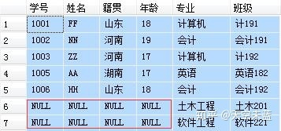
>
> ### No.4 【FULL JOIN】 完全连接
>
> 返回两个表中的所有行。
>
> 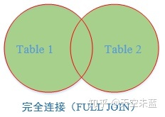
>
> ```sql
> -- 完全连接：显示两张表的并集，如果其中一张表的记录
> -- 在另一张表中没有匹配的行，则对应的数据项填充NULL
>
> SELECT A.学号, A.姓名, A.籍贯, A.年龄, B.专业, B.班级
>     FROM student A FULL JOIN major B
>     ON  A.学号=B.学号
> ```
>
> 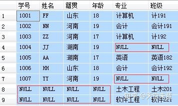
>
> ### No.5 【CROSS JOIN】交叉连接
>
> 结果是笛卡尔积，就是第一个表的行数乘以第二个表的行数。
>
> 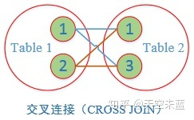
>
> ```sql
> -- 交叉连接：一张表中的数据依次取出分别与另一张表中的
> -- 每条数据挨个组合，最后记录数量为两张表记录数的乘积
>
> SELECT * FROM student CROSS JOIN major
>
> -- 本例student和major都为7条记录，所以结果为7*7=49条记录
> ```
>
> 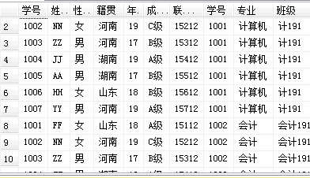
>
> ### No.6 延伸【Left Excluding JOIN】左表唯一
>
> 返回左表有但右表没有关联数据的记录。
>
> 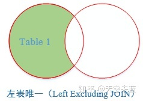
>
> ```sql
> -- 左表唯一：将右表B以及两张表交集的部分过滤掉，
> -- 得到的记录是左表中唯一存在的。
>
> SELECT A.学号, A.姓名, A.籍贯, A.年龄, B.专业, B.班级
>     FROM student A LEFT JOIN major B
>     ON A.学号 = B.学号
>     WHERE B.学号 IS NULL
> ```
>
> 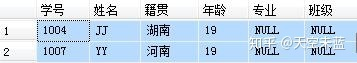
>
> ### No.7 延伸【Right Excluding JOIN】右表唯一
>
> 返回右表有但左表没有关联数据的记录。
>
> 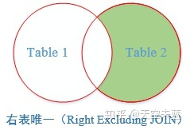
>
> ```sql
> -- 右表唯一：将左表A以及两张表交集的部分过滤掉，
> -- 得到的记录是右表中唯一存在的。
>
> SELECT A.学号, A.姓名, A.籍贯, A.年龄, B.专业, B.班级
>     FROM student A RIGHT JOIN major B
>     ON A.学号=B.学号
>     WHERE A.学号 IS NULL
> ```
>
> 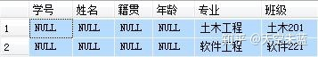
>
> ### No.8 延伸【Outer Excluding JOIN】非交集连接
>
> 返回左表和右表里没有相互关联的记录。
>
> 
>
> ```sql
> -- 非交集连接：查找两张表中没有关联的记录项。
>
> SELECT A.学号, A.姓名, A.籍贯, A.年龄, B.专业, B.班级
>     FROM student A FULL JOIN major B
>     ON A.学号=B.学号
>     WHERE A.学号 IS NULL OR B.学号 IS NULL
> ```
>
> 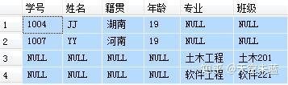
>
> ### 最后
>
> 谈及 SQL 里的各种 JOIN 之间的区别时，被广为引用的是 CodeProject 上 C.L. Moffatt 的文章, 本文也有所参考，感兴趣的小伙伴可以去看一下。
>
> [https://www.codeproject.com/Articles/33052/Visual-Representation-of-SQL-Joins](https://link.zhihu.com/?target=https%3A//www.codeproject.com/Articles/33052/Visual-Representation-of-SQL-Joins)

## 子查询

在 WHERE 子句中包含一个形如 SELECT-FROM-WHERE 的查询块，此查询块称为子查询或嵌套查询，包含子查询的语句称为父查询或外部查询。嵌套查询可以将一系列简单查询构成复杂查询，增强查询能力。子查询的嵌套层次最多可达到 255 层，以层层嵌套的方式构造查询，充分体现了 SQL“结构化”的特点。

嵌套查询在执行时由里向外处理，每个子查询是在上一级外部查询处理之前完成的，父查询要用到子查询的结果。

### 普通子查询

普通子查询的执行顺序是：首先执行子查询，然后把子查询的结果作为父查询的查询条件的值。普通子查询只执行一次，而父查询所涉及的所有记录行都与其查询结果进行比较以确定查询结果集合。

当子查询的返回值只有一个时，可以使用比较运算符（=、 >、 <、 >=、 <=、 !=）将父查询和子查询连接起来。

如：查询与“刘伟”老师职称相同的教师号、姓名。

```sql
SELECT TNo,TN FROM T
	WHERE Prof= (SELECT Prof FROM T WHERE TN='刘伟')

-- 查询结果：
-- TNo TN
-- T2 王平
-- T3 刘伟
```

如果子查询的返回值不止一个，而是一个集合时，则不能直接使用比较运算符，可以在比较运算符和子查询之间插入 ANY 或 ALL。其具体含义详见以下各例。

（1）使用 ANY。

```sql
-- 查询讲授课程号为 C5 的教师姓名。
SELECT TN FROM T
	WHERE (TNo = ANY(SELECT TNo FROM TC WHERE CNo = 'C5') )
```

先执行子查询，找到讲授课程号为 C5 的教师号，教师号为一组值构成的集合(T2,T3,T5)；再执行父查询。其中 ANY 的含义为任意一个，查询教师号为 T2、T3、T5 的教师的姓名。查询结果如下：

| TN   |
| ---- |
| 王平 |
| 刘伟 |
| 张兰 |

该例也可以使用前面所讲的连接操作来实现：

```sql
SELECT T.TN FROM T,TC
	WHERE T.TNo = TC.TNo AND TC.CNo= 'C5'
```

可见，对于同一查询，可使用子查询和连接查询两种方法来解决，读者可根据习惯任意选用。

又如：查询其他系中比计算机系某一教师工资高的教师的姓名和工资。

```sql
SELECT TN, Sal FROM T
	WHERE (Sal > ANY(SELECT Sal FROM T WHERE Dept = ' 计算机'))
	AND (Dept <> '计算机') -- <> 代表不等于
```

先执行子查询，找到计算机系中所有教师的工资集合（1500，900）；再执行父查询，查询所有不是计算机系且工资高于 900 元的教师姓名和工资。

查询结果如下：

| TN   | Sal  |
| ---- | ---- |
| 张雪 | 1600 |
| 张兰 | 1300 |

此查询也可以写成：

```sql
SELECT TN, Sal FROM T
	WHERE Sal > (SELECT MIN(Sal) FROM T WHERE Dept = '计算机')
	AND Dept <> '计算机'
```

先执行子查询，利用库函数 MIN 找到计算机系中所有教师的最低工资 900 元；再执行父查询，查询所有不是计算机系且工资高于 900 元的教师。

（2）使用 IN。可以使用 IN 代替“=ANY”。

```sql
-- 查询讲授课程号为 C5 的教师姓名（使用 IN）。
SELECT TN FROM T
	WHERE (TNo IN (SELECT TNo FROM TC WHERE CNo = 'C5'))
```

（3）使用 ALL。ALL 的含义为全部。

如：查询其他系中比计算机系所有教师工资都高的教师的姓名和工资。

```sql
SELECT TN, Sal FROM T
	WHERE (Sal > ALL(SELECT Sal FROM T WHERE Dept='计算机') )
	AND (Dept <> '计算机')
```

子查询找到计算机系中所有教师的工资集合(1500，900)，父查询找到所有不是计算机系且工资高于 1500 的教师姓名和工资。

此查询也可以写成：

```sql
SELECT TN, Sal FROM T
	WHERE (Sal > (SELECT MAX(Sal) FROM T WHERE Dept = '计算机'))
	AND (Dept <> '计算机')
```

### 相关子查询

有时子查询的查询条件需要引用父查询表中的属性值，我们把这类查询称为相关子查询。相关子查询的执行顺序是：首先选取父查询表中的第一行记录，内部的子查询利用此行中相关的属性值进行查询，然后父查询根据子查询返回的结果判断此行是否满足查询条件。如果满足条件，则把该行放入父查询的查询结果集合中。重复执行这一过程，直到处理完父查询表中的每一行数据。

如：查询不讲授课程号为 C5 的教师姓名。

```sql
SELECT DISTINCT TN FROM T
	WHERE ('C5' <> ALL(SELECT CNo FROM TC WHERE TNo = T.TNo))
-- <> ALL 的含义为不等于子查询结果中的任何一个值。也可使用 NOT IN 代替。
```

此外，使用 EXISTS 也可以进行相关子查询。EXISTS 是表示存在的量词，带有 EXISTS 的子查询不返回任何实际数据，它只得到逻辑值“真”或“假”。当子查询的查询结果集合为非空时，外层的 WHERE 子句返回真值，否则返回假值。NOT EXISTS 与此相反。

```sql
SELECT TN FROM T
	WHERE EXISTS
	(SELECT * FROM TC WHERE TNo = T.TNo AND CNo = 'C5')
```

当子查询 TC 表存在一行记录满足其 WHERE 子句中的条件时，父查询便得到一个 TN 值，重复执行以上过程，直到得出最后结果。

> 参考：[MySQL 子查询--再难一看就懂 - 知乎 (zhihu.com)](https://zhuanlan.zhihu.com/p/164547826)，有删改。
>
> 子查询指一个查询语句嵌套在另一个查询语句内的查询。在 select 语句中先计算子查询，子查询结果作为外层另一个查询的过滤条件。
>
> - 标量子查询：子查询的值是固定的。
> - 关联子查询：内层查询与外层查询是有互动的。
>
> 下面的例子的数据在 [Chapter 3@建](./03-data-def-lang#建) 部分有给出完整数据。此处不再给出如何创建数据，仅提供表格预览：
>
> - stu (student) 表格：
>
>   
>
> - sc (score) 表格：
>
>   
>
> - co (course) 表格：
>
>   
>
> - te (teacher) 表格：
>
> 
>
> ### 1. 查询比学生编号为 02 的学生的最高成绩都高的成绩信息
>
> 1. 查询结果：成绩信息，sc 表所有字段信息
> 2. 查询条件：比学生编号为 02 的学生的最高成绩都高
> 3. 思路：先找到 02 的学生的最高成绩作为子查询，然后用“>”与子查询连接
>
> ```sql
> SELECT * FROM sc
> 	WHERE score > (SELECT MAX(score) FROM sc WHERE s_id='02');
> ```
>
> 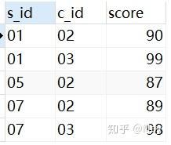
>
> ### 2. 查询平均成绩大于等于 85 的所有学生的学号、姓名和平均成绩
>
> 1. 查询结果：所有学生的学号、姓名和平均成绩
> 2. 连接：所有学生、成绩所以是 stu 表作为左表，与 sc 表进行左连接
> 3. 查询条件：平均成绩大于等于 85
> 4. 思路：平均成绩大于等于 85 的学生，要先找到符合条件的学生学号，然后再通过匹配学号找到这些学生的信息。首先学生的平均成绩肯定是要按学号分组，分组后用 having 条件找到平均成绩>=85 的**学生学号**作为子查询。
>
> ```sql
> SELECT
> 	stu.s_id,
> 	stu.s_name,
> 	AVG( sc.score ) AS avgscore
> FROM
> 	stu
> 	JOIN sc ON stu.s_id = sc.s_id
> GROUP BY
> 	stu.s_id
> HAVING
> 	AVG( sc.score ) >= 85;
> ```
>
> 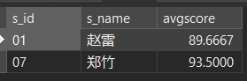
>
> ### 3. 查询选修了全部课程的学生信息：
>
> 1. 查询结果：学生信息
> 2. 连接：学生、成绩及全部课程所以是 stu 表作为左表，与 sc 和 co 进行内连接
> 3. 查询条件：选修了全部课程
> 4. 思路：先想到全部课程数量是多少（通过 co 表计算课程总数量）；选修了全部课程，意思是每个学生所修不同课程的数量与全部课程的数量相同（因为出现“每个”所以要分组，针对每个学生的课程数量进行计算所以用 having 后加条件）
>
> ```sql
> SELECT
> 	stu.*
> FROM
> 	stu
> 	JOIN sc ON stu.s_id = sc.s_id
> 	JOIN co ON sc.c_id = co.c_id
> GROUP BY
> 	stu.s_id
> HAVING
> 	COUNT(sc.c_id) = (SELECT COUNT(DISTINCT co.c_id) FROM co);
> ```
>
> 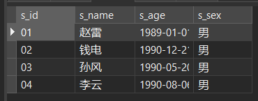
>
> ### 4. 按平均成绩从高到低显示所有学生的所有课程的成绩以及平均成绩
>
> 1. 查询结果：所有学生、所有课程、所有成绩以及平均成绩
> 2. 连接：所有学生、成绩及全部课程所以是 stu 表作为左表，与 sc 进行左连接
> 3. 查询条件：所有课程的成绩以及平均成绩
> 4. 排序：按平均成绩从高到低，降序
> 5. 思路：因为要同时显示成绩和平均成绩，而平均是聚合函数平均成绩是通过学号分组得来的，行数是不同的；如果想同时显示的，子查询作为子表通过学号与需要显示的其他信息进行连接。**注意：作为子表时一定要给别名。**
>
> ```sql
> SELECT stu.s_name, co.c_name, sc.score, a.avgscore
> FROM stu
> 	LEFT JOIN sc
> 	ON stu.s_id = sc.s_id
> 	LEFT JOIN (
> 		SELECT sc.s_id, AVG(sc.score) AS avgscore
> 		FROM sc
> 		GROUP BY sc.s_id
> 	) AS a
> 	ON sc.s_id = a.s_id
> 	LEFT JOIN co
> 	ON sc.c_id = co.c_id
> ORDER BY
> 	a.avgscore DESC;
> ```
>
> 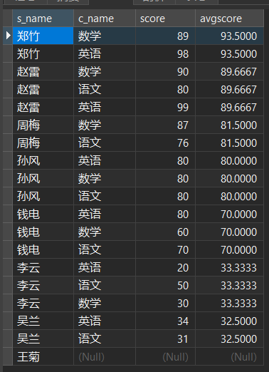
>
> ### 5. 查询没学过“张三”老师授课的同学的信息；
>
> 1. 查询结果：学生信息，主要是 stu 表信息
> 2. 连接：子查询时用到连接，学生、教师名字，所以是 stu 表作为左表，与 sc、co 和 te 进行内连接
> 3. 查询条件：没学过“张三”老师授课
> 4. 思路：先找到学过张三老师授课的学生学号作为子查询，通过 where s_id not in + 子查询进行筛选
>
> ```sql
> SELECT * FROM stu
> WHERE s_id NOT IN (
> 	SELECT stu.s_id FROM stu
> 		JOIN sc ON stu.s_id = sc.s_id
> 		JOIN co ON sc.c_id = co.c_id
> 		JOIN te ON co.t_id = te.t_id
> 	WHERE
> 		te.t_name = '张三'
> 	GROUP BY stu.s_id );
> ```
>
> 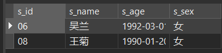
>
> ### 6. 查询至少有一门课与学号为“01”的同学所学相同的同学的信息
>
> 1. 查询结果：学生信息，主要是 stu 表信息
> 2. 连接：学生、课程号，所以是 stu 表作为左表，与 sc 进行内连接
> 3. 查询条件：至少有一门课与学号为“01”的同学所学相同
> 4. 思路：先找到学号为“01”的同学所学课程，只要其他同学课程与 1 号同学所学任一课程相同就符合条件。
>
> **方法一**：
>
> ```sql
> SELECT stu.* FROM stu
> 	JOIN sc ON stu.s_id = sc.s_id
> WHERE
> 	c_id = ANY ( SELECT c_id FROM sc WHERE s_id = '01' )
> GROUP BY
> 	stu.s_id;
> ```
>
> **方法二**：通过课程号只要在 1 号同学所学课程里的学号进行筛选。
>
> ```sql
> SELECT *
> FROM stu
> WHERE
> 	s_id IN (
> 		SELECT s_id FROM sc
> 		WHERE c_id IN ( SELECT c_id FROM sc WHERE s_id = "01" )
> 	);
> ```
>
> 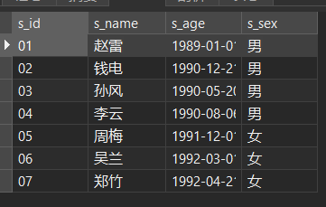
>
> ### 7. 查询学过编号为“01”并且也学过编号为“02”的课程的同学的信息
>
> 1. 查询结果：学生信息，主要是 stu 表信息
> 2. 连接：学生、课程号，所以是 stu 表作为左表，与 sc 进行内连接
> 3. 查询条件：学过编号为“01”并且也学过编号为“02”的课程
>
> **方法一**：通过 `having sum(c_id='01')` 来实现
>
> ```sql
> SELECT stu.*
> FROM stu
> 	JOIN sc ON stu.s_id = sc.s_id
> GROUP BY stu.s_id
> HAVING SUM( c_id = '01' ) AND SUM( c_id = '02' );
> -- SUM() 输出包含条件的行数，没有就返回 0，也就是否定的意思。只有两者的 SUM() 都大于等于 1，才能允许被输出
> ```
>
> **方法二**：找到学过 01 课程和 02 课程的学号，通过 where+学号+子查询来筛选
>
> ```sql
> SELECT * FROM stu
> WHERE
> 	s_id IN ( SELECT s_id FROM sc WHERE c_id = '01' )
> 	AND s_id IN ( SELECT s_id FROM sc WHERE c_id = '02' );
> ```
>
> 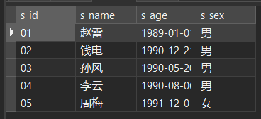
>
> ### 8. 查询“01”课程比“02”课程成绩高的学生的信息及课程分数
>
> 1. 查询结果：学生信息，主要是 stu 表信息及课程分数
> 2. 连接：学生、课程号，所以是 stu 表作为左表，与 sc 进行内连接
> 3. 查询条件：“01”课程比“02”课程成绩高的学生
>
> **方法一**：通过 `having SUM((c_id='01')*score)>SUM((c_id='02')*score)` 来实现，但前提是两个课程都存在通过此代码证实存在 `SUM(c_id='01')>0 AND SUM(c_id='02')>0`
>
> ```sql
> SELECT stu.*, sc.c_id, sc.score FROM stu
> 	JOIN sc ON stu.s_id = sc.s_id
> WHERE stu.s_id IN (
> 	SELECT stu.s_id FROM stu
> 		JOIN sc ON stu.s_id = sc.s_id
> 	GROUP BY stu.s_id
> 	HAVING
> 		SUM( c_id = '01' ) > 0 AND SUM( c_id = '02' ) > 0
> 		AND SUM(( c_id = '01' ) * score ) > SUM(( c_id = '02' ) * score )
> 	);
> ```
>
> **方法二**：找到 01 和 02 课程的成绩信息，分别作为子表与 stu 表通过学号和课程号=`'01'/'02'` 进行连接，通过 where+子查询 `sc.score>sc2.score` 来筛选。最后将筛选出的学号作为子查询，找出学生信息及成绩。
>
> ```sql
> SELECT stu.*, sc.c_id, sc.score FROM stu
> 	JOIN sc ON stu.s_id = sc.s_id
> WHERE
> 	stu.s_id IN (
> 	SELECT stu.s_id FROM stu
> 		JOIN sc AS sc01 ON stu.s_id = sc01.s_id AND sc01.c_id = '01'
> 		JOIN sc AS sc02 ON stu.s_id = sc02.s_id AND sc02.c_id = '02'
> 	WHERE sc01.score > sc02.score
> 	);
> ```
>
> 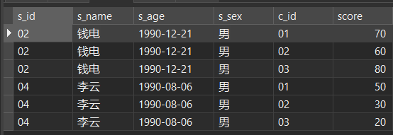
>
> ### 9. 查询学过编号为“01”但是没有学过编号为“02”的课程的同学的信息
>
> 与 7 题大同小异。
>
> **方法一**：
>
> ```sql
> SELECT stu.* FROM stu
> JOIN sc ON stu.s_id = sc.s_id
> GROUP BY stu.s_id
> HAVING SUM(c_id='01') > 0 AND SUM(c_id='02') = 0;
> ```
>
> **方法二**：
>
> ```sql
> SELECT * FROM stu
> WHERE s_id in (SELECT s_id FROM sc WHERE c_id='01')
> 	AND s_id not in (SELECT s_id FROM sc WHERE c_id='02');
> ```
>
> 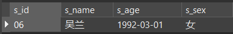
>
> ### 10. 查询有一门课程成绩在 70 分以上的姓名、课程名称和分数
>
> 1. 查询结果：姓名、课程名称和分数
> 2. 连接：学生姓名、课程名称、分数，所以是 stu 表作为左表，与 sc 和 co 表进行内连接
> 3. 查询条件：有一门课程成绩在 70 分以上的学生
>
> **方法一**：通过 `HAVING SUM(score>70)>0` 找到符合条件的学号，然后通过 s_id+in+(子查询实现)
>
> ```sql
> SELECT s_name, c_name, score FROM stu
> 	JOIN sc ON stu.s_id = sc.s_id
> 	JOIN co ON sc.c_id = co.c_id
> GROUP BY stu.s_id
> HAVING SUM( score > 70 ) > 0;
> ```
>
> **方法二**：只要最大成绩大于 70 分则存在大于 70 分的课程找到学号，再通过 `s_id in (子查询)` 实现。
>
> ```sql
> SELECT s_name, c_name, score
> FROM stu
> 	JOIN sc ON stu.s_id = sc.s_id
> 	JOIN co ON sc.c_id = co.c_id
> WHERE stu.s_id IN (
> 	SELECT s_id FROM sc
> 	GROUP BY s_id
> 	HAVING MAX( score )> 70 );
> ```
>
> 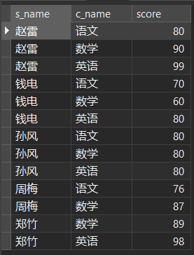
>
> ### 11. 查询选修“张三”老师所授课程的学生中，成绩最高的学生信息及其成绩
>
> 1. 查询结果：学生信息和成绩
> 2. 连接：学生姓名、课程名称、分数，所以是 stu 表作为左表，与 sc、co 及 te 表进行内连接
> 3. 查询条件：选修“张三”老师所授课程的学生中，成绩最高的学生
> 4. 思路：条件一选修张三老师的课程，`where t_name='张三'`；条件二成绩最高；通过 score=最高成绩子查询而且`where t_name='张三'`来实现。
>
> ```sql
> SELECT stu.*, sc.score FROM stu
> 	JOIN sc ON stu.s_id = sc.s_id
> 	JOIN co ON sc.c_id = co.c_id
> 	JOIN te ON co.t_id = te.t_id
> WHERE t_name = '张三' AND score = (
> 	SELECT MAX( score )
> 	FROM stu
> 		JOIN sc ON stu.s_id = sc.s_id
> 		JOIN co ON sc.c_id = co.c_id
> 		JOIN te ON co.t_id = te.t_id
> 	WHERE t_name = '张三'
> 	);
> ```
>
> 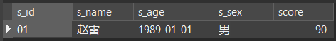
>
> ### 12. 查询每门课程的成绩第 2 名到第 3 名的学生信息及该课程成绩
>
> 1. 查询结果：学生信息和成绩
> 2. 连接：学生姓名、课程名称、分数，所以是 stu 表作为左表，与 sc 表进行内连接
> 3. 查询条件：每门课程的成绩第 2 名到第 3 名的学生
>
> **方法一**：窗口函数实现，`row_number() over((PARTITION by c_id ORDER BY score DESC)`计算出排名列，然后通过 where+in(2,3) 实现
>
> ```sql
> SELECT a.* FROM (
> 	SELECT stu.*, sc.c_id, sc.score,
> 		ROW_NUMBER() over ( PARTITION BY c_id ORDER BY score DESC ) AS ranks
> 	FROM stu
> 		JOIN sc ON stu.s_id = sc.s_id
> 	) AS a
> WHERE
> 	ranks IN ( 2, 3 );
> ```
>
> > [SQL 数据分析-窗口函数 ROW_NUMBER() - 知乎 (zhihu.com)](https://zhuanlan.zhihu.com/p/353144510)
> >
> > SQL 中有一类函数叫聚合函数，比如 `count`、`sum`、`avg`、`min`数据按照规整聚集为一行，一般聚集前的数据行要大于聚集后的数据行。
> >
> > 而有时候我们不仅想要聚集前的数据，又想要聚集后的数据，这时候便引入了**窗口函数**。涉及知识点有**用于排序的窗口函数、用于用户分组查询的窗口函数、用于偏移分析的窗口函数**。
> >
> > ### row_number 函数
> >
> > 作用：分组聚合，先分组在进行排序。
> >
> > 使用方法：`row_number() over(partition by 列名1 order by 列名2 desc)`
> >
> > 表示根据 **列名 1** 分组，然后在分组内部根据 **列名 2** 排序，而此函数计算的值就表示每组内部排序后的顺序编号,可以用于去重复值。
>
> **方法二**：关联子查询：两个 sc 表通过 c_id 相同进行连接，然后再用 `SUM(sc.score<score)` 进行筛选
>
> ```sql
> SELECT stu.*, sc.c_id, sc.score FROM sc
> 	JOIN stu ON stu.s_id = sc.s_id
> WHERE (
> 	SELECT SUM( sc.score < sc1.score )
> 	FROM sc AS sc1 WHERE sc1.c_id = sc.c_id
> 	)
> 	IN ( 1, 2 );
> ```
>
> 代码意思：相同课程，找到 sc1 成绩比 sc 成绩大的学号数量，然后得到排序列。以 1 号课程为例，遍历每个学号，找到比这个学号成绩高的学生的数量再加 1 就是排名。
>
> 这是 1 号课程的所有学生的成绩：
>
> 
>
> - sc 表第一行成绩为 80 的学生表（无色行），到 sc1 表中找没有比 80 大的，所以排名是 0；
> - sc 表第二行成绩为 70 的学生表（浅黄色行），到 sc1 表中有 3 个比 70 大的（深黄色行），所以排名是 3；
> - sc 表第四行成绩为 50 的学生表（浅绿色行），到 sc1 表中有 4 个比 50 大的（深绿色行），所以排名是 4；
> - sc 表第五行成绩为 76 的学生表（浅蓝色行），到 sc1 表中有 2 个比 76 大的（深蓝色行），所以排名是 2；
> - sc 表第六行成绩为 50 的学生表（浅灰色行），到 sc1 表中有 5 个比 31 大的（深灰色行），所以排名是 5；
>
> 因为排名是从 0 开始的，所以最后（2，3）名变成 in（1，2）最大的排前面属于降序。如果`SUM(sc.score<score)`变成大于号就从 sc1 中找到成绩小于 sc 表成绩的学生数量。
>
> **方法三**：都各自查出来，再纵向连接（最笨的方法）
>
> ```sql
> ( SELECT stu.*, sc.score FROM stu
> 		JOIN sc ON stu.s_id = sc.s_id
> 	WHERE c_id = '01'
> 	ORDER BY score DESC
> 		LIMIT 1, 2
> ) UNION
> ( SELECT stu.*, sc.score FROM stu
> 		JOIN sc ON stu.s_id = sc.s_id
> 	WHERE c_id = '02'
> 	ORDER BY score DESC
> 		LIMIT 1, 2
> ) UNION
> ( SELECT stu.*, sc.score FROM stu
> 		JOIN sc ON stu.s_id = sc.s_id
> 	WHERE c_id = '03'
> 	ORDER BY score DESC
> 		LIMIT 1, 2
> );
> ```
>
> 
>
> ### 13. 按各科成绩进行排序，并显示排名
>
> 与 12 题一样。
>
> **方法一**：窗口函数
>
> ```sql
> SELECT stu.s_name, sc.c_id, sc.score,
> 	RANK() over ( PARTITION BY sc.c_id ORDER BY sc.score ) AS ranks
> FROM stu
> 	JOIN sc ON stu.s_id = sc.s_id;
> ```
>
> **方法二**：关联子查询
>
> ```sql
> SELECT stu.s_name, sc.c_id, sc.score,
> 	(
> 		SELECT SUM( sc.score < sc1.score )
> 		FROM sc AS sc1
> 		WHERE sc.c_id = sc1.c_id
> 	) + 1 AS ranks
> FROM sc
> 	JOIN stu ON sc.s_id = stu.s_id
> ORDER BY c_id, ranks;
> ```
>
> 

## 其他类型查询

### 集合运算查询

合并查询是使用 UNION 操作符将来自不同查询的数据组合起来，形成一个具有综合信息的查询结果。UNION 操作会自动将重复的数据行剔除。必须注意的是，参加合并查询的各子查询的使用的表结构应该相同，即各子查询中的数据数目和对应的数据类型都必须相同。

如：从 SC 数据表中查询出学号为“S1”同学的学号和总分，再从 SC 数据表中查询出学号为“S5”的同学的学号和总分，然后将两个查询结果合并成一个结果集。

```sql
SELECT SNo AS 学号, SUM(Score) AS 总分 FROM SC
    WHERE (SNo = 'S1')
    GROUP BY SNo
UNION SELECT SNo AS 学号, SUM(Score) AS 总分 FROM SC
	WHERE (SNo = 'S5')
	GROUP BY SNo
```

### 存储查询结果到表中

使用 SELECT...INTO 语句可以将查询结果存储到一个新建的数据库表或临时表中。

如：从 SC 数据表中查询出所有同学的学号和总分，并将查询结果存放到一个新的数据表 Cal_Table 中。

```sql
SELECT SNo AS 学号, SUM(Score) AS 总分
INTO Cal_Table
FROM SC GROUP BY SNo
```

如果在本例中，将 INTO Cal_Table 改为 INTO #Cal_Table，则查询的结果被存放到一个临时表中， 临时表只存储在内存中，并不存储在数据库中，所以其存在的时间非常短。

## 数据表中数据的操纵

### 添加数据表中的数据

添加数据是把新的记录添加到一个已存在的表中。添加数据使用的 SQL 命令是 INSERT INTO，可分为以下几种情况。

**（1）添加一行新记录。**

添加一行新记录的语法格式为：

```sql
INSERT INTO <表名> (<列名 1> [,<列名 2>...]) VALUES <值>
```

其中，`<表名>` 是指要添加新记录的表，`<列名>` 是可选项，指定待添加数据的列，VALUES 子句指定待添加数据的具体值。列名的排列顺序不一定要和表定义时的顺序一致，但当指定列名时，VALUES 子句中值的排列顺序必须和列名表中的列名排列顺序一致，个数相等，数据类型一一对应。

如：在 S 表中添加一条学生记录（学号：S7，姓名：郑冬，性别：女，年龄：21，系别：计算机）。

```sql
INSERT INTO S (SNo, SN, Age, Sex, Dept)
VALUES ('S7', '郑冬', 21, '女', '计算机')
```

> 必须用逗号将各个数据分开，字符型数据要用单引号括起来。如果 INTO
> 子句中没有指定列名，则新添加的记录必须在每个属性列上均有值，且 VALUES
> 子句中值的排列顺序要和表中各属性列的排列顺序一致。

**（2）添加一行记录的部分数据值。**

如：在 SC 表中添加一条选课记录 `('S7', 'C1')`。

```sql
INSERT INTO SC (SNo, CNo) VALUES ('S7', 'C1')
```

将 VALUES 子句中的值按照 INTO 子句中指定列名的顺序添加到表中，对于 INTO 子句中没有出现的列，则新添加的记录在这些列上将赋 NULL 值，如上例的 Score 即赋 NULL 值。但在表定义时有 NOT NULL 约束的属性列不能取 NULL 值，插入时必须给其赋值。

**(3) 添加多行记录。**

添加多行记录用于表间的复制，即将一个表中的数据抽取数行添加到另一个表中，可以通过子查询来实现。

如：求出各系教师的平均工资，把结果存放在新表 AvgSal 中。

```sql
-- 首先，建立新表 AvgSal，用来存放系名和各系的平均工资。
CREATE TABLE AvgSal (
    Department VARCHAR(20),
    Average SMALLINT)

-- 然后，利用子查询求出 T 表中各系的平均工资，把结果存放在新表 AvgSal 中。
INSERT INTO AvgSal
	SELECT Dept, AVG(Sal) FROM T
	GROUP BY Dept
```

### 修改数据表中的数据

可以使用 SQL 的 UPDATE 语句对表中的一行或多行记录的某些列值进行修改，其语法格式为：

```sql
UPDATE <表名>
SET <列名>=<表达式> [,<列名>=<表达式>]... [WHERE <条件>]
```

其中，`<表名>` 是指要修改的表，SET 子句给出要修改的列及其修改后的值。WHERE 子句指定待修改的记录应当满足的条件，WHERE 子句省略时，则修改表中的所有记录。

```sql
-- （1）修改一行
-- 把刘伟老师转到信息系。
UPDATE T
SET Dept = '信息' WHERE TN = '刘伟'

-- （2）修改多行
-- 将所有学生的年龄增加 1 岁。
UPDATE S
SET Age = Age + 1
-- 把教师表中工资小于或等于 1000 元的讲师的工资提高 20%。
UPDATE T
SET Sal = 1.2 * Sal
	WHERE ( Prof = '讲师' ) AND ( Sal <= 1000 )

-- （3）用子查询选择要修改的行。
-- 把讲授 C5 课程的教师的岗位津贴增加 100 元。
UPDATE T
SET Comm = Comm + 100
	WHERE TNo IN (
        SELECT TNo FROM T, TC
        WHERE T.TNo = TC.TNo AND TC.CNo = 'C5')

-- （4）用子查询提供要修改的值。
-- 把所有教师的工资提高到平均工资的 1.2 倍。
UPDATE T
SET Sal = ( SELECT 1.2 * AVG(Sal) FROM T )
```

### 删除数据

使用 SQL 的 DELETE 语句可以删除表中的一行或多行记录，其语法格式为：

```sql
DELETE FROM <表名> [WHERE <条件>]
```

其中，`<表名>` 是指要删除数据的表。WHERE 子句指定待删除的记录应当满足的条件，WHERE 子句省略时，则删除表中的所有记录。

```sql
-- （1）删除一行记录。
-- 删除刘伟老师的记录。
DELETE FROM T WHERE TN = '刘伟'

-- （2）删除多行记录。
-- 删除所有教师的授课记录。
DELETE FROM TC
-- 执行此语句后，TC 表即为一个空表，但其定义仍存在数据字典中。

-- （3）利用子查询选择要删除的行。
-- 删除刘伟老师授课的记录。
DELETE FROM TC
WHERE TNo = ( SELECT TNo FROM T WHERE TN = '刘伟' )
```

## 视图

视图通常用来集中、简化和自定义每个用户对数据库的不同认识。视图可用作安全机制，方法是允许用户通过视图访问数据，而不授予用户直接访问视图关联的基础表权限。视图可用于提供向后兼容接口来模拟曾经存在但其架构已更改的基础表。还可以在向 SQL Server 复制数据和从其中复 制数据时使用视图，以便提高性能并对数据进行分区。

> [SQL VIEW（视图） - 知乎 (zhihu.com)](https://zhuanlan.zhihu.com/p/80183774)
>
> ### 什么是视图？
>
> 1. 在 SQL 中，视图是基于 SQL 语句的结果集的可视化的表。视图包含行和列，就像一个真实的表。
> 2. 视图是一种不存在的虚拟表: 类似表但是不是表。
>
>    - 类似表: 视图有表结构；
>    - 不是表: 没有数据, 视图的数据来源都是基表；
>
> 3. 视图中的字段是来自一个或多个数据库中的真实的表中的字段。
>
>    - 单表视图: 基表只有一个；
>    - 多表视图: 基表至少两个以上；
>
> 4. 我们可以向视图添加 SQL 函数、WHERE 以及 JOIN 语句，我们也可以提交数据，就像这些来自于某个单一的表。
> 5. 数据库的设计和结构不会受到视图中的函数、WHERE 或 JOIN 语句的影响。
> 6. 视图总是显示最近的数据。每当用户查询视图时，数据库引擎通过使用 SQL 语句来重建数据。
> 7. 可以从某个查询内部、某个存储过程内部，或者从另一个视图内部来使用视图。通过向视图添加函数、JOIN 等等，我们可以向用户精确地提交我们希望提交的数据。
>
> ### SQL CREATE VIEW 实例
>
> SQL CREATE VIEW 语法：
>
> ```sql
> CREATE VIEW view_name AS
> SELECT column_name(s) FROM table_name
> WHERE condition
> ```
>
> 实例：
>
> ```sql
> -- 创建视图
> create or replace view v_student as
> select Sno,Sname
> from student;
>
> -- 从视图中检索数据，即查询上面这个视图
> select * from v_student;
>
> -- 也可以向查询添加条件
> select *
> from v_student
> where Sname like '%云';
>
> -- 删除视图
> drop view v_student;
> ```
>
> ### 视图的作用
>
> 1. 简化了操作，把**经常使用**的数据定义为视图，可以将复杂的 SQL 查询语句进行封装。
>
>    如在实际工作中，不同的人员只关注与其相关的数据，而与他无关的数据，对他没有任何意义。根据这一情况，可以专门为其创建一个视图，定制用户数据，聚焦特定的数据。此后当他查询数据时，只需 `select * from view_name;` 就可以了。
>
> 2. 安全性，用户只能查询和修改能看到的数据。
>
>    使用视图，基表中的数据就有了一定的安全性。因为视图是虚拟的，物理上是不存在的，只是存储了数据的集合，我们可以不通过视图将基表中重要的字段信息给用户。视图是动态的数据的集合，数据是随着基表的更新而更新的。同时，用户对视图，不可以随意的更改和删除，可以保证数据的安全性。
>
>    方便了权限管理，让用户对视图有权限而不是对底层表有权限进一步加强了安全性
>
> 3. 逻辑上的独立性，屏蔽了真实表的结构带来的影响。
>
>    视图的存在: 主要是为了对外提供数据支持(外部系统)；隐藏了基表字段(隐私)；保证了数据库的数据安全(保护数据库内部的数据结构)；可以灵活的控制对外的数据: 保证针对每个接口都有一个单独的数据支持，增强了用户友好性。
>
> ### 视图的缺点
>
> 1. 性能差
>
>    数据库必须把视图查询转化成对基本表的查询，如果这个视图是由一个复杂的多表查询所定义，那么即使是视图的一个简单查询，数据库也要把它变成一个复杂的结合体，需要花费一定的时间。
>
> 2. 修改限制
>
>    - 当用户试图修改视图的某些信息时，数据库必须把它转化为对基本表的某些信息的修改，对于简单的视图来说，这是很方便的，但是，对于比较复杂的试图，可能是不可修改的。
>    - 在定义数据库对象时，不能不加选择地来定义视图，应该权衡视图的优点和缺点，合理地定义视图。
>
>    **tip 对视图的修改**
>
>    1. 单表视图操作: 可以进行增删改, 但是要实现新增: 前提是视图必须包含基表的所有不能为空的字段。
>    2. 多表视图(基表来源两个以上)不能插入数据, 也不能删除数据，但是可以修改数据。
>
> 使用视图还是有很多局限性的，并没有像直接使用表那么方便。如果视图定义中包含了 group by、union、聚合函数以及其他一些特殊情况，就不能被更新了；更新视图的查询也可以是一个关联语句，但是被更新的列必须来自同一张表；而且所有使用临时表算法实现的视图都无法被更新。

### 创建视图

可以使用 SQL 语句 CREATE VIEW 创建视图，其语法格式为：

```sql
CREATE VIEW view_name (column [ ,...n ])
	[WITH <view_attribute> [ ,...n ]]
AS select_statement [WITH CHECK OPTION] [;]
<view_attribute> ::=
{
	[ENCRYPTION]
	[SCHEMABINDING]
	[VIEW_METADATA]
}
```

其中：

1. `view_name`：视图的名称，必须符合 SQL Server 的标识符命名规则。
2. `column`：视图的列名称。仅在下列情况下需要列名：列是从算术表达式、函数或常量派生的；两个或更多的列可能会具有相同的名称（通常是由于联接的原因）；视图中的某个列的指定名称不同于其派生来源列的名称。
3. `select_statement`：定义视图的 SELECT 语句。该语句可以使用多个表和其他视图。

4. `CHECK OPTION`：设置针对视图的所有数据修改语句都必须符合 select_statement 中规定的条件。
5. `ENCRYPTION`：视图是加密的，如果加上这个选项，则无法修改视图。因此，创建视图时需要将脚本保存，否则再也不能修改了。
6. `SCHEMABINDING`：和底层引用的表进行定义绑定。加上这个选项的话，则视图引用的表不能随便更改构架（例如列的数据类型），如果需要更改底层表构架，则先 DROP 或者 ALTER 在底层表之上绑定的视图。SCHEMABINDIN 常用于定义索引视图。
7. `VIEW_METADATA`：不设置该选项，返回给客户端的 metadata 是视图所引用表的 metadata。设置了该选项，则返回视图自身的 metadata。通俗点说，VIEW_METADATA 可以让视图看起来貌似表一样，视图的每一列的定义直接告诉客户端，而不是所引用的底层表列的定义。

如：创建一个计算机系教师情况的视图 Sub_T。

```sql
CREATE VIEW Sub_T AS
	SELECT TNo, TN, Prof FROM T WHERE Dept = '计算机'
```

视图名字为 Sub_T，省略了视图字段列表。视图由子查询中的三列 Tno、TN 和 Prof 组成。视图创建后，对视图 Sub_T 的数据的访问只限制在“计算机系”内，且只能访问 TNo、TN 和 Prof 三列的内容，从而达到了数据保密的目的。

又如：创建一学生情况视图 S_SC_C（包括学号、姓名、课程名及成绩）。

```sql
CREATE VIEW S_SC_C(SNo, SN, CN, Score) AS
	SELECT S.SNo, SN, CN, Score FROM S, C, SC
	WHERE S.SNo = SC.SNo AND SC.CNo = C.CNo
-- 此视图由三个表连接得到，在 S 表和 SC 表中均存在 SNo 列，故需指定视图列名。
```

### 修改视图

可以使用 SQL 的 ALTER VIEW 语句修改视图，其语法格式为：

```sql
ALTER VIEW <视图名>[(<视图列表>)] AS <子查询>
```

如：修改学生情况视图 S_SC_C（包括姓名、课程名及成绩）。

```sql
ALTER VIEW S_SC_C(SN, CN, Score)
AS SELECT SN, CN, Score
	FROM S, C, SC
	WHERE S.SNo = SC.SNo AND SC.CNo = C.CNo
```

### 删除视图

删除视图的语法格式为：

```sql
DROP VIEW <视图名>
```

如：删除计算机系教师情况的视图 Sub_T。

```sql
DROP VIEW Sub_T
```

视图删除后，只会删除该视图在数据字典中的定义，而与该视图有关的基本表中的数据不会受任何影响，由此视图导出的其他视图的定义不会删除，但已无任何意义。用户应该把这些视图删除。

### 查询视图

视图定义后，对视图的查询操作如同对基本表的查询操作一样。

如：查询视图 Sub_T 中职称为教授的教师号和姓名。

```sql
SELECT TNo, TN FROM Sub_T
WHERE Prof = '教授'
```

此查询的执行过程是系统首先从数据字典中找到 Sub_T 的定义，然后把此定义和用户的查询结合起来，转换成等价的对基本表 T 的查询，这一转换过程称为视图消解（View Resolution），相当于执行以下查询：

```sql
SELECT TNo,TN FROM T
WHERE Dept = '计算机' AND Prof= '教授'
```

由上例可以看出，当对一个基本表进行复杂的查询时，可以先对基本表建立一个视图，然后只需对此视图进行查询，这样就不必再键入复杂的查询语句，而将一个复杂的查询转换成一个简单的查询，从而简化了查询操作。

### 更新视图

由于视图是一张虚表，所以对视图的更新，最终转换成对基本表的更新。其更新操作包括添加、修改和删除数据，其语法格式与对基本表的更新操作一样。

有些更新在理论上是不可能的，有些实现起来比较困难，如来自于多个基本表的视图。以下仅考虑**可以更新的视图**。

1. **添加（INSERT）**

   如：向计算机系教师视图 Sub_T 中添加一条记录（教师号：T6、姓名：李丹、职称： 副教授）。

   ```sql
   INSERT INTO Sub_T (TNo, TN, Prof)
   VALUES ('T6', '李丹', '副教授')
   ```

   系统在执行此语句时，首先从数据字典中找到 Sub_T 的定义，然后把此定义和添加操作结合起来，转换成等价的对基本表 T 的添加。相当于执行以下操作：

   ```sql
   INSERT INTO T (TNo, TN, Prof)
   VALUES ('T6', '李丹', '副教授')
   ```

2. **修改（UPDATE）**

   如：将计算机系教师视图 Sub_T 中刘伟的职称改为“副教授”。

   ```sql
   UPDATE Sub_T SET Prof = '副教授'
   WHERE (TN = '刘伟')
   ```

   转换成对基本表的修改操作：

   ```sql
   UPDATE T SET Prof = '副教授'
   WHERE TN = '刘伟' AND Dept = '计算机'
   ```

3. **删除（DELETE）**

   如：删除计算机系教师视图 Sub_T 中刘伟老师的记录。

   ```sql
   DELETE FROM Sub_T WHERE TN = '刘伟'
   ```

   转换成对基本表的删除操作：

   ```sql
   DELETE FROM T WHERE Dept = '计算机' AND TN = '刘伟'
   ```

## 创建与使用索引

索引是一种可以加快检索的数据库结构，它包含从表或视图的一列或多列生成的键，以及映射到指定数据存储位置的指针。通过创建设计良好的索引，可以显著提高数据库查询和应用程序的性能。从某种程度上说，可以把数据库看作一本书，把索引看作书的目录。借助目录查找信息，显然比没有目录的书方便快捷。除提高检索速度外，索引还可以强制表中的行具有唯一性，从而确保数据的完整性。

> [MySQL 索引详解（一文搞懂）-阿里云开发者社区 (aliyun.com)](https://developer.aliyun.com/article/831250)
>
> - 索引是对数据库表中一列或多列的值进行排序的一种结构，使用索引可快速访问数据库表中的特定信息。
> - 一种能帮助 mysql 提高了查询效率的数据结构：**索引数据结构**。
>
> ### 索引原理
>
> 索引的存储原理大致可以概括为一句话：**以空间换时间**。
>
> 一般来说索引本身也很大，不可能全部存储在内存中，因此索引往往是存储在磁盘上的文件中的（可能存储在单独的索引文件中，也可能和数据一起存储在数据文件中）。
>
> 数据库在未添加索引进行查询的时候默认是进行全文搜索，也就是说有多少数据就进行多少次查询，然后找到相应的数据就把它们放到结果集中，直到全文扫描完毕。
>
> ### 索引的分类
>
> **聚集索引**：
>
> - 聚集索引的意思可以理解为顺序排列。
> - 因为数据库中的数据只能按照一个顺序进行排列，所以聚集索引一个数据库只能有一个。在 mysql 中，不能自己创建聚集索引，主键即为聚集索引，如果没有创建主键，那么默认非空的列为聚集索引，如果没有非空的列那么会自动生成一个隐藏列为聚集索引。
>
> **非聚集索引**：
>
> - 非聚集索引可以简单理解为有序目录，是一种以空间换取时间的方法。
> - 为指定列增加非聚集索引，添加了非聚集索引后，会给指定列进行排序（而不是只有主键有排序）。
> - 在非聚集索引中，不重复的数据越多，那么索引的效率越高。
>
> **唯一索引**：
>
> - 索引列的值必须唯一，但允许有空值（Null），但只允许有一个空值（Null）。
>
> **视图索引**：
>
> - 视图也称为虚表，由视图返回的结果集格式与基本表相同，都由行和列组成，在 SQL 语句中使 用视图与使用基本表的方式相同。标准视图的结果集不是永久地存储在数据库中的。每次查询引用 标准视图时，SQL Server 会在内部将视图的定义替换为该查询，直到修改后的查询仅引用基本表。
> - 对标准视图而言，查询动态生成的结果集开销很大，特别是涉及对大量行进行复杂处理的视图。如果很少更新基础表数据，则索引视图的使用效果最佳。如果经常更新基础表数据，维护索引 视图的开销可能超过使用索引视图所带来的性能收益。
>
> **复合索引**：
>
> - 一个索引可以包含多个列，多个列共同构成一个复合索引。
>
> **全文索引**：
>
> - Full Text（MySQL5.7 之前，只有 MYISAM 存储引擎引擎支持全文索引）。
> - 全文索引类型为 FULLTEXT，在定义索引的列上支持值的全文查找允许在这些索引列中插入重复值和空值。全文索引可以在**Char、VarChar** 上创建。
>
> **空间索引**：
>
> - MySQL 在 5.7 之后的版本支持了空间索引，而且支持 OpenGIS 几何数据模型，MySQL 在空间索引这方年遵循 OpenGIS 几何数据模型规则。
>
> **前缀索引**：
>
> - 在文本类型为 char、varchar、text 类列上创建索引时，可以指定索引列的长度，但是数值类型不能指定。
>
> **XML 索引**：
>
> - 可以对 xml 数据类型列创建 XML 索引。XML 索引对列中 xml 实例的所有标记、值和路径进行索引，从而提高查询性能。
> - 适用于：对 xml 列进行查询在工作中很常见（但 xml 列没有被频繁修改）；xml 列的值相对较大，而检索的部分相对较小。
>
> ### 索引的优缺点
>
> 优点：
>
> - 大大提高数据查询速度。
> - 可以提高数据检索的效率，降低数据库的 IO 成本，类似于书的目录。
> - 通过索引列对数据进行排序，降低数据的排序成本降低了 CPU 的消耗。
> - 被索引的列会自动进行排序，包括【单例索引】和【组合索引】，只是组合索引的排序需要复杂一些。
> - 如果按照索引列的顺序进行排序，对 order 不用语句来说，效率就会提高很多。
>
> 缺点：
>
> - 索引会占据磁盘空间。
> - 索引虽然会提高查询效率，但是会降低更新表的效率。比如每次对表进行增删改查操作，MySQL 不仅要保存数据，还有保存或者更新对应的索引文件。
> - 维护索引需要消耗数据库资源。
>
> 数据库表中不是索引越多越好，而是仅为那些常用的搜索字段建立索引效果最佳！

### 创建索引

MySQL 使用 CREATE INDEX 语句创建索引，既可以创建聚集索引，也可以创建非聚集索引；既可以在一列上创建索引，也可以在多列上创建索引。其基本的语法形式如下：

```sql
CREATE [UNIQUE] [CLUSTERED|NONCLUSTERED]
INDEX index_name
ON table_or_view_name (column_name [ASC|DESC] [,...n])
[WITH <index_option> [,...n]]
[ON {filegroup_name|"default"}]
```

其中，UNIQUE 表示创建唯一索引，CLUSTERED 表示创建聚集索引，NONCLUSTERED 表示 创建非聚集索引。

如：为表 SC 在 SNo 和 CNo 上建立唯一索引。

```sql
CREATE UNIQUE INDEX SCI ON SC(SNo,CNo)
```

执行此命令后，为 SC 表建立一个名为 SCI 的唯一索引，此索引为 SNo 和 CNo 两列的复合索引，即对 SC 表中的行先按 SNo 的递增顺序索引。对于相同的 SNo，又按 CNo 的递增顺序索引。由于有 UNIQUE 的限制，所以该索引在（SNo，CNo）组合列的排序上具有唯一性，不存在重复值。

### 修改索引

通常情况下，索引建立后由 DBMS 自动维护更新，无需手工干预，但有的情况下可能需要对索引进行修改。修改索引的 SQL 命令语法如下：

```sql
ALTER INDEX {index_name|ALL}
ON table_or_view_name
{ REBUILD
	[
        [PARTITION = ALL]
        [WITH (<rebuild_index_option> [ ,...n ])]
        | [PARTITION = partition_number
          [WITH (<single_partition_rebuild_index_option> [,...n ])]
    ]
  | DISABLE
  | REORGANIZE
        [PARTITION = partition_number]
        [WITH (LOB_COMPACTION = {ON|OFF})]
  | SET (<set_index_option> [,...n])
};
```

主要参数的含义如下：

1. `REBUILD`：删除索引并且重新生成索引，这样可以根据指定的填充度压缩页来删除磁盘碎片，回收磁盘空间，重新排序索引。
2. `PARTITION`：指定只重新生成或重新组织索引的一个分区。如果 index_name 不是已分区索引，则不能指定 PARTITION。
3. `DISABLE`：将索引标记为禁用，从而不能由数据库引擎使用。任何索引均可被禁用，已禁用索引的索引定义保留在没有基础索引数据的系统目录中。禁用聚集索引将阻止用户访问基础表数据。若要启用已禁用的索引，使用 `ALTER INDEX REBUILD` 或 `CREATE INDEX WITH DROP_EXISTING` 命令。
4. `REORGANIZE`：重新组织索引，此子句等同于 `DBCC INDEXDEFRAG`。`ALTER INDEX REORGANIZE` 语句始终联机执行，这意味着不保留长期阻塞的表锁，对基础表的查询或更新可以在 `ALTER INDEX REORGANIZE` 事务处理期间继续执行。不能为已禁用的索引指定 `REORGANIZE`。

### 删除索引

在 SQL 中，可以使用 DROP INDEX 删除索引。语法格式如下：

```sql
DROP INDEX <table or view name>.<index name>
```

也可以使用如下的语法格式：

```sql
DROP INDEX <index name> ON <table or view name>
```

上述语句中，index_name 表示要删除的索引名，table_or_view_name 表示当前索引基于的表名或者视图名。

### 查看索引

用 Sp_helpindex 存储过程查看索引：Sp_helpindex 存储过程可以返回表中的所有索引信息，其语法如下：

```
Sp_helpindex [@objname =] 'name'
```

其中，`[@objname =] 'name'` 子句指定当前数据库中的表名。

如：查看表 SC 的索引。

```sql
EXEC Sp_helpindex SC
```

如果要更改索引名称，可利用 Sp_rename 存储过程更改，其语法如下：

```sql
Sp_rename '数据表名.原索引名', '新索引名'
```

如：更改 T 表中的索引 TI 名称为 T_Index。

```sql
EXEC Sp_rename 'T.TI', 'T_Index'
```
