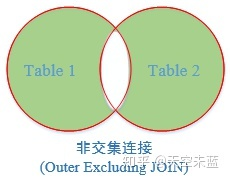

# 第 3 章 关系数据库标准语言——SQL

SQL 是 Structured Query Language 的缩写，中文翻译为"结构化查询语言"。它是一种标准的关系型数据库管理系统（RDBMS）的语言，用于存储、管理和检索数据。尽管它被称为查询语言，但其功能包括数据查询、数据定义、数据操纵和数据控制四部分。

## SQL 的基本概念与特点

### SQL 历史发展

1. 历史悠久的前身阶段（1960-1970）：在关系型数据库之前，主要使用网络和层次数据库管理系统。这个时期的数据库查询语言还要针对特定数据库编写相应的语言，没有标准化的统一语言。

2. 标准化阶段（1970-1986）：关系型数据库得到了广泛的应用，IBM 公司推出了一种被称为 SEQUEL 的数据库语言。后来，SEQUEL 被更名为 SQL，并在 1986 年成为 ISO 的国际标准。

3. 发展阶段（1986-至今）：SQL 成为各种关系型数据库的标准语言，并且被广泛地应用于企业级数据管理系统中。SQL 标准持续发展，并且被越来越多的应用到数据分析和数据科学领域中。

除了标准的 SQL，也有许多针对特定数据库或应用的语言或标准，如 MySQL 的 MySQL Query Language（MySQL 的方言）、Microsoft 的 Transact-SQL（T-SQL）等。

### SQL 的基本概念

1．基本表（Base Table）

一个关系对应一个基本表。基本表是独立存在的表，不是由其他表导出的。一个或多个基本表对应一个存储文件。

2．视图（View）

视图是从一个或几个基本表导出的表，是一个虚表。数据库中只存放视图的定义而不存放视图对 应的数据，这些数据仍存放在导出视图的基本表中。当基本表中的数据发生变化时，从视图查询出来的数据也随之改变。

> **SQL 语句后面的分号？**
>
> 某些数据库系统要求在每条 SQL 命令的末端使用分号。分号是在数据库系统中分隔每条 SQL 语句的标准方法，这样就可以在对服务器的相同请求中执行一条以上的语句。
>
> 如果您使用的是 MS Access 和 SQL Server 2000，则不必在每条 SQL 语句之后使用分号，不过某些数据库软件要求必须使用分号。
>
> **SQL 中的大小写？**
>
> SQL 不区分关键字的大小写。例如，不管写成 SELECT 还是 select，解释都是一样的。表名和列名也是如此。
>
> 虽然可以根据个人喜好选择大写还是小写（或大小写混杂），但为了理解起来更加容易，可以用以下规则来书写 SQL 语句。
>
> - 关键字大写
> - 表名的首字母大写
> - 其余（列名等）小写

## 数据库/表的创建与使用

### 一些重要的 SQL 命令

DDL（Data Definition Language，数据定义语言）用来创建或者删除存储数据用的数据库以及数据库中的表等对象。DDL 包含以下几种指令。

- `CREATE DATABASE`：创建新数据库

- `ALTER DATABASE`：修改数据库

- `CREATE TABLE`：创建新表

- `ALTER TABLE`：变更（改变）数据库表
- `DROP TABLE`：删除表

- `CREATE INDEX`：创建索引（搜索键）
- `DROP INDEX`：删除索引

DML（Data Manipulation Language，数据操纵语言）用来查询或者变更表中的记录。DML 包含以下几种指令。

- `INSERT INTO`：向数据库中插入新数据
- `UPDATE`：更新数据库中的数据
- `SELECT`: 从数据库中提取数据
- `DELETE`：从数据库中删除数据

DCL（Data Control Language，数据控制语言） 用来确认或者取消对数据库中的数据进行的变更。除此之外，还可以对 RDBMS 的用户是否有权限操作数据库中的对象（数据库表等）进行设定。DCL 包含以下几种指令。

- `COMMIT`：确认对数据库中的数据进行的变更
- `ROLLBACK`：取消对数据库中的数据进行的变更
- `GRANT`：赋予用户操作权限
- `REVOKE`：取消用户的操作权限

### 数据类型

在 MySQL 中，有三种主要的类型：文本、数字和日期/时间类型。

Text 类型：

| 数据类型               | 描述                                                                                                                                                                                     |
| :--------------------- | :--------------------------------------------------------------------------------------------------------------------------------------------------------------------------------------- |
| CHAR(_size_)           | 保存固定长度的字符串（可包含字母、数字以及特殊字符）。在括号中指定字符串的长度。最多 255 个字符。                                                                                        |
| VARCHAR(_size_)        | 保存可变长度的字符串（可包含字母、数字以及特殊字符）。在括号中指定字符串的最大长度。最多 255 个字符。注释：如果值的长度大于 255，则被转换为 TEXT 类型。                                  |
| TINYTEXT               | 存放最大长度为 255 个字符的字符串。                                                                                                                                                      |
| TEXT                   | 存放最大长度为 65,535 个字符的字符串。                                                                                                                                                   |
| BLOB                   | 用于 BLOBs (Binary Large OBjects)。存放最多 65,535 字节的数据。                                                                                                                          |
| MEDIUMTEXT             | 存放最大长度为 16,777,215 个字符的字符串。                                                                                                                                               |
| MEDIUMBLOB             | 用于 BLOBs (Binary Large OBjects)。存放最多 16,777,215 字节的数据。                                                                                                                      |
| LONGTEXT               | 存放最大长度为 4,294,967,295 个字符的字符串。                                                                                                                                            |
| LONGBLOB               | 用于 BLOBs (Binary Large OBjects)。存放最多 4,294,967,295 字节的数据。                                                                                                                   |
| ENUM(_x_,_y_,_z_,etc.) | 允许你输入可能值的列表。可以在 ENUM 列表中列出最大 65535 个值。如果列表中不存在插入的值，则插入空值。注释：这些值是按照你输入的顺序存储的。可以按照此格式输入可能的值：ENUM('X','Y','Z') |
| SET                    | 与 ENUM 类似，SET 最多只能包含 64 个列表项，不过 SET 可存储一个以上的值。                                                                                                                |

Number 类型：

| 数据类型            | 描述                                                                                                         |
| :------------------ | :----------------------------------------------------------------------------------------------------------- |
| TINYINT(_size_)     | -128 到 127 常规。0 到 255 无符号\*。在括号中规定最大位数。                                                  |
| SMALLINT(_size_)    | -32768 到 32767 常规。0 到 65535 无符号\*。在括号中规定最大位数。                                            |
| MEDIUMINT(_size_)   | -8388608 到 8388607 普通。0 to 16777215 无符号\*。在括号中规定最大位数。                                     |
| INT(_size_)         | -2147483648 到 2147483647 常规。0 到 4294967295 无符号\*。在括号中规定最大位数。                             |
| BIGINT(_size_)      | -9223372036854775808 到 9223372036854775807 常规。0 到 18446744073709551615 无符号\*。在括号中规定最大位数。 |
| FLOAT(_size_,_d_)   | 带有浮动小数点的小数字。在括号中规定最大位数。在 d 参数中规定小数点右侧的最大位数。                          |
| DOUBLE(_size_,_d_)  | 带有浮动小数点的大数字。在括号中规定最大位数。在 d 参数中规定小数点右侧的最大位数。                          |
| DECIMAL(_size_,_d_) | 作为字符串存储的 DOUBLE 类型，允许固定的小数点。                                                             |

> 这些整数类型拥有额外的选项 UNSIGNED。通常，整数可以是负数或正数。如果添加 UNSIGNED 属性，那么范围将从 0 开始，而不是某个负数。

Date 类型：

| 数据类型    | 描述                                                                                                                                                                                    |
| :---------- | :-------------------------------------------------------------------------------------------------------------------------------------------------------------------------------------- |
| DATE()      | 日期。格式：YYYY-MM-DD 注释：支持的范围是从 '1000-01-01' 到 '9999-12-31'                                                                                                                |
| DATETIME()  | \*日期和时间的组合。格式：YYYY-MM-DD HH:MM:SS 注释：支持的范围是从 '1000-01-01 00:00:00' 到 '9999-12-31 23:59:59'                                                                       |
| TIMESTAMP() | \*时间戳。TIMESTAMP 值使用 Unix 纪元('1970-01-01 00:00:00' UTC) 至今的描述来存储。格式：YYYY-MM-DD HH:MM:SS 注释：支持的范围是从 '1970-01-01 00:00:01' UTC 到 '2038-01-09 03:14:07' UTC |
| TIME()      | 时间。格式：HH:MM:SS 注释：支持的范围是从 '-838:59:59' 到 '838:59:59'                                                                                                                   |
| YEAR()      | 2 位或 4 位格式的年。注释：4 位格式所允许的值：1901 到 2155。2 位格式所允许的值：70 到 69，表示从 1970 到 2069。                                                                        |

> 即便 DATETIME 和 TIMESTAMP 返回相同的格式，它们的工作方式很不同。在 INSERT 或 UPDATE 查询中，TIMESTAMP 自动把自身设置为当前的日期和时间。TIMESTAMP 也接受不同的格式，比如 YYYYMMDDHHMMSS、YYMMDDHHMMSS、YYYYMMDD 或 YYMMDD。

### 示例

```sql
-- 创建数据库
CREATE DATABASE shop;

-- 创建表
CREATE TABLE Product(
    product_id CHAR(4) NOT NULL,
    product_name VARCHAR(100) NOT NULL,
    product_type VARCHAR(32) NOT NULL,
    sale_price INTEGER,
    purchase_price INTEGER,
    regist_date DATE,
    PRIMARY KEY (product_id));
    -- 第 12 行也可以合并到第 6 行：
    -- product_id CHAR(4) PRIMARY KEY NOT NULL
```

该语法清楚地描述了我们要创建一个包含 <列名 1>、<列名 2>、 ……的名称为 <表名> 的表，非常容易理解。每一列的数据类型（后述）是必须要指定的，还要为需要的列设置约束（后述）。约束可以在定义列的时候进行设置，也可以在语句的末尾进行设置。

命名规则上：我们只能使用半角英文字母、数字、下划线（\_）作为数据库、表和列的名称 。例如，不能将 product_id 写成 product-id，因为标准 SQL 并不允许使用连字符作为列名等名称。$、#、? 这样的符号同样不能作为名称使用。

```sql
-- 修改（添加）列
-- DB2 PostgreSQL MySQL
ALTER TABLE Product ADD COLUMN product_name_pinyin VARCHAR(100);
-- Oracle
ALTER TABLE Product ADD (product_name_pinyin VARCHAR2(100));
-- SQL Server
ALTER TABLE Product ADD product_name_pinyin VARCHAR(100);

-- 删除列
-- SQL Server DB2 PostgreSQL MySQL
ALTER TABLE Product DROP COLUMN product_name_pinyin;
-- Oracle
ALTER TABLE Product DROP (product_name_pinyin);

-- 删除表
DROP TABLE Product;
```

插入数据：

```sql
-- SQL Server PostgreSQL
BEGIN TRANSACTION;
-- MySQL
START TRANSACTION;

INSERT INTO Product VALUES('0001', 'T恤衫', '衣服', 1000, 500, '2009-09-20');
INSERT INTO Product VALUES('0002', '打孔器', '办公用品', 500, 320, '2009-09-11');
INSERT INTO Product VALUES('0003', '运动T恤', '衣服', 4000, 2800, NULL);
INSERT INTO Product VALUES('0004', '菜刀', '厨房用具', 3000, 2800, '2009-09-20');
INSERT INTO Product VALUES('0005', '高压锅', '厨房用具', 6800, 5000, '2009-01-15');
INSERT INTO Product VALUES('0006', '叉子', '厨房用具', 500, NULL, '2009-09-20');
INSERT INTO Product VALUES('0007', '擦菜板', '厨房用具', 880, 790, '2008-04-28');
INSERT INTO Product VALUES('0008', '圆珠笔', '办公用品', 100, NULL, '2009-11-11');
COMMIT;
```

### 定义数据表的约束

数据的完整性是指保护数据库中数据的正确性、有效性和相容性，防止错误的数据进入数据库造成无效操作。SQL Server 提供的数据完整性机制主要包括：约束（Constraint）、默认（Default）、规则（Rule）、触发器（Trigger）、存储过程（Stored Procedure）等。本节只介绍约束。

约束是 SQL Server 自动强制数据库完整性的方式，约束定义了列中允许的取值。在 SQL Server 中，对于数据表的约束分为列约束和表约束。其中，列约束是对某一个特定列的约束，包含在列定义中，直接跟在该列的其他定义之后，用空格分隔，不必指定列名；表约束与列定义相互独立，不包括在列定义中，通常用于对多个列一起进行约束，与列定义用“，”分隔，定义表约束时必须指出要约束的列的名称。完整性约束的基本语法格式为：`CONSTRAINT <约束名> (约束类型)`

约束名：约束不指定名称时，系统会给定一个名称。

约束类型：在定义完整性约束时必须指定完整性约束的类型。在 SQL Server 中可以定义 5 种类 型的完整性约束，下面分别加以介绍。

1. **NULL / NOT NULL 约束**

   NULL 值不是 0，也不是空白，更不是填入字符串“NULL”，而是表示“不知道”“不确定”或“没有数据”的意思。当某一字段的值一定要输入值才有意义的时候，则可以设置为 NOT NULL。例如，主键列就不允许出现空值，否则就失去了唯一标识一条记录的作用。

   如：

   ```sql
   CREATE TABLE S(
   	SNo VARCHAR(6) CONSTRAINT S_CONS NOT NULL
   	SN NVARCHAR(10),
       Sex NCHAR(1),
       Age INT,
       Dept NVARCHAR(20));
   ```

   其中，S_CONS 为指定的约束名称（也可以不加约束名称，加是为了更好的维护约束规则）。有了 NOT NULL 约束，在 S 表中录入数据，当 SNo 为空时，系统给出错误信息。无 NOT NULL 约束时，系统缺省为 NULL。

2. **UNIQUE 约束（唯一约束）**

   UNIQUE 约束用于指明基本表在某一列或多个列的组合上的取值必须唯一。定义了 UNIQUE 约束的那些列称为唯一键，系统自动为唯一键建立唯一索引，从而保证了唯一键的唯一性。唯一键允许为空，但系统为保证其唯一性，最多只可以出现一个 NULL 值。

   在建立 UNIQUE 约束时，需要考虑以下几个因素：

   - 使用 UNIQUE 约束的字段允许为 NULL 值。
   - 一个表中可以允许有多个 UNIQUE 约束。
   - 可以把 UNIQUE 约束定义在多个字段上。
   - UNIQUE 约束用于强制在指定字段上创建一个 UNIQUE 索引，缺省为非聚集索引。

   UNIQUE 既可用于列约束，也可用于表约束。

3. **PRIMARY KEY 约束（主键约束）**

   PRIMARY KEY 约束用于定义基本表的主键，起唯一标识作用，**其值不能为 NULL，也不能重复**，以此来保证实体的完整性。

   PRIMARY KEY 与 UNIQUE 约束类似，通过建立唯一索引来保证基本表在主键列取值的唯一性，但它们之间存在着很大的区别。

   - 在一个基本表中只能定义一个 PRIMARY KEY 约束，但可定义多个 UNIQUE 约束。
   - 对于指定为 PRIMARY KEY 的一个列或多个列的组合，其中任何一个列都不能出现 NULL 值，而对于 UNIQUE 所约束的唯一键，则允许为 NULL。
   - 不能为同一个列或一组列，既定义 UNIQUE 约束，又定义 PRIMARY KEY 约束。

4. **FOREIGN KEY 约束（外键约束）**

   FOREIGN KEY 约束指定某一列或几列作为外部键。其中，**包含外部键的表称为从表**，包含外部键所引用的主键或唯一键的表称为主表。系统保证从表在外部键上的取值是主表中某一个主键值或唯一键值，或者取空值，以此保证两表间的参照完整性。

   FOREIGN KEY 既可用于列约束，也可用于表约束，其语法格式为：

   ```sql
   CONSTRAINT (约束名) FOREIGN KEY REFERENCES <主表名>(<列名>[{,<列名>}])
   ```

   如：

   ```sql
   -- 建立一个 SC 表，定义 SNo、CNo 为 SC 的外部键。
   CREATE TABLE SC(
   	SNo VARCHAR(6) NOT NULL CONSTRAINT S_Fore
       	FOREIGN KEY REFERENCES S(SNo),
   	CNo VARCHAR(6) NOT NULL CONSTRAINT C_Fore
       	FOREIGN KEY REFERENCES C(CNo),
   	Score NUMERIC(4,1),
   	CONSTRAINT S_C_Prim PRIMARY KEY(SNo, CNo));
   ```

5. **CHECK 约束**

   CHECK 约束用来检查字段值所允许的范围，如一个字段只能输入整数，而且限定在 0 ～ 100 的整数，以此来保证域的完整性。

   在建立 CHECK 约束时，需要考虑以下几个因素：

   - 一个表中可以定义多个 CHECK 约束。
   - 每个字段只能定义一个 CHECK 约束。
   - 在多个字段上定义的 CHECK 约束必须为表约束。
   - 当执行 INSERT、UPDATE 语句时，CHECK 约束将验证数据。

   CHECK 既可用于列约束，也可用于表约束。

   如：

   ```sql
   -- 建立一个 SC 表，定义 Score 的取值范围为 0～100 之间。
   CREATE TABLE SC(
       SNo VARCHAR(6),
       CNo VARCHAR(6),
       Score NUMERIC(4,1) CONSTRAINT Score_Chk CHECK(Score>=0 AND Score <=100))
   
   -- 建立包含完整性定义的学生表 S。
   CREATE TABLE S(
       SNo VARCHAR(6) CONSTRAINT S_Prim PRIMARY KEY,
       SN NVARCHAR(10) CONSTRAINT SN_Cons NOT NULL,
       Sex NCHAR(1) CONSTRAINT Sex_Cons NOT NULL DEFAULT '男',
       Age INT CONSTRAINT Age_Cons NOT NULL
       	CONSTRAINT Age_Chk CHECK (Age BETWEEN 15 AND 50),
       Dept NVARCHAR(20) CONSTRAINT Dept_Cons NOT NULL));
   ```

### 修改表

1. ADD 方式

   如：

   ```sql
   -- 在 S 表中增加一个班号列和住址列。
   ALTER TABLE S ADD
       Class_No VARCHAR(6),
       Address NVARCHAR(20);
   ```

2. ALTER 方式

   如：

   ```sql
   -- 把 S 表中的 SN 列加宽到 12 个字符。
   ALTER TABLE S ALTER
   	COLUMN SN NVARCHAR(12)
   ```

   注意：使用此方式有如下一些限制：

   - 不能改变列名。
   - 不能将含有空值的列的定义修改为 NOT NULL 约束。
   - 若列中已有数据，则不能减少该列的宽度，也不能改变其数据类型。
   - 只能修改 NULL/NOT NULL 约束，其他类型的约束在修改之前必须先将约束删除，然后再重新添加修改过的约束定义。

3. DROP 方式

   如：

   ```sql
   -- 删除 S 表中的主键。
   ALTER TABLE S DROP
   	CONSTRAINT S_Prim
   ```

## 单关系（表）的数据查询

数据查询是数据库中最常用的操作。SQL 提供 SELECT 语句，通过查询操作可得到所需的信息。

关系（表）的 SELECT 语句的一般格式为：

```sql
SELECT [ALL|DISTINCT][TOP N [PERCENT][WITH TIES]]
	<列名>(AS 别名 1) [{,<列名>(AS 别名 2)}]
	FROM <表名>(AS 表别名)
	[WHERE <检索条件>]
	[GROUP BY <列名 1> [HAVING <条件表达式>]]
	[ORDER BY <列名 2> [ASC|DESC]]
```

查询的结果仍是一个表。SELECT 语句的执行过程是，根据 WHERE 子句的检索条件，从 FROM 子句指定的基本表中选取满足条件的元组，再按照 SELECT 子句中指定的列，投影得到结果表。如果有 GROUP 子句，则将查询结果按照与 `<列名 1>` 相同的值进行分组。如果 GROUP 子句后有 HAVING 短语，则只输出满足 HAVING 条件的元组。如果有 ORDER 子句，查询结果还要按照 ORDER 子句中 `<列名 2>` 的值进行排序。

可以看出，WHERE 子句相当于关系代数中的选取操作，SELECT 子句则相当于投影操作，但 SQL 查询不必规定投影、选取连接的执行顺序，它比关系代数更简单、功能更强大。

### 无条件查询

无条件查询是指只包含 `SELECT ... FROM` 的查询，这种查询最简单，相当于只对关系（表） 进行投影操作。如：

```sql
-- 查询全体学生的姓名、学号和年龄。
SELECT SNo, SN, Age
	FROM S

SELECT * FROM S
-- 用“*”表示 S 表的全部列名，而不必逐一列出。

-- 使用关键字 DISTINCT 能消去重复行：
SELECT DISTINCT SNo FROM SC
```

### 条件查询

当要在表中找出满足某些条件的行时，则需使用 WHERE 子句指定查询条件。WHERE 子句中，条件通常通过三部分来描述：

1. 列名。
2. 比较运算符。
3. 列名、常数。

其中常用的比较运算符：

| 运算符                  | 含义     |
| ----------------------- | -------- |
| =、>、<、>=、<=、!=、<> | 比较大小 |
| AND、OR、NOT            | 多重条件 |
| BETWEEN                 | AND      |
| IN                      | 确定集合 |
| LIKE                    | 字符匹配 |
| IS                      | NULL     |

1. **比较大小**

   如：

   ```sql
   -- 查询选修课程号为 C1 的学生的学号和成绩。
   SELECT SNo,Score FROM SC
   	WHERE CNo = 'C1'
   ```

2. **多重条件查询**

   当 WHERE 子句需要指定一个以上的查询条件时，则需要使用逻辑运算符 AND、OR 和 NOT 将其连接成复合的逻辑表达式。其优先级由高到低为：NOT、AND、OR，用户可以使用括号改变优先级。如：

   ```sql
   -- 查询选修 C1 或 C2 且分数大于等于 85 分学生的学号、课程号和成绩。
   SELECT SNo, CNo, Score FROM SC
   	WHERE (CNo = 'C1' OR CNo = 'C2') AND (Score >= 85)
   ```

3. **确定范围**

   如：

   ```sql
   -- 查询选修 C1 或 C2 且分数大于等于 85 分学生的学号、课程号和成绩。
   SELECT TNo, TN, Prof FROM T
   	WHERE Sal BETWEEN 1000 AND 1500
   -- 等价于：
   SELECT TNo, TN, Prof FROM T
   	WHERE Sal>=1000 AND Sal<=1500

   SELECT TNo, TN, Prof FROM T
   	WHERE Sal NOT BETWEEN 1000 AND 1500
   ```

   > 在 SQL Server 中，`BETWEEN ... AND ...` 的条件包含等号；在有些 DBMS 中，这样的条件不包含等号。

4. **确定集合**

   利用“IN”操作可以查询属性值属于指定集合的元组。

   ```sql
   -- 查询选修 C1 或 C2 的学生的学号、课程号和成绩。
   SELECT SNo, CNo, Score FROM SC
   	WHERE CNo IN('C1'，'C2')
   -- 此语句也可以使用逻辑运算符“OR”实现：
   SELECT SNo, CNo, Score FROM SC
   	WHERE CNo = 'C1' OR CNo = 'C2'

   -- 查询没有选修 C1，也没有选修 C2 的学生的学号、课程号和成绩。
   SELECT SNo, CNo, Score FROM SC
   	WHERE CNo NOT IN('C1'，'C2')
   -- 等价于：
   SELECT SNo, CNo, Score FROM SC
   	WHERE (CNo <> 'C1') AND (CNo <> 'C2')
   ```

5. **部分匹配查询**

   以上各例均属于完全匹配查询，当不知道完全精确的值时，用户还可以使用 LIKE 或 NOT LIKE 进行部分匹配查询（也称模糊查询）。LIKE 定义的一般格式为：

   `<属性名> LIKE <字符串常量>`

   其中，属性名必须为字符型，字符串常量中的字符可以包含通配符，利用这些通配符，可以进行模糊查询。

   字符串中的通配符及其功能：

   | 通配符       | 功能                   | 实例   | 含义                     |
   | ------------ | ---------------------- | ------ | ------------------------ |
   | %            | 代表 0 个或多个字符    | ab%    | 'ab'后可接任意字符串     |
   | \_（下划线） | 代表一个字符           | a_b    | 'a'与'b'之间可有一个字符 |
   | [ ]          | 表示在某一范围的字符   | [0-9]  | 0~9 之间的字符           |
   | [^ ]         | 表示不在某一范围的字符 | [^0-9] | 不在 0~9 之间的字符      |

   如：

   ```sql
   -- 查询所有姓张的教师的教师号和姓名。
   SELECT TNo, TN FROM T
      WHERE TN LIKE '张%'

   -- 查询姓名中第二个汉字是“力”的教师号和姓名。
   SELECT TNo, TN FROM T
      WHERE TN LIKE'_力%'
   ```

6. 空值查询

   某个字段没有值称为具有空值（NULL）。通常没有为一个列输入值时，该列的值就是空值。空值不同于零和空格，它不占任何存储空间。

   如：

   ```sql
   -- 查询没有考试成绩的学生的学号和相应的课程号。
   SELECT SNo, CNo FROM SC
   	WHERE Score IS NULL
   ```

   > 这里的空值条件为 Score IS NULL，不能写成 Score=NULL。

### 常用库函数及统计汇总查询

SQL 提供了许多库函数，增强了基本检索能力。常用的库函数：

| 函数名称 | 功能             |
| -------- | ---------------- |
| AVG      | 按列计算平均值   |
| SUM      | 按列计算值的总和 |
| MAX      | 求一列中的最大值 |
| MIN      | 求一列中的最小值 |
| COUNT    | 按列值统计个数   |

如：

```sql
-- 求学号为 S1 的学生的总分和平均分。
SELECT SUM(Score) AS TotalScore,
	AVG(Score) AS AvgScore
	FROM SC WHERE (SNo = 'S1')
```

查询结果：

| TotalScore | AvgScore |
| ---------- | -------- |
| 175        | 87.5     |

上述查询语句中 AS 后面的 TotalScore 和 AvgScore 是别名，别名会显示在查询结果中，让使用者能清楚地知道查询内容所表示的含义。

> 在使用库函数进行查询时，通常要给查询的每一项内容加别名，否则查询结果中就不显示列名。

如：

```sql
-- 求选修 C1 号课程的最高分、最低分及之间相差的分数。
SELECT MAX(Score) AS MaxScore,
	MIN(Score) AS MinScore,
	MAX(Score)－MIN(Score) AS Diff
	FROM SC WHERE (CNo = 'C1')

-- 求计算机系学生的总数。
SELECT COUNT（SNo）FROM S
	WHERE Dept= '计算机'

-- 求学校中共有多少个系。
SELECT COUNT(DISTINCT Dept) AS DeptNum FROM S

-- 利用特殊函数 COUNT(*)求计算机系学生的总数。
SELECT COUNT(*) FROM S WHERE Dept='计算机'
```

> 加入关键字 `DISTINCT` 后表示消去重复行，可计算字段“Dept”不同值的数目。`COUNT` 函数对空值不计算，但对 0 进行计算。
>
> `COUNT(*)` 用来统计元组的个数，不消除重复行，不允许使用 `DISTINCT` 关键字。

### 分组查询

分组查询 `GROUP BY` 子句可以将查询结果按属性列或属性列组合在行的方向上进行分组，每组在属性列或属性列组合上具有相同的值。

如：

```sql
-- 查询每个教师的教师号及其任课的门数。
SELECT TNo, COUNT(*) AS C_Num
	FROM TC GROUP BY TNo
```

`GROUP BY` 子句按 TNo 的值分组，所有具有相同 TNo 的元组为一组，对每一组使用函数 `COUNT` 进行计算，统计出各位教师任课的门数。查询结果如下：

| TNo | C_Num |
| --- | ----- |
| T1  | 2     |
| T2  | 2     |
| T3  | 2     |
| T4  | 2     |
| T5  | 2     |

若在分组后还要按照一定的条件进行筛选，则需使用 `HAVING` 子句。

如：

```sql
-- 查询选修两门以上（含两门）课程的学生的学号和选课门数。
SELECT SNo, COUNT(*) AS SC_Num -- 新列 SNo、SC_Num
	FROM SC
	GROUP BY SNo -- 按学号分组
	HAVING (COUNT(*) >= 2) -- 条件：计数大于等于2
```

查询结果如下：

| SNo | SC_Num |
| --- | ------ |
| S1  | 2      |
| S2  | 4      |
| S3  | 3      |
| S4  | 3      |

`GROUP BY` 子句按 SNo 的值分组，所有具有相同 SNo 的元组为一组，对每一组使用函数 COUNT 进行计算，统计出每个学生选课的门数。HAVING 子句去掉不满足 COUNT(\*)>=2 的组。

当在一个 SQL 查询中同时使用 `WHERE` 子句，`GROUP BY` 子句和 `HAVING` 子句时，其顺序是 `WHERE`、`GROUP BY`、`HAVING`。`WHERE` 与 `HAVING` 子句的根本区别在于作用对象不同。WHERE 子句作用于基本表或视图，从中选择满足条件的元组；`HAVING` 子句作用于组，选择满足条件的组， 必须用在 `GROUP BY` 子句之后，但 `GROUP BY` 子句可没有 HAVING 子句。

### 查询结果的排序

当需要对查询结果排序时，应该使用 `ORDER BY` 子句，`ORDER BY` 子句必须出现在其他子句之后。排序方式可以指定：`DESC` 为降序，`ASC` 为升序，缺省时为升序。

如：

```sql
-- 查询选修 C1 的学生学号和成绩，并按成绩降序排列。
SELECT SNo, Score FROM SC WHERE (CNo = 'C1')
	ORDER BY Score DESC
```

## 多关系（表）的连接查询

数据库中的各个表中存放着不同的数据，用户往往需要用多个表中的数据来组合、提炼出所需要的信息。如果一个查询需要对多个表进行操作，就称为连接查询。连接查询的结果集或结果表称为表之间的连接。连接查询实际上是通过各个表之间共同列的关联性来查询数据的，数据表之间的联系是通过表的字段值来体现的，这种字段称为连接字段。连接操作的目的就是通过加在连接字段上的条件将多个表连接起来，以便从多个表中查询数据。

当查询同时涉及两个及两个以上的表时，称为连接查询。

多关系（表）的连接查询结构表的连接方法有以下两种：

1. 表之间满足一定条件的行进行连接时，FROM 子句指明进行连接的表名，WHERE 子句指明 连接的列名及其连接条件：

   ```sql
   SELECT [ALL|DISTINCT] [TOP N [PERCENT][WITH TIES]]
   	〈列名〉[AS 别名 1] (，列名2 [AS 别名 2])
   	FROM〈表名 1〉[AS 表 1 别名] (，〈表名 2〉[AS 表 2 别名,...])
   	[WHERE〈检索条件〉]
   	[GROUP BY <列名 1> [HAVING <条件表达式>]]
   	[ORDER BY <列名 2> [ASC|DESC]]
   ```

2. 利用关键字 JOIN 进行连接。

具体的连接方法分为以下几种：

- INNER JOIN（内连接）显示符合条件的记录，此为默认值。
- LEFT（OUTER）JOIN 称为左（外）连接，用于显示符合条件的数据行以及左边表中不符合条件的数据行。此时右边数据行会以 NULL 来显示。
- RIGHT（OUTER）JOIN 称为右（外）连接，用于显示符合条件的数据行以及右边表中不符合条件的数据行。此时左边数据行会以 NULL 来显示。
- FULL（OUTER）JOIN 显示符合条件的数据行以及左边表和右边表中不符合条件的数据行。此时缺乏数据的数据行会以 NULL 来显示。
- CROSS JOIN 将一个表的每一个记录和另一表的每个记录匹配成新的数据行。

当将 JOIN 关键词放于 FROM 子句中时，应有关键词 ON 与之对应，以表明连接的条件。

```sql
SELECT [ALL|DISTINCT][TOP N [PERCENT][WITH TIES]]
	列名 1 [AS 别名 1] (, 列名 2 [ AS 别名 2]...)
	[INTO 新表名]
	FROM 表名 1 [[AS] 表 1 别名]
	[INNER|RIGHT|FULL|OUTER|CROSS] JOIN 表名 2 [[AS] 表 2 别名]
	ON 条件
```

下面介绍几种表的连接操作。

> [SQL 多表查询：SQL JOIN 连接查询各种用法总结 - 知乎 (zhihu.com)](https://zhuanlan.zhihu.com/p/68136613)
>
> ### 写在前面
>
> 在实际应用中，大多的查询都是需要多表连接查询的，但很多初学 SQL 的小伙伴总对各种 JOIN 有些迷糊。回想一下，初期很长一段时间，我常用的似乎也就是等值连接 WHERE 后面加等号，对各种 JOIN 也是不求甚解，今天索性就来个 JOIN 的小总结。
>
> 首先，设定两张表，作为下面例子的操作对象。
>
> 表 1 学生信息表：
>
> 
>
> 表 2 专业班级表：
>
> 
>
> 再来个 SQL JOIN 连接查询各种用法的大合影，先预热一下。
>
> 
>
> ### No.1 【INNER JOIN】内连接
>
> 这是最常用的，获取两个表中指定字段满足匹配关系的记录。
>
> 
>
> 内连接通常有两种情况：
>
> **等值连接：**查找两个表中连接字段相等的记录。
>
> ```sql
> -- 查询每个学生的学号、姓名、籍贯、年龄、专业、班级
> -- 涉及到 student 和 major 两张表，用共有字段“学号”为连接字段
>
> -- 写法1：使用 INNER JOIN
> SELECT A.学号, A.姓名, A.籍贯, A.年龄, B.专业, B.班级
> 	FROM student A
> 	INNER JOIN major B
> 	ON  A.学号=B.学号
>
> -- 写法2：省去了 INNER，直接写 JOIN，与 INNER JOIN 没有区别
> SELECT A.学号, A.姓名, A.籍贯, A.年龄, B.专业, B.班级
>     FROM student A
>     JOIN major B
>     ON A.学号=B.学号
>
> -- 写法3：使用 WHERE，已经逐渐被淘汰
> SELECT A.学号, A.姓名, A.籍贯, A.年龄, B.专业, B.班级
>     FROM student A, major B
>     WHERE A.学号 = B.学号
>
> -- 上面三种写法的结果都是一样的，推荐使用写法2
> ```
>
> 
>
> **自身连接：**就是和自己进行连接查询，给一张表取两个不同的别名，然后附上连接条件。
>
> ```sql
> -- 要在学生表里查询与 HH 同龄且籍贯也相同的学生信息
>
> SELECT B.学号, B.姓名, B.性别, B.籍贯, B.年龄
>     FROM student A
>     JOIN student B
>     ON A.年龄=B.年龄 AND A.籍贯=B.籍贯 AND A.姓名='HH'
> ```
>
> 
>
> ### No.2 【LEFT JOIN】左连接
>
> 获取左表中的所有记录，即使在右表没有对应匹配的记录。
>
> 
>
> ```sql
> -- 左连接：显示左表student所有记录，如右表中没有与之
> -- 匹配的项则以NULL值代替。
>
> SELECT A.学号, A.姓名, A.籍贯, A.年龄, B.专业, B.班级
>     FROM student A LEFT JOIN major B
>     ON  A.学号 = B.学号
> ```
>
> 
>
> ### No.3 【RIGHT JOIN】右连接
>
> 用于获取右表中的所有记录，即使左表没有对应匹配的记录。
>
> 
>
> ```sql
> -- 右连接：显示右表 major 所有记录，如左表中没有与之
> -- 匹配的项则以NULL值代替。
>
> SELECT A.学号, A.姓名, A.籍贯, A.年龄, B.专业, B.班级
>     FROM student A RIGHT JOIN major B
>     ON A.学号=B.学号
> ```
>
> 
>
> ### No.4 【FULL JOIN】 完全连接
>
> 返回两个表中的所有行。
>
> 
>
> ```sql
> -- 完全连接：显示两张表的并集，如果其中一张表的记录
> -- 在另一张表中没有匹配的行，则对应的数据项填充NULL
>
> SELECT A.学号, A.姓名, A.籍贯, A.年龄, B.专业, B.班级
>     FROM student A FULL JOIN major B
>     ON  A.学号=B.学号
> ```
>
> 
>
> ### No.5 【CROSS JOIN】交叉连接
>
> 结果是笛卡尔积，就是第一个表的行数乘以第二个表的行数。
>
> 
>
> ```sql
> -- 交叉连接：一张表中的数据依次取出分别与另一张表中的
> -- 每条数据挨个组合，最后记录数量为两张表记录数的乘积
>
> SELECT * FROM student CROSS JOIN major
>
> -- 本例student和major都为7条记录，所以结果为7*7=49条记录
> ```
>
> 
>
> ### No.6 延伸【Left Excluding JOIN】左表唯一
>
> 返回左表有但右表没有关联数据的记录。
>
> 
>
> ```sql
> -- 左表唯一：将右表B以及两张表交集的部分过滤掉，
> -- 得到的记录是左表中唯一存在的。
>
> SELECT A.学号, A.姓名, A.籍贯, A.年龄, B.专业, B.班级
>     FROM student A LEFT JOIN major B
>     ON A.学号 = B.学号
>     WHERE B.学号 IS NULL
> ```
>
> 
>
> ### No.7 延伸【Right Excluding JOIN】右表唯一
>
> 返回右表有但左表没有关联数据的记录。
>
> 
>
> ```sql
> -- 右表唯一：将左表A以及两张表交集的部分过滤掉，
> -- 得到的记录是右表中唯一存在的。
>
> SELECT A.学号, A.姓名, A.籍贯, A.年龄, B.专业, B.班级
>     FROM student A RIGHT JOIN major B
>     ON A.学号=B.学号
>     WHERE A.学号 IS NULL
> ```
>
> 
>
> ### No.8 延伸【Outer Excluding JOIN】非交集连接
>
> 返回左表和右表里没有相互关联的记录。
>
> 
>
> ```sql
> -- 非交集连接：查找两张表中没有关联的记录项。
>
> SELECT A.学号, A.姓名, A.籍贯, A.年龄, B.专业, B.班级
>     FROM student A FULL JOIN major B
>     ON A.学号=B.学号
>     WHERE A.学号 IS NULL OR B.学号 IS NULL
> ```
>
> 
>
> ### 最后
>
> 谈及 SQL 里的各种 JOIN 之间的区别时，被广为引用的是 CodeProject 上 C.L. Moffatt 的文章, 本文也有所参考，感兴趣的小伙伴可以去看一下。
>
> [https://www.codeproject.com/Articles/33052/Visual-Representation-of-SQL-Joins](https://link.zhihu.com/?target=https%3A//www.codeproject.com/Articles/33052/Visual-Representation-of-SQL-Joins)

## 子查询

在 WHERE 子句中包含一个形如 SELECT-FROM-WHERE 的查询块，此查询块称为子查询或嵌套查询，包含子查询的语句称为父查询或外部查询。嵌套查询可以将一系列简单查询构成复杂查询，增强查询能力。子查询的嵌套层次最多可达到 255 层，以层层嵌套的方式构造查询，充分体现了 SQL“结构化”的特点。

嵌套查询在执行时由里向外处理，每个子查询是在上一级外部查询处理之前完成的，父查询要用到子查询的结果。

### 普通子查询

普通子查询的执行顺序是：首先执行子查询，然后把子查询的结果作为父查询的查询条件的值。普通子查询只执行一次，而父查询所涉及的所有记录行都与其查询结果进行比较以确定查询结果集合。

当子查询的返回值只有一个时，可以使用比较运算符（=、 >、 <、 >=、 <=、 !=）将父查询和子查询连接起来。如：

```sql
-- 查询与“刘伟”老师职称相同的教师号、姓名。
SELECT TNo,TN FROM T
	WHERE Prof= (SELECT Prof FROM T WHERE TN='刘伟')

-- 查询结果：
-- TNo TN
-- T2 王平
-- T3 刘伟
```

如果子查询的返回值不止一个，而是一个集合时，则不能直接使用比较运算符，可以在比较运算符和子查询之间插入 ANY 或 ALL。其具体含义详见以下各例。

（1）使用 ANY。

```sql
-- 查询讲授课程号为 C5 的教师姓名。
SELECT TN FROM T
	WHERE (TNo = ANY(SELECT TNo FROM TC WHERE CNo = 'C5') )
```

先执行子查询，找到讲授课程号为 C5 的教师号，教师号为一组值构成的集合(T2,T3,T5)；再执行父查询。其中 ANY 的含义为任意一个，查询教师号为 T2、T3、T5 的教师的姓名。查询结果如下：

| TN   |
| ---- |
| 王平 |
| 刘伟 |
| 张兰 |

该例也可以使用前面所讲的连接操作来实现：

```sql
SELECT T.TN FROM T,TC
	WHERE T.TNo = TC.TNo AND TC.CNo= 'C5'
```

可见，对于同一查询，可使用子查询和连接查询两种方法来解决，读者可根据习惯任意选用。

又如：

```sql
-- 查询其他系中比计算机系某一教师工资高的教师的姓名和工资。
SELECT TN, Sal FROM T
	WHERE (Sal > ANY(SELECT Sal FROM T WHERE Dept = ' 计算机'))
	AND (Dept <> '计算机') -- <> 代表不等于
```

先执行子查询，找到计算机系中所有教师的工资集合（1500，900）；再执行父查询，查询所有不是计算机系且工资高于 900 元的教师姓名和工资。

查询结果如下：

| TN   | Sal  |
| ---- | ---- |
| 张雪 | 1600 |
| 张兰 | 1300 |

此查询也可以写成：

```sql
SELECT TN, Sal FROM T
	WHERE Sal > (SELECT MIN(Sal) FROM T WHERE Dept = '计算机')
	AND Dept <> '计算机'
```

先执行子查询，利用库函数 MIN 找到计算机系中所有教师的最低工资 900 元；再执行父查询，查询所有不是计算机系且工资高于 900 元的教师。

（2）使用 IN。可以使用 IN 代替“=ANY”。

```sql
-- 查询讲授课程号为 C5 的教师姓名（使用 IN）。
SELECT TN FROM T
	WHERE (TNo IN (SELECT TNo FROM TC WHERE CNo = 'C5'))
```

（3）使用 ALL。ALL 的含义为全部。

如：

```sql
-- 查询其他系中比计算机系所有教师工资都高的教师的姓名和工资。
SELECT TN, Sal FROM T
	WHERE (Sal > ALL(SELECT Sal FROM T WHERE Dept='计算机') )
	AND (Dept <> '计算机')
```

子查询找到计算机系中所有教师的工资集合(1500，900)，父查询找到所有不是计算机系且工资高于 1500 的教师姓名和工资。

此查询也可以写成：

```sql
SELECT TN, Sal FROM T
	WHERE (Sal > (SELECT MAX(Sal) FROM T WHERE Dept = '计算机'))
	AND (Dept <> '计算机')
```

### 相关子查询

有时子查询的查询条件需要引用父查询表中的属性值，我们把这类查询称为相关子查询。相关子查询的执行顺序是：首先选取父查询表中的第一行记录，内部的子查询利用此行中相关的属性值进行查询，然后父查询根据子查询返回的结果判断此行是否满足查询条件。如果满足条件，则把该行放入父查询的查询结果集合中。重复执行这一过程，直到处理完父查询表中的每一行数据。

如：

```sql
-- 查询不讲授课程号为 C5 的教师姓名。
SELECT DISTINCT TN FROM T
	WHERE ('C5' <> ALL(SELECT CNo FROM TC WHERE TNo = T.TNo))
-- <> ALL 的含义为不等于子查询结果中的任何一个值。也可使用 NOT IN 代替。
```

此外，使用 EXISTS 也可以进行相关子查询。EXISTS 是表示存在的量词，带有 EXISTS 的子查询不返回任何实际数据，它只得到逻辑值“真”或“假”。当子查询的查询结果集合为非空时，外层的 WHERE 子句返回真值，否则返回假值。NOT EXISTS 与此相反。

```sql
SELECT TN FROM T
	WHERE EXISTS
	(SELECT * FROM TC WHERE TNo = T.TNo AND CNo = 'C5')
```

当子查询 TC 表存在一行记录满足其 WHERE 子句中的条件时，父查询便得到一个 TN 值，重复执行以上过程，直到得出最后结果。
