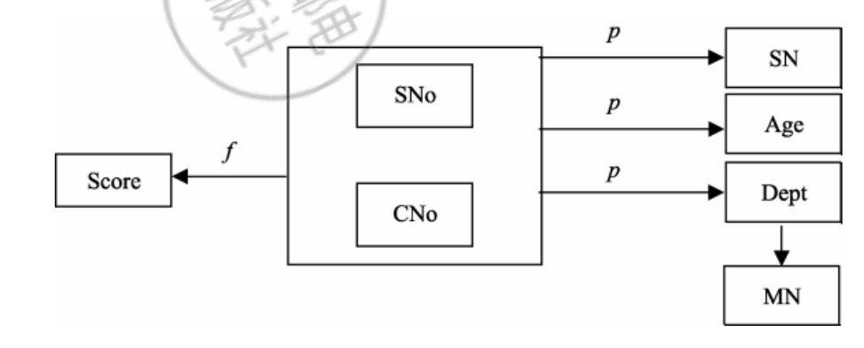
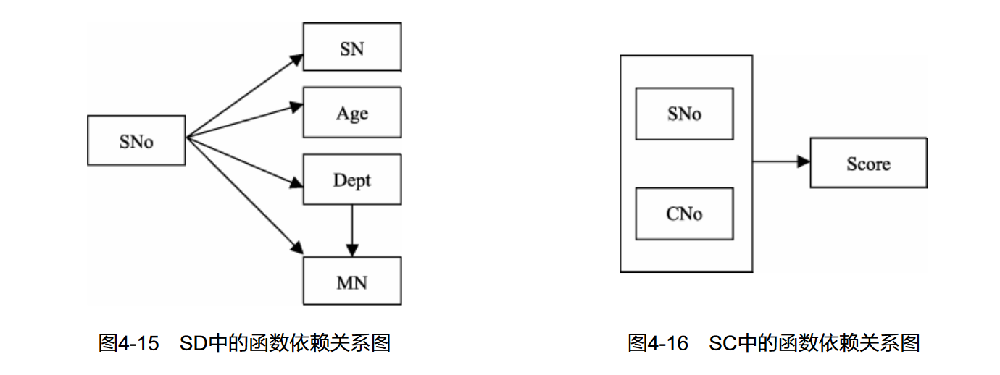
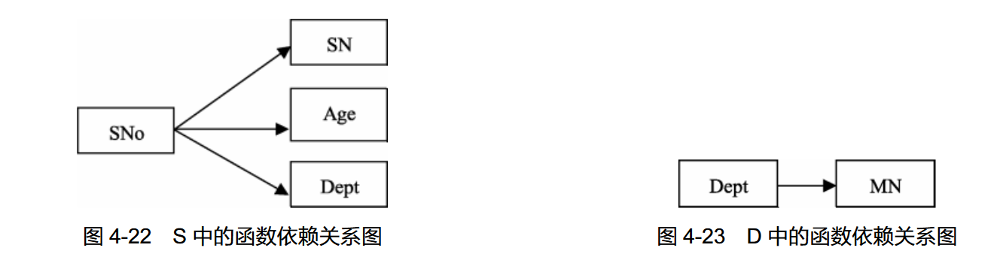

前面已经讲述了关系数据库、关系模型的基本概念以及关系数据库的标准语言。如何使用关系模型设计关系数据库，也就是面对一个现实问题，如何选择一个比较好的关系模式的集合，每个关系又应该由哪些属性组成，这属于数据库设计的问题，确切地讲是数据库逻辑设计的问题。

设计关系数据库的步骤：

- 需求分析（现实世界用户需求）
- 概念设计（如画 E-R 图，设计实体与实体关系、属性）
- 逻辑设计（实体转化为对应表）
- 物理设计（考虑索引，并转换为 SQL 语句）

规范化是在逻辑设计这个阶段提出的。

## 规范化问题的提出

关系数据库的规范化理论主要包括三个方面的内容：**函数依赖**、**范式（Normal Form）**和**模式设计**。其中函数依赖起着核心的作用，是模式分解和模式设计的基础，范式是模式分解的标准。

- 针对具体问题，应该如何构造一个适合于它的数据库模式，即应该构造几个关系模式，每个关系由哪些属性组成等。
- 人们以关系模型为背景讨论这个问题，形成了数据库逻辑设计的工具——关系数据库的规范化理论。

如：要求设计教学管理数据库，其关系模式 SCD 如下：

$$
SCD(SNo,SN,Age,Dept,MN,CNo,Score)
$$

其中，SNo 表示学生学号，SN 表示学生姓名，Age 表示学生年龄，Dept 表示学生所在的系别，MN 表示系主任姓名，CNo 表示课程号，Score 表示成绩。

根据实际情况，SCD 的这些数据具有如下语义规定：

1. 一个系有若干名学生，但一名学生只属于一个系；
2. 一个系只有一名系主任，但一名系主任可以同时兼几个系的系主任；
3. 一名学生可以选修多门功课，每门课程可被若干名学生选修；
4. 每名学生学习的课程有一个成绩，但不一定立即给出。

在此关系模式中填入一部分具体的数据，则可得到 SCD 关系模式的实例，即一个教学管理数据库。

根据上述的语义规定分析以上教学管理数据库，可以看出，（SNo，CNo）属性的组合能唯一标识一个元组，即可以通过（SNo，CNo）的取值分辨不同学生记录，所以（SNo，CNo）是该关系模式的主码。若使用上述数据库建立教学管理信息系统，则会出现以下几方面的问题：

1. **数据冗余**。每个系名和系主任名字的存储次数等于该系学生人数乘以每个学生选修的课程门数，同时学生的姓名、年龄也都要重复存储多次，数据的冗余度很大，浪费了存储空间。尽管很多时候有冗余反而在查询方面带来一些好处。
2. **插入异常**。如果某个新系没有招生，尚无学生时，则系名和系主任的信息无法插入到数据库中。因为在这个关系模式中，（SNo，CNo）是主码。根据关系的实体完整性约束，任何记录的主码的值不能为空，由于该系没有学生，SNo 和 CNo 均无值，因此不能进行插入操作。另外，当某个学生尚未选课，同样也不能进行插入操作，主要原因是 CNo 未知，实体完整性约束还规定，主码的值不能部分为空。
3. **删除异常**。当某系学生全部毕业而没有招生时，要删除全部学生的记录，这时系名、系主任也随之删除，而现实中这个系可能依然存在，但在数据库中却无法找到该系的信息。另外，如果某个学生不再选修 C1 课程，本应该只删去 C1，但 C1 是主码的一部分，为保证实体完整性，必须将整个元组一起删掉，这样，元组中有关该学生的其他信息也随之丢失。
4. **更新异常**。如果某学生改名，则该学生的所有记录都要逐一修改 SN 的值；又如某系更换系主任，则属于该系的学生记录都要修改 MN 的内容，稍有不慎，就有可能漏改某些记录，这就会造成数据的不一致性，破坏了数据的完整性。

由于存在以上问题，可以说，SCD 是一个不好的关系模式。产生上述问题的原因，直观地说，是因为关系中“包罗万象”，内容过于全面。我们一般把原来的关系模式 SCD 称为泛模式，泛模式用一个大表存放所有的数据。

优化后，我们把关系模式 SCD 分解为学生关系 S（SNo， SN，Age，Dept）、选课关系 SC（SNo，CNo，Score）和系关系 D（Dept，MN）三个结构简单的关系模式。

经过上述分析，我们说分解后的关系模式是一个规范的关系数据库模式。从而得出结论，一个规范的关系模式应该具备以下四个条件：

1. 尽可能少的数据冗余。
2. 没有插入异常。
3. 没有删除异常。
4. 没有更新异常。

按照一定的规范设计关系模式，将结构复杂的关系分解成结构简单的关系，从而把不规范的关系数据库模式转变为规范的关系数据库模式，这就是关系的规范化。

> 关系模式是一个五元组：
>
> $$
> R(U,D,\text{DOM},F)
> $$
>
> - 关系名 R 是符号化的元组语义
> - U 为一组属性
> - D 为 U 中的属性所来自的域
> - DOM 为属性到域的映射
> - F 为 U 上的一组数据依赖

## 函数依赖

关系模式中的各属性之间相互依赖、相互制约的联系称为数据依赖。数据依赖一般分为函数依赖和多值依赖。其中函数依赖是最重要的数据依赖。

函数依赖（Functional Dependency，FD）是关系模式中属性之间的一种逻辑依赖关系。例如，在上一节的关系模式 SCD 中，SNo 与 SN、Age 和 Dept 之间都有一种逻辑依赖关系。

由于一个 SNo 只 对应一个学生，而一个学生只能属于一个系，因此当 SNo 的值确定之后，该学生的 SN、Age、Dept 的值也随之被唯一地确定了。这类似于变量之间的单值函数关系。设单值函数 $Y=F(X)$，自变量 X 的值可以决定唯一的函数值 Y。同理，我们可以说 SNo 的值唯一地决定函数（SN，Age，Dept）的值，或者说（SN，Age，Dept）函数依赖于 SNo。

> 设关系模式 R（U，F），U 是属性全集，F 是由 U 上函数依赖所构成的集合，X 和 Y 是 U 的子集，如果对于 R（U）的任意一个可能的关系 r，对于 X 的每一个具体值，Y 都有唯一的具体值与之对应，则称 X 决定函数 Y，或 Y 函数依赖于 X，记作 $X→Y$。我们称 X 为决定因素，Y 为依赖因素。当 Y 不函数依赖于 X 时，记作：$X→Y$（有个斜划线打不出来，读者知道就好）。当 $X→Y$ 且 $Y→X$ 时，则记作：$X ↔ Y$。

使用这个定义关系模式 SCD 中属性全集 U 和函数依赖集 F：

$$
U=\{SNo，SN，Age，Dept，MN，CNo，Score\} \\
F=\{SNo→SN，SNo→Age，SNo→Dept，(SNo，CNo) →Score\}
$$

有关函数依赖有以下几点需要说明。

1. **唯一性**

   对于定义 “如果对于 $R(U)$ 的任意一个可能的关系 r，对于 X 的每一个具体值，Y 都有唯一的具体值与之对应”，其含义是，对于 r 的任意两个元组 t1 和 t2，只要 $t1[X]=t2[X]$，就有 $t1[Y]=t2[Y]$。

2. **平凡的函数依赖与非平凡的函数依赖**

   当属性集 Y 是属性集 X 的子集（即 $Y ⊆ X$）时，则必然存在着函数依赖 $X→Y$，这种类型的函数依赖称为平凡的函数依赖，如当 $(SNo,SN,Age)$ 唯一确定的时候，它的任意子属性集合$(SNo, Age)$ 必然唯一确定。

   如果 Y 不是 X 的子集，则称 $X→Y$ 为非平凡的函数依赖。**平凡的函数依赖并没有实际意义**，若不特别声明，我们讨论的都是非平凡的函数依赖，非平凡的函数依赖才和 “真正的” 完整性约束条件相关。

3. **部分依赖（P）和完全依赖（F）**

   部分依赖指的是某个非主属性依赖于部分而不是整个候选键，而完全依赖表示非主属性完全依赖于整个候选键。

   如：$SNo→SN$ 就是部分依赖，学生学号（SNo）部分依赖于学生姓名（SN），因为一个学生可能有多个姓名，而学号却保持不变。

   但 $(SNo, CNo)→Score$ 是完全依赖，学生学号（SNo）和课程号（CNo）完全依赖于成绩（Score），因为给定学生和课程的组合，成绩是唯一确定的。如果移除任何一个属性（SNo 或 CNo），就无法确定对应的成绩。

4. **传递函数依赖**

   传递函数依赖是指当存在函数依赖 $A→B$ 和 $B→C$ 时，可以推导出 $A→C$ 的情况。换句话说，如果通过中间属性 B 能够推导出 A 依赖于 C，那么就存在传递函数依赖。

   如 $Sno→Sdept$，$Sdept→Mname$，可以推出 Mname 传递函数依赖于 Sno。

5. **函数依赖与属性之间的联系类型有关**

   - 在一个关系模式中，如果属性 X 与 Y 有 1∶1 联系时，则存在函数依赖 X→Y，Y→X，即 $X ↔ Y$。例如，当学生无重名时，$SNo ↔ SN$。
   - 如果属性 X 与 Y 有 m∶1 的联系时，则只存在函数依赖 X→Y。例如，SNo 与 Age、Dept 之间均为 m∶1 联系，所以有 $SNo→Age$，$SNo→Dept$。
   - 如果属性 X 与 Y 有 m∶n 的联系时，则 X 与 Y 之间不存在任何函数依赖关系。

   由于函数依赖与属性之间的联系类型有关，因此在确定属性间的函数依赖关系时，可以从分析属性间的联系类型入手，便可确定属性间的函数依赖。

### 函数依赖的逻辑蕴涵定义

假设已知关系模式 $R(X, Y, Z)$ 有 $X→Y$，$Y→Z$，问 $X→Z$ 是否成立？能否从已知的函数依赖推导出 $XY→YZ$？

设 F 是在关系模式 $R(U)$ 上成立的函数依赖集合，X，Y 是属性集 U 的子集，$X→Y$ 是一个函数依赖。如果从 F 中能够推导出 X→Y，即如果对于 R 的每个满足 F 的关系 r 也满足 $X→Y$，则称 X→Y 为 F 的逻辑蕴涵（或 F 逻辑蕴涵 X→Y），记为 $F|=X→Y$。

### 函数依赖的推理规则及正确性

从已知的函数依赖，可以推导出另外一些新的函数依赖，这就需要一系列推理规则，函数依赖的推理规则最早出现在 1974 年 W.W.Armstrong 的论文里，这些规则常被称为“Armstrong 公理”（即阿氏公理），下面的推理规则是其他人于 1977 年对阿氏公理体系改进后的形式。

设有关系模式 $R(U)$，U 是关系模式 R 的属性集，F 是 R 上成立的只涉及 U 中属性的函数依赖集。X，Y，Z，W 均是 U 的子集，r 是 R 的一个实例。函数依赖的推理规则如下。

#### Armstrong 公理及正确性

1. **A1：自反律（Reflexivity）**

   如果 $Y ⊆ X ⊆ U$，则 $X→Y$ 在 R 上成立。即一组属性函数决定它的所有子集。

   > 证明：因为 $Y ⊆ X$，若 r 中存在两个元组在 X 上的值相等，那么 X 的子集 Y 其值也必然相等。前 面所提到的平凡的函数依赖就可根据自反律推出。

   例如，在关系 SCD 中，$(SNo, CNo)→SNo$ 和 $(SNo, CNo)→CNo$。

2. **A2：增广律（Augmentation）**

   若 $X→Y$ 在 R 上成立，且 $Z ⊆ U$，则 $XZ→YZ$ 在 R 上也成立。

   证明：用反证法。

   > 假设 r 中存在
   >
   > 两个元组 t1 和 t2 违反 $XZ→YZ$，即 $t1[XZ]=t2[XZ]$，但 $t1[YZ]≠t2[YZ]$。
   >
   > 从 $t1[YZ]≠t2[YZ]$ 可知，$t1[Y]≠t2[Y]$ 或 $t1[Z]≠t2[Z]$。
   >
   > 如果 $t1[Y]≠t2[Y]$，则与已知的 $X→Y$ 相矛盾；如果 $t1[Z]≠t2[Z]$，则与假设的 $t1[XZ]=t2[XZ]$ 相矛盾。 因此，假设不成立，从而得出增广律是正确的。

   例如：在关系 SCD 中，$SNo→Age$，则 $(SNo, SN)→(Age,SN)$。

3. **A3：传递律（Transitivity）**

   若 $X→Y$ 和 $Y→Z$ 在 R 上成立，则 $X→Z$ 在 R 上也成立。

   > 证明：用反证法。 假设 r 中存在两个元组 t1 和 t2 违反 $X→Z$，即 $t1[X]=t2[X]$，但 $t1[Z]≠t2[Z]$。
   >
   > 在上述假设下，$t1[Y]≠t2[Y]$ 或 $t1[Y]=t2[Y]$。
   >
   > 如果 t1[Y]≠t2[Y]，则与已知的 $X→Y$ 相矛盾；如果 $t1[Y]=t2[Y]$，则与已知的 $Y→Z$ 相矛盾。
   >
   > 因此，假设不成立，从而得出传递律是正确的。

   例如：在关系 SCD 中，$SNo→Dept$，$Dept→MN$，则 $SNo→MN$。

#### Armstrong 公理推论及正确性

1. **合并律（Union rule）**

   若 X→Y 和 X→Z 在 R 上成立，则 X→YZ 在 R 上也成立。

   > 证明：对已知的 $X→Y$，根据增广律，两边用 X 扩充，得到 $X→XY$。
   >
   > 对已知的 $X→Z$，根据增广律，两边用 Y 进行扩充，得到 $XY→YZ$。
   >
   > 对 $X→XY$ 和 $XY→YZ$，根据传递律，得到 $X→YZ$。

   例如，在关系 SCD 中，$SNo→(SN, Age)$，$SNo→(Dept, MN)$，则有 $SNo→(SN, Age, Dept, MN)$。

2. **伪传递律（Pseudotransitivity rule）**

   若 $X→Y$ 和 $YW→Z$ 在 R 上成立，则 $XW→Z$ 在 R 上也成立。

   > 证明：对已知的 $X→Y$，根据增广律，两边用 W 扩充，得到 $XW→YW$。 对 $XW→YW$ 和已知的 $YW→Z$，根据传递律，得到 $XW→Z$。

   例如，在 SCD 中，$SNo→SNo$，$(SNo, CNo)→Score$，则 $(SNo, CNo)→Score$。

3. **分解律（Decomposition rule）**

   若 $X→Y$ 和 $Z ⊆ Y$ 在 R 上成立，则 $X→Z$ 在 R 上也成立。

   > 证明：对已知的 $Z ⊆ Y$，根据自反律，得到 $Y→Z$；对已知的 $X→Y$ 和 $Y→Z$，再根据传递律，得到 $X→Z$。

   很显然，分解律和合并律互为逆过程。

   例如：在 SCD 中，$(SNo→(SN, Sex, Age)) ↔ (SNo→SN, SNo→Sex, SNo→Age)$。

4. **复合律（Composition）**

   若 $X→Y$ 和 $W→Z$ 在 R 上成立，则 $XW→YZ$ 在 R 上也成立。

   > 证明：对已知的 $X→Y$，根据增广律，两边用 W 扩充，得到 $XW→YW$。
   >
   > 对已知的 $W→Z$，根据增广律，两边用 Y 扩充，得到 $YW→YZ$。
   >
   > 对 $XW→YW$ 和 $YW→YZ$，根据传递律，得到 $XW→YZ$。

   例如，在 SCD 中，$SNo→(SN,Age)$，$Dept→MN$，则有 $(SNo,Dept)→(SN,Age,MN)$。

### 闭包

设 F 是函数依赖集，被 F 逻辑蕴涵的全部函数依赖集合，称为函数依赖集 F 的闭包 （Closure），记为 $F^+$。即：

$$
F^+=\{ X→Y\ |\ F|=X→Y\}
$$

求闭包（原理是 Armstrong 定理）：

1. 看左边，找右边（由左边子元素可以直接推出）
2. 右边迁到左边，继续看左边找右边，直到寻找结束

求码：通过指定属性求出闭包为 U（全体）就算是码。但已知的关系式中只在左边的属性（推导属性）通常是码的组成部分之一（只能主动推导别人，不能被别人推导）；反过来说，只在右边出现的属性（被推导属性）通常不会是码的组成部分之一。

## 码

在关系数据库中，码（Key）是用于唯一标识关系中元组的属性或属性组合。它在关系模型中起着至关重要的作用，用于确保关系的唯一性和识别性。

主属性（Primary Attribute）：主属性是与主码直接关联的属性。主属性的取值在关系中必须是唯一的，与主码的取值一一对应。一个关系可以有多个主属性，每个主属性都直接依赖于主码。

有几种类型的码可以在关系数据库中使用：

1. **候选码（Candidate Key）**：候选码是能够唯一标识关系中元组的最小属性组合。换句话说，候选码是没有冗余属性的最小超键。一个关系可以有多个候选码，其中任意一个候选码都可以成为主码（Primary Key）。
2. **主码（Primary Key）**：主码是从候选码中选择的一个，用于唯一标识关系中的每个元组。主码必须是候选码，且不能包含重复或空值。
3. **外码（Foreign Key）**：外码是关系中的属性（或属性组合），它引用了另一个关系中的主码。外码用于建立关系之间的联系，实现关系数据库的关联性。外码的值必须与其所引用的主码值相匹配，或者为 NULL。
4. **全码（Full Key）**：全码是指能够唯一标识关系中每个元组的属性或属性组合。换句话说，全码是关系中没有冗余属性的超键，它可以唯一地识别关系中的每个元组。在一个关系中，可能存在多个全码。

全码或主码可以用下划线或者加粗等方式来标识，以示其在关系中的重要性和特殊性。

## 关系模式的范式

在关系模式的分解中，函数依赖起着重要的作用，那么分解以后模式的好坏，用什么标准衡量？这个标准就是模式的范式（Normal Forms，NF）。

关系模式规范化的基本思想是消除关系模式中的数据冗余，消除数据依赖中的不合适的部分，解决数据插入、删除时发生的异常现象。这就要求关系模式要满足一定的条件。把关系模式规范化过程中为不同程度的规范化要求设立的不同标准称为范式。由于规范化的程度不同，就产生了不同的范式。

各个范式之间的联系可以表示为：$5NF ⊂ 4NF ⊂ BCNF ⊂ 3NF ⊂ 2NF ⊂ 1NF$

### 第一范式

第一范式（First Normal Form）是最基本的规范形式，即关系中每个属性都是不可再分的原子项。

如果关系模式 R 所有的属性均为原子属性，即每个属性都是不可再分的，则称 R 属于第一范式，简称 1NF，记作 $R∈1NF$。1NF 是关系模式应具备的最起码的条件。在非规范化的关系中去掉组合项就能转化成规范化的关系。

然而，一个关系模式仅仅属于第一范式是不够的。在上面中给出的关系模式 SCD 属于第一范式，但它具有大量的数据冗余，存在插入异常、删除异常和更新异常等弊端。为什么会存在这种问题呢？让我们分析一下 SCD 中的函数依赖关系，它的码是（SNo，CNo）的属性组合，所以有：

$$
(SNo, CNo)\overset{f}{\rightarrow} Score \\
SNo→SN,(SNo,CNo) \overset{p}{\rightarrow} SN \\
SNo→Age,(SNo,CNo) \overset{p}{\rightarrow} Age \\
SNo→Dept,(SNo,CNo) \overset{p}{\rightarrow} Dept \\
Dept→MN，SNo \overset{t}{\rightarrow} MN
$$

函数依赖关系：

### 第二范式

如果关系模式 $R∈1NF$，且每个非主属性都完全函数依赖于 R 的主码，则称 R 属于第二范式（Second Normal Form），简称 2NF，记作 $R∈2NF$。如果数据库模式中每个关系模式都是 2NF，则这个数据库模式称为 2NF 的数据库模式。

在关系模式 SCD 中，SNo、CNo 为主属性，Age、Dept、SN、MN 和 Score 均为非主属性，经上述分析，存在非主属性对主码的部分函数依赖，所以 $SCD ∉ 2NF$。而如图 4-2 所示的由 SCD 分解的三个关系模式 S、D 和 SC 中，S 的码为 SNo；D 的码为 Dept，它们都是单属性，不可能存在部分函数依赖。而对于 SC，$(SNo,CNo) \overset{f}{\rightarrow} Score$。所以 SCD 分解后，消除了非主属性对主码的部分函数依赖，S、D 和 SC 均属于 2NF。

由 $SNo→SN$，$SNo→Age$，$SNo→Dept$，$SNo→MN$，$(SNo,CNo) \overset{f}{\rightarrow} Score$，可以判断，关系 SCD 至少描述了两个实体，一个为学生实体，属性有 SNo、SN、Age、Dept 和 MN；另一个是学生 与课程的选课联系，属性有 SNo、CNo 和 Score。根据分解的原则，可以将 SCD 分解成如下两个关系：

1NF 的关系模式经过投影分解转换成 2NF 后，消除了一些数据冗余。分析图中 SD 和 SC 中的数据，可以看出，它们存储的冗余度比关系模式 SCD 有了较大幅度的降低，但仍然存在一些问题：

- 数据冗余。如每个系名和系主任的名字存储的次数等于该系的学生人数。

- 插入异常。如当一个新系没有招生时，有关该系的信息无法插入。
- 删除异常。如某系学生全部毕业而没有招生时，删除全部学生的记录也随之删除了该系的有关信息。
- 更新异常。如更换系主任时，仍需改动较多的学生记录。

为此，对关系模式 SD 还需进一步简化，消除这种传递函数依赖，这样就得到了 3NF。

### 第三范式

如果关系模式 $R∈2NF$，且每个非主属性都不传递函数依赖于 R 的主码，则称 R 属于第三范式（Third Normal Form），简称 3NF，记作 $R∈3NF$。

在 SD 中，主码为 SNo，非主属性 Dept 和 MN 与主码 SNo 间存在着函数依赖 $SNo→Dept$ 和 $Dept→MN$，即 $SNo \overset{t}{\rightarrow} Score MN$。可见，非主属性 MN 与主码 SNo 间存在着传递函数依赖，所以 $SD∉ 3NF$。 对于 SD，应该进一步进行分解，使其转换成 3NF。

3NF 规范化是指把 2NF 的关系模式通过投影分解转换成 3NF 关系模式的集合。

3NF 规范化时遵循的原则与 2NF 相同 ，即“ 一 事一地”，让一个关系只描述一个实体或者实体间 的联系。把一个关系模式分解为 3NF，使它既具有无 损连接性，又具有保持函数依赖性。

如将 SD 分解为 $ρ={S(SNo,SN,Age,Dept), D(Dept,MN)}$ 时，S，D 都属于 3NF， 且既具有无损连接性又具有保持函数依赖性。

由以上两图可以看出，关系模式 SD 由 2NF 分解为 3NF 后，函数依赖关系变得更加简单，既没有非主属性对主码的部分函数依赖，也没有非主属性对主码的传递函数依赖，解决了 2NF 中存在的四个问题，具有以下特点。

1. 数据冗余降低了。如系主任的名字存储的次数与该系的学生人数无关，只在关系 D 中存储一次。
2. 不存在入异常。如当一个新系没有学生时，该系的信息可以直接插入到关系 D 中，而与学生关系 S 无关。
3. 不存在删除异常。当要删除某系的全部学生而仍然保留该系的有关信息时，可以只删除学生关系 S 中的相关学生记录，而不影响系关系 D 中的数据。
4. 不存在更新异常。如更换系主任时，只需修改关系 D 中一个相应元组的 MN 属性值，不会出现数据的不一致现象。

SCD 规范到 3NF 后，所存在的异常现象已经全部消失。但是，3NF 只限制了非主属性对主码的依赖关系，而没有限制主属性对主码的依赖关系。如果发生了这种依赖，仍有可能存在数据冗余、插入异常、删除异常和修改异常。这时，则需对 3NF 进一步规范化，消除主属性对主码的依赖关系。为了解决这种问题，Boyce 与 Codd 共同提出了一个新范式的定义，这就是 Boyce-Codd 范式，通常简称 BCNF 或 BC 范式，它弥补了 3NF 的不足。

### BC 范式

如果关系模式 $R∈1NF$，且所有的函数依赖 $X→Y(Y∉ X)$，决定因素 X 都包含了 R 的一个候选码，则称 R 属于 BC 范式（Boyce-Codd Normal Form），记作 $R∈BCNF$。如果数据库中每个关系模式都属于 BCNF，则称为 BCNF 的数据库模式。

BCNF 具有如下性质：

1. 满足 BCNF 的关系将消除任何属性（主属性或非主属性）对主码的部分函数依赖和传递函数依赖。也就是说，如果 $R∈BCNF$，则 R 也是 3NF。

2. 如果 $R∈3NF$，则 R 不一定是 BCNF。

   如 $SNC(SNo,SN,CNo,Score)$ 函数依赖：

   $$
   SNo ↔ SN \\
   (SNo,CNo)→Score \\
   (SN,CNo)→Score
   $$

3.

BCNF 规范化是指把 3NF 的关系模式通过投影分解转换成 BCNF 关系模式的集合。

> 多值依赖与第四范式（4NF）考试不考，所以不写（不服打我）

## 关系模式的规范化

范式级别可以逐级升高，而升高规范化的过程就是逐步消除关系模式中不合适的数据依赖的过程，使模型中的各个关系模式达到某种程度的分离。一个低一级范式的关系模式，通过模式分解转化为若干个高一级范式的关系模式的集合，这种分解过程叫作关系模式的规范化（Normalization）。
