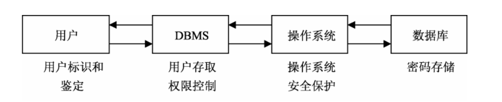

## 数据库的安全性

### 数据库安全性的含义

数据库的安全性是指保护数据库以防止非法使用所造成的数据泄露、更改或破坏。安全性问题有许多方面，其中包括：

1. 法律、社会和伦理方面的问题，如请求查询信息的人是不是有合法的权力；
2. 物理控制方面的问题，如计算机房是否应该加锁或用其他方法加以保护；
3. 政策方面的问题，如确定存取原则，允许指定用户存取指定数据；
4. 运行方面的问题，如使用口令时，如何使口令保密；
5. 硬件控制方面的问题，如 CPU 是否提供任何安全性方面的功能诸如存储保护键或特权工作 方式；
6. 操作系统安全性方面的问题，如在主存储器和数据文件用过以后，操作系统是否把它们的 内容清除掉；
7. 数据库系统本身的安全性方面的问题。

这里讨论的是数据库本身的安全性问题，主要考虑安全保护的策略，尤其是控制访问的策略。

### 安全性控制的一般方法

安全性控制是指要尽可能地杜绝所有可能的数据库非法访问。实际上，安全性问题并不是数据系统所独有的，所有计算机系统都存在这个问题。在计算机系统中，安全措施是一级一级层层设置的，安全控制模型下图所示。



后面我们只讨论数据库有关的用户标识和鉴定、用户存取权限控制、定义视图、数据加密和审计等几类安全性措施。

1. **用户标识和鉴定**

   数据库系统是不允许一个未经授权的用户对数据库进行操作的。用户标识和鉴定是系统提供的最外层的安全保护措施，其方法是由系统提供一定的方式让用户标识自己的名字或身份，系统内部记录着所有合法用户的标识，每次用户要求进入系统时，由系统进行核实，通过鉴定后才提供计算机的使用权。用户标识和鉴定的方法一般有：

   - 用一个用户名或用户标识符来标明用户的身份，系统以此来鉴别用户的合法性。
   - 用户标识符是用户公开的标识，它不足以成为鉴别用户身份的凭证。为了进一步核实用户身份，常采用用户名（Username）与口令（Password）相结合的方法，系统通过核对口令判别用户身份的真伪。
   - 通过用户名和口令来鉴定用户的方法简单易行，但该方法在使用时，由于用户名和口令的产生和使用比较简单，也容易被窃取，因此还可采用更复杂的方法。例如，每个用户都预先约定好一个过程或者函数，鉴别用户身份时，系统提供一个随机数，用户根据自己预先约定的计算过程或者函数进行计算，系统根据计算结果辨别用户身份的合法性。

2. **用户存取权限控制**

   用户存取权限指的是不同的用户对于不同的数据对象允许执行的操作权限。在数据库系统中，每个用户只能访问他有权存取的数据并执行有权使用的操作。因此，系统必须预先定义用户的存取权限。

   在数据库系统中，定义用户存取权限称为授权（Authorization）。用户的存取权限有两种：系统权限和对象权限。系统权限是由 DBA 授予某些数据库用户，只有得到系统权限，才能成为数据库用户。对象权限可以由 DBA 授予，也可以由数据对象的创建者授予，使数据库用户具有对某些数据对象进行某些操作的权限。

3. **定义视图**

   为不同的用户定义不同的视图，可以限制各个用户的访问范围。通过视图机制把要保密的数据对无权存取这些数据的用户隐藏起来，从而自动地对数据提供一定程度的安全保护。

   但视图机制的安全保护功能太不精细，往往不能达到应用系统的要求，其主要功能在于提供了数据库的逻辑独立性。在实际应用中，通常将视图机制与授权机制结合起来使用，首先用视图机制屏蔽一部分保密数据，然后在视图上再进一步定义存取权限。

4. **数据加密**

   前面介绍的几种数据库安全措施，都是防止从数据库系统窃取保密数据，不能防止通过不正常渠道非法访问数据。例如，偷取存储数据的磁盘，或在通信线路上窃取数据。为了防止这些窃密活动，比较好的办法是对数据加密。

   数据加密（Data Encryption）是防止数据库中数据在存储和传输中失密的有效手段。加密的基本思想是根据一定的算法将原始数据（术语为明文，Plain Text）加密成为不可直接识别的格式（术语为密文，Cipher Text），数据以密文的形式存储和传输。

   加密方法有两种，一种是替换方法，该方法使用密钥（Encryption Key）将明文中的每一个字符转换为密文中的字符。另一种是转换方法，该方法将明文中的字符按不同的顺序重新排列。通常将这两种方法结合起来使用，就可以达到相当高的安全程度。例如，美国 1977 年制定的官方加密标准——数据加密标准（Data Encryption Standard，DES），就是使用这种算法的例子。

5. **审计（Audit）**

   前面介绍的各种数据库安全性措施，都可将用户操作限制在规定的安全范围内，但实际上任何系统的安全性措施都不是绝对可靠的，窃密者总有办法打破这些控制。对于某些高度敏感的保密数据，必须以审计作为预防手段。审计功能是一种监视措施，它跟踪记录有关数据的访问活动。

   使用审计功能把用户对数据库的所有操作自动记录下来，存放在一个特殊文件中，即审计日志（Audit Log）中。记录的内容一般包括：操作类型（如修改、查询等）、操作终端标识与操作者标识、操作日期和时间、操作所涉及的相关数据（如基本表、视图、记录、属性等）、数据的前象和后象等。利用这些信息，可以重现导致数据库现有状况的一系列事件，以进一步找出非法存取数据的人、时间和内容等。

   使用审计功能会大大增加系统的开销，所以 DBMS 通常将其作为可选特征，并提供相应的操作语句，可灵活地打开或关闭审计功能。例如，可使用如下 SQL 语句打开对表 S 的审计功能，对表 S 的每次成功的查询、增加、删除和修改操作都作审计追踪：

   ```sql
   AUDIT SELECT,INSERT,DELETE,UPDATE ON S
   WHENEVER SUCCESSFUL
   ```

   要关闭对表 S 的审计功能可以使用如下语句：

   ```sql
   NO AUDIT ALL ON S
   ```

### 数据安全性机制

安全模型上分为三层结构，分别为服务器安全管理、数据库安全管理和数据库 对象的访问权限管理。

1. 第一层安全性是系统服务器级别的安全性，这一级别的安全性建立在控制服务器登录账号和密码的基础上，即必须具有正确的服务器登录账号和密码才能连接到服务器/终端。
2. 第二层安全性是数据库级别的安全性，即检查是否具有访问某个数据库的权利。
3. 第三层安全性是数据库对象级别的安全性，用户通过了前两层的安全性验证之后，在对具体的数据库对象（表、视图、存储过程等）进行操作时，将接受权限检查，即用户想要访问数据库里的对象时，必须事先被赋予相应的访问权限，否则系统将拒绝访问。

三个层次的安全机制相当于用户访问数据库对象过程中的三道安全屏障，只有合法地通过了这三个层次的安全验证，用户才能真正访问到相应的数据库对象。
