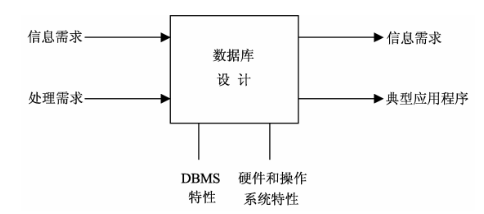
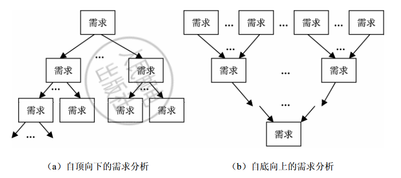
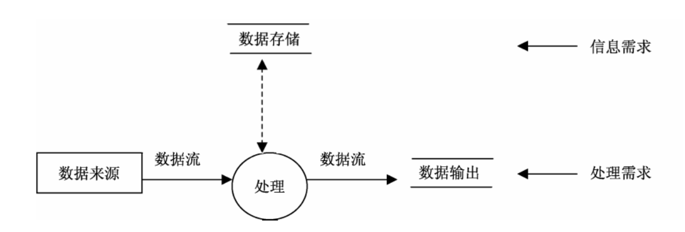
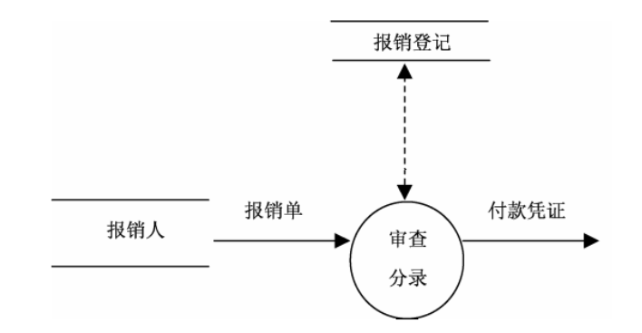
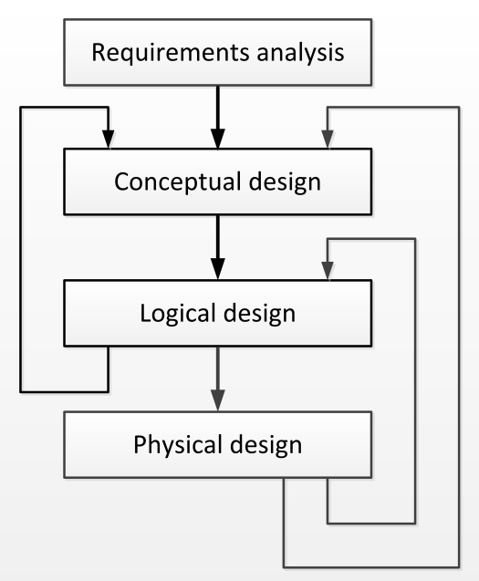
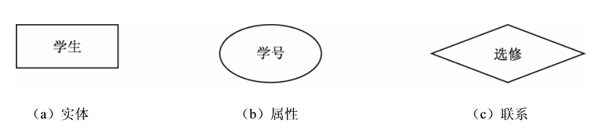
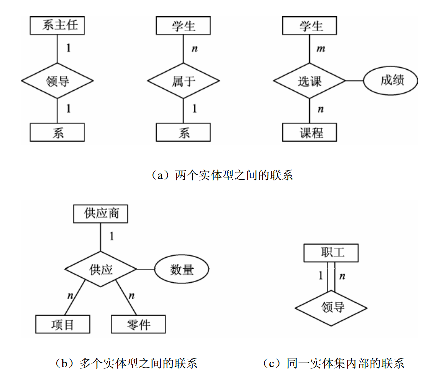
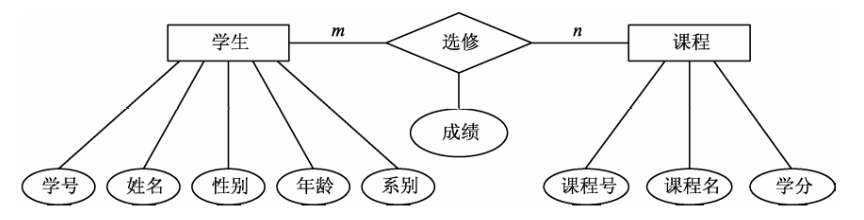

## 数据库设计概述

### 数据库设计的任务、内容和特点

数据库设计的任务：数据库设计是指根据用户需求研制数据库结构的过程。

数据库设计的内容：

1. 数据库的结构设计：根据给定的应用环境，进行数据库的子模式或模式的设计。数据库模式是各应用程序共享的结构，是静态的、稳定的， 一经形成后通常情况下是不容易改变的，所以结构设计又称为静态模型设计。
2. 数据库的行为设计：确定数据库用户的行为和动作。用户的行为总是使数据库的内容发生变化，所以行为设计是动态的，行为设计又称为动态模型设计。

数据库设计的特点：强调结构设计与行为设计相结合，是一种“反复探寻，逐步求精” 的过程。首先从数据模型开始设计，以数据模型为核心进行展开，将数据库设计和应用系统设计相结合，建立一个完整、独立、共享、冗余小和安全有效的数据库系统。

### 数据库设计方法简述

据库设计方法目前可分为四类：**直观设计法**、**规范设计法**、**计算机辅助设计法**和**自动化设计法**。直观设计法也称为手工试凑法，它是最早使用的数据库设计方法，但这种方法越来越不适应信 息管理发展的需要。

为了改变这种情况，各国数据库专家在美国新奥尔良（New Orleans）市专门讨论了数据库设计问题，新奥尔良法将数据库设计分成**需求分析**（分析用户需求的数据及数据的联系）、**概念结构设计**（信息分析和定义）、**逻辑结构设计** （设计实现）和**物理结构设计**（物理数据库设计）。目前，常用的规范设计方法大多起源于新奥尔良法，并在设计的每一阶段采用一些辅助方法来具体实现。下面简单介绍几种常用的规范设计方法。

1. **基于 E-R 模型的数据库设计方法**

   基于 E-R 模型的数据库设计方法是由 P.P.S.Chen 于 1976 年提出的数据库设计方法，其基本思想是在需求分析的基础上，用 E-R（实体-联系）图构造一个反映现实世界实体之间联系的企业模式，即概念模式，并进而将此企业模式转换成基于某一特定的 DBMS 的物理模式。

2. **基于 3NF 的数据库设计方法**

   基于 3NF 的数据库设计方法是由 S·Atre 提出的结构化设计方法，其基本思想是在需求分析的 基础上，确定数据库模式中的全部属性和属性间的依赖关系，将它们组织在一个单一的关系模式中， 然后再分析模式中不符合 3NF 的约束条件，将其进行投影分解，规范成若干个 3NF 关系模式的集合。

3. **基于视图的数据库设计方法**

   基于视图的数据库设计方法先从分析各个应用的数据着手，并为每个应用建立自己的视图，然 后再把这些视图汇总起来合并成整个数据库的概念模式。

除了以上三种方法外，规范化设计方法还有实体分析法、属性分析法和基于抽象语义的设计方 法等，这里不再详细介绍。

**计算机辅助设计法**是指在数据库设计的某些过程中模拟某一规范化设计的方法，并以人的知识或经验为主导，通过人机交互方式实现设计中的某些部分。目前许多计算机辅助软件工程（Computer Aided Software Engineering，CASE）工具可以自动或辅助设计人员完成数据库设计过程中的很多任务，如 Sybase 公司的 PowerDesigner 和 Premium 公司的 Navicat 等。

**现代数据库设计方法**是上述设计方法相互融合的产物。围绕软件工程的思想和方法，通常以 E-R 图设计为主体，辅以 3NF 设计和视图设计实现模式的评价和模式的优化，从而吸收各种设计方法的优势。同时，为提高设计的协同效率和规范化程度，现代数据库设计过程还会通过计算机辅助设计工具（如 PowerDesigner 等）获得规范的数据库设计结果。

## 系统需求分析

需求分析是数据库设计的起点，为以后的具体设计做准备。

### 需求分析的任务

从数据库设计的角度来看，需求分析的任务是：对现实世界要处理的对象（组织、部门、企业）等进行详细的调查，通过对原系统的了解，收集支持新系统的基础数据并对其进行处理，在此基础上确定新系统的功能。

具体地说，需求分析阶段的任务包括下述三项。

1. 调查分析用户活动
2. 收集和分析需求数据，确定系统边界
3. 编写系统分析报告

### 需求分析的方法

用户参加数据库设计是数据系统设计的特点，是数据库设计理论不可分割的一部分。用于需求分析的方法有多种，主要方法有自顶向下和自底向上两种。

其中自顶向下的分析方法（又称结构化分析方法，Structured Analysis，SA）是最简单实用的方 法。SA 方法从最上层的系统组织机构入手，采用逐层分解的方式分析系统，用数据流图（Data Flow Diagram，DFD）和数据字典（Data Dictionary，DD）描述系统。下面对数据流图和数据字典作些简单的介绍。

#### 数据流图

使用 SA 方法，任何一个系统都可抽象为下图所示的数据流图。

在数据流图中，用命名的箭头表示数据流，用圆圈表示处理，用不封闭的矩形或其他形状表示存储，使用封闭的矩形表示数据来源和输出。下图是一个简单的数据流图。一个简单的系统可用一张数据流图来表示。当系统比较复杂时，为了便于理解，控制其复杂性，可以采用分层描述的方法。一般用第一层描述系统的全貌，第二层分别描述各子系统的数据流。如果系统结构还比较复杂，那么，可以继续细化，直到表达清楚为止。在处理功能逐步分解的同时，它们所用的数据也逐级分解，形成若干层次的数据流图。数据流图表达了数据和处理过程的关系。

#### 数据字典

暂时不写

## 概念结构设计

### 概念结构设计的必要性

在需求分析阶段，设计人员充分调查并描述了用户的需求，但这些需求只是现实世界的具体要 求，应把这些需求抽象为信息世界的信息结构，才能更好地实现用户的需求。

概念结构设计就是将需求分析得到的用户需求抽象为信息结构，即概念模型。

本阶段目的：

- An abundance of data required to meet organization’s information needs 满足组织信息需求所需的丰富数据

- Goal: Organise the data to store, update, and query effectively and efficiently 组织数据以有效、高效地存储、更新和查询

Iterative Database Design 迭代数据库设计：

- 收集所有的需求
- 将需求结构化为原子性的信息
- 类型和它们之间的关系
- 将概念性的东西转化为关系性的模型
- 在物理层面上实施关系模型
- 将物理变化映射到逻辑模型上
- 将物理变化映射到概念模型上
- 将逻辑变化映射到概念模型上
- 重点关注概念模型及其
- 转化为逻辑模型

如：From Requirements to a First Approximate Model 从需求到第一个近似模型

Input: information requirements of the users 用户的信息需求

Output is a database schema:

- consolidation of all user requirements, but 所有用户需求的整合，但
- does not yet contain any layout considerations 还没有包含任何布局考虑
- in terms of relational tables 在关系表方面的布局考虑
- nor implementation details in terms of physical storage structures 也没有物理存储结构方面的实施细节

Conceptual data model 概念数据模型: provides the language for describing the database schema 提供了用于描述数据库模式的语言

### 概念模型的特点

概念模型作为概念结构设计的表达工具，为数据库提供一个说明性结构，是设计数据库逻辑结构即逻辑模型的基础。因此，概念模型必须具备以下特点。

1. 语义表达能力丰富。概念模型能表达用户的各种需求，充分反映现实世界，包括事物和事物之间的联系、用户对数据的处理要求，它是现实世界的一个真实模型。
2. 易于交流和理解。概念模型是 DBA、设计人员和用户之间的主要界面，因此，概念模型的表达要自然、直观和容易理解，以便和不熟悉计算机的用户交换意见。
3. 易于修改和扩充。概念模型要能灵活地加以改变，以反映用户需求和现实环境的变化。
4. 易于向各种数据模型转换。概念模型独立于特定的 DBMS，因而更加稳定，能方便地向关系模型、网状模型或层次模型等各种数据模型转换。

人们提出了许多概念模型，其中最著名、最实用的一种是 E-R 模型，它将现实世界的信息结构统一用属性、实体以及它们之间的联系来描述。

> The Entity-Relationship Model is the most widely used conceptual data model 实体关系模型是使用最广泛的概念数据模型。

### 概念模型的 E-R 表示方法

在概念模型中，比较著名的是由 P.P.Chen 于 1976 年提出的实体联系模型（Entity Relationship Model），简称 E-R 模型。E-R 模型是广泛应用于数据库设计工作中的一种概念模型，它利用 E-R 图来表示实体及其之间的联系。

E-R 图的基本成分包含实体型、属性和联系，它们的表示方式如下。

1. **实体型**：用矩形框表示，框内标注实体名称，如图（a）所示。
2. **属性**：用椭圆形框表示，框内标注属性名称，并用无向边将其与相应的实体相连，如图（b）所示。
3. **联系**：联系用菱形框表示，框内标注联系名称，并用无向边与有关实体相连，同时在无向 边旁标上联系的类型，即 1:1、1:n 或 m:n，如图（c）所示。

实体之间的联系有一对一（1:1）、一对多（1:n）和多对多（m:n）三种联系类型。例如，系主任 领导系、学生属于某个系、学生选修课程、工人生产产品，这里“领导”“属于”“选修”“生产”表示实体间的联系，可以作为联系名称。

现实世界的复杂性导致实体联系的复杂性，表现在 E-R 图上可以归结为下图所示的几种基本形式。

- 两个实体型之间的联系，如图（a）所示。
- 两个以上实体型间的联系，如图（b）所示。
- 同一实体集内部各实体之间的联系，例如一个部门内的职工有领导与被领导的联系，即某一 职工（干部）领导若干名职工，而一个职工（普通员工）仅被另外一个职工直接领导，这就构成了 实体内部的一对多的联系，如图（c）所示。

需要注意的是，因为联系本身也是一种实体型，所以联系也可以有属性。如果一个联系具有属性，则这些联系也要用无向边与该联系的属性连接起来。例如，学生选修的课程有相应的成绩。这里的“ 成绩”既不是学生的属性，也不是课程的属性，只能是学生选修课程的联系的属性，如图（a）所示。

E-R 图的基本思想就是分别用矩形框、椭圆形框和菱形框表示实体型、属性和联系，使用无向边将属性与其相应的实体连接起来，并将联系和有关实体相连接，注明联系类型。图 6-12 所示为几个 E-R 图的例子，只给出了实体及其 E-R 图，省略了实体的属性。下图所示为一个描述学生与课程联系的完整的 E-R 图。

