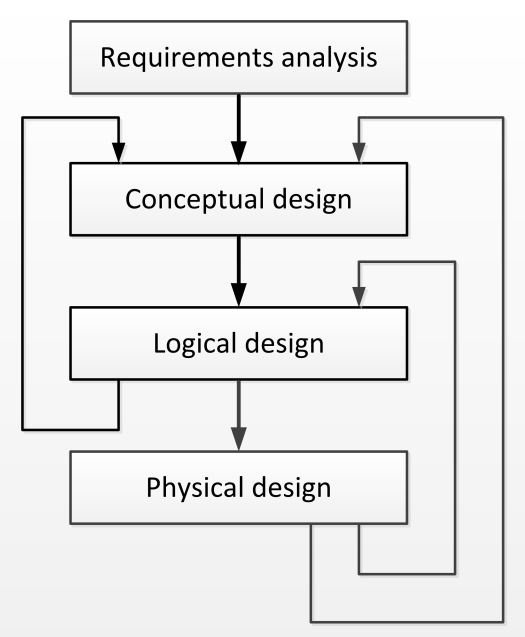

## 概念性数据库设计：实体-关系模型

An abundance of data required to meet organization’s information needs 满足组织信息需求所需的丰富数据

Goal: Organise the data to store, update, and query effectively and efficiently 组织数据以有效、高效地存储、更新和查询

Iterative Database Design 迭代数据库设计：

- 收集所有的需求
- 将需求结构化为原子性的信息
- 类型和它们之间的关系
- 将概念性的东西转化为关系性的模型
- 在物理层面上实施关系模型
- 将物理变化映射到逻辑模型上
- 将物理变化映射到概念模型上
- 将逻辑变化映射到概念模型上
- 重点关注概念模型及其
- 转化为逻辑模型

如：From Requirements to a First Approximate Model 从需求到第一个近似模型

Input: information requirements of the users 用户的信息需求

Output is a database schema:

- consolidation of all user requirements, but 所有用户需求的整合，但
- does not yet contain any layout considerations 还没有包含任何布局考虑
- in terms of relational tables 在关系表方面的布局考虑
- nor implementation details in terms of physical storage structures 也没有物理存储结构方面的实施细节

Conceptual data model 概念数据模型: provides the language for describing the database schema 提供了用于描述数据库模式的语言

> The Entity-Relationship Model is the most widely used conceptual data model 实体关系模型是使用最广泛的概念数据模型。
