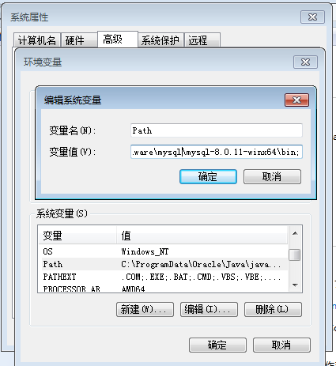
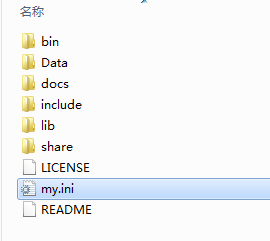
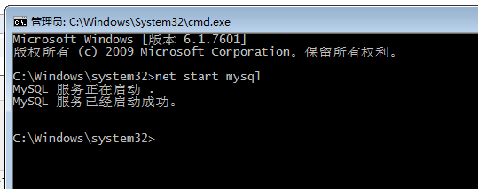
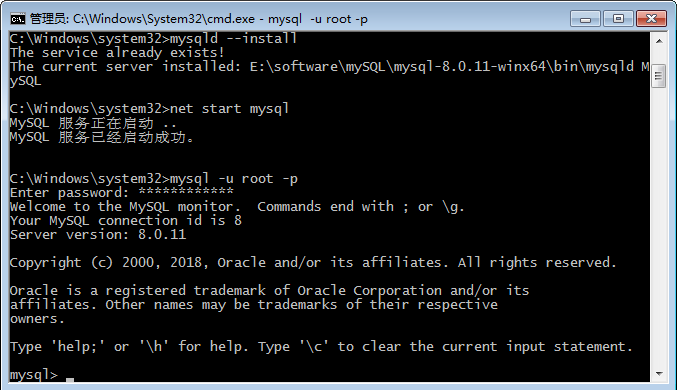

## MySQL 安装

- 下载 MySQL：https://dev.mysql.com/downloads/mysql/

- 安装 Workbench：https://dev.mysql.com/downloads/file/?id=492434

  （此链接非最新版，可以下载最新版）

- MySQL-mysql 安装教程：https://www.cnblogs.com/laumians-notes/p/9069498.html

1. 下载 Zip 安装包：[MySQL8 For Windows zip](https://dev.mysql.com/downloads/mysql/)，进入页面后可以不登录。后点击底部“No thanks, just start my download.”即可开始下载。

2. 解压 zip 包到安装目录；

3. 配置环境变量：

   

4. 配置初始化的 my.ini 文件

   我们发现解压后的目录并没有 my.ini 文件，没关系可以自行创建。在安装根目录下添加 my.ini（新建文本文件，将文件类型改为.ini），写入基本配置：

   

   ```ini
   [mysqld]
   # 设置3306端口
   port=3306
   # 设置mysql的安装目录
   basedir=E:\\software\\mysql\\mysql-8.0.11-winx64 # 切记此处一定要用双斜杠\\，单斜杠我这里会出错，不过看别人的教程，有的是单斜杠。自己尝试吧
   # 设置mysql数据库的数据的存放目录
   datadir=E:\\software\\mysql\\mysql-8.0.11-winx64\\Data # 此处同上
   # 允许最大连接数
   max_connections=200
   # 允许连接失败的次数。这是为了防止有人从该主机试图攻击数据库系统
   max_connect_errors=10
   # 服务端使用的字符集默认为UTF8
   character-set-server=utf8
   # 创建新表时将使用的默认存储引擎
   default-storage-engine=INNODB
   # 默认使用“mysql_native_password”插件认证
   default_authentication_plugin=mysql_native_password
   [mysql]
   # 设置mysql客户端默认字符集
   default-character-set=utf8
   [client]
   # 设置mysql客户端连接服务端时默认使用的端口
   port=3306
   default-character-set=utf8
   ```

5. 安装 MySQL：

   在安装时，必须以管理员身份运行 cmd，否则在安装时会报错，会导致安装失败的情况。

   在 MySQL 安装目录的 bin 目录下执行命令：

   ```shell
   mysqld --initialize --console
   ```

   执行完成后，会打印 root 用户的初始默认密码，比如：

   ```
   C:\Users\Administrator>cd C:\Program Files\MySQL\bin

   C:\Program Files\MySQL\bin>mysqld --initialize --console
   2018-04-28T15:57:17.087519Z 0 [System] [MY-013169] [Server] C:\Program Files\MySQL\bin\mysqld.exe (mysqld 8.0.11) initializing of server in progress as process 4984
   2018-04-28T15:57:24.859249Z 5 [Note] [MY-010454] [Server] A temporary password is generated for root@localhost: rI5rvf5x5G,E
   2018-04-28T15:57:27.106660Z 0 [System] [MY-013170] [Server] C:\Program Files\MySQL\bin\mysqld.exe (mysqld 8.0.11) initializing of server has completed
   ```

   注意！执行输出结果里面有一段： [Note] [MY-010454] [Server] A temporary password is generated for root@localhost: rI5rvf5x5G,E 其中 root@localhost:后面的“rI5rvf5x5G,E”就是初始密码（不含首位空格）。在没有更改密码前，需要记住这个密码，后续登录需要用到。

   要是你手贱，关快了，或者没记住，那也没事，删掉初始化的 datadir 目录，再执行一遍初始化命令，又会重新生成的。当然，也可以使用安全工具，强制改密码，用什么方法，自己随意。

   参考：https://dev.mysql.com/doc/refman/8.0/en/data-directory-initialization-mysqld.html

6. 安装 MySQL 服务

   在 MySQL 安装目录的 bin 目录下执行命令：

   ```shell
   mysqld --install [服务名]
   ```

   后面的服务名可以不写，默认的名字为 mysql。当然，如果你的电脑上需要安装多个 MySQL 服务，就可以用不同的名字区分了，比如 mysql5 和 mysql8。

7. 启动服务

   安装完成之后，就可以通过命令启动 MySQL 的服务：

   ```shell
   net start mysql
   ```

   停止服务命令：

   ```shell
   net stop mysql
   ```

   卸载 MySQL 服务：

   ```sql
   sc delete MySQL/mysqld -remove
   ```

   

8. 更改密码

   MySQL 安装目录的 bin 目录下执行命令：

   ```shell
   mysql -u root -p
   ```

   这时候会提示输入密码，记住了上面第 3.1 步安装时的密码，填入即可登录成功，进入 MySQL 命令模式。

   如果你不喜欢明文密码，你可以尝试：

   ```shell
   mysql -uroot -p
   ```

   这时候会提示输入密码，记住了上面第 5 步安装时的密码，填入即可登录成功，进入 MySQL 命令模式。

   

   在 MySQL 中执行命令：

   ```sql
   ALTER USER 'root'@'localhost' IDENTIFIED WITH mysql_native_password BY '新密码';
   ```

到此，安装部署就完成了。

可以用命令查看一下默认安装的数据库：

```sql
show databases;
use mysql;
show tables;
```

```shell
mysql> show databases;
+--------------------+
| Database           |
+--------------------+
| information_schema |
| mysql              |
| performance_schema |
| sys                |
+--------------------+
4 rows in set (0.01 sec)

mysql>
```

看到默认初始化了 mysql 数据库，其中 user 表里面存储 MySQL 用户信息。我们可以看一下默认 MySQL 用户：

```sql
select user,host,authentication_string from mysql.user;
```

```shell
mysql> select user,host,authentication_string from mysql.user;
+------------------+-----------+-------------------------------------------+
| user             | host      | authentication_string                     |
+------------------+-----------+-------------------------------------------+
| mysql.infoschema | localhost | *THISISNOTAVALIDPASSWORDTHATCANBEUSEDHERE |
| mysql.session    | localhost | *THISISNOTAVALIDPASSWORDTHATCANBEUSEDHERE |
| mysql.sys        | localhost | *THISISNOTAVALIDPASSWORDTHATCANBEUSEDHERE |
| root             | localhost | *27C237A977F4F44D3F551F1A673BE14DFD232961 |
+------------------+-----------+-------------------------------------------+
4 rows in set (0.00 sec)

mysql>
```

管理员 root 的 host 是 localhost，代表仅限 localhost 登录访问。如果要允许开放其他 ip 登录，则需要添加新的 host。如果要允许所有 ip 访问，可以直接修改成“**%**”。

创建用户：

```sql
CREATE USER 'xxh'@'%' IDENTIFIED WITH mysql_native_password BY 'xxh123!@#';
```

```shell
mysql> use mysql;
Database changed
mysql> CREATE USER 'xxh'@'%' IDENTIFIED WITH mysql_native_password BY 'xxh123!@#'; #创建用户(注意：mysql8.0加密方式修改了)
Query OK, 0 rows affected (0.07 sec)
```

检查用户：

```sql
select user, host, plugin, authentication_string from user\G;
```

```shell
mysql> select user, host, plugin, authentication_string from user;
+------------------+-----------+-----------------------+-------------------------------------------+
| user             | host      | plugin                | authentication_string                     |
+------------------+-----------+-----------------------+-------------------------------------------+
| xxh              | %         | mysql_native_password | *70FD6FB4F675E08FF785A754755B5EBA6DA62851 |
| mysql.infoschema | localhost | mysql_native_password | *THISISNOTAVALIDPASSWORDTHATCANBEUSEDHERE |
| mysql.session    | localhost | mysql_native_password | *THISISNOTAVALIDPASSWORDTHATCANBEUSEDHERE |
| mysql.sys        | localhost | mysql_native_password | *THISISNOTAVALIDPASSWORDTHATCANBEUSEDHERE |
| root             | localhost | mysql_native_password | *27C237A977F4F44D3F551F1A673BE14DFD232961 |
+------------------+-----------+-----------------------+-------------------------------------------+
5 rows in set (0.00 sec)

mysql>
```

授权远程数据库：

```sql
# 授权所有权限
GRANT ALL PRIVILEGES ON *.* TO 'xxh'@'%'；
# 授权基本的查询修改权限，按需求设置
GRANT SELECT,INSERT,UPDATE,DELETE,CREATE,DROP,ALTER ON *.* TO 'xxh'@'%';
```

查看用户权限：

```sql
show grants for 'xxh'@'%';
```

另外，如果需要新增账户，或者本机以外的其他人访问 MySQL 则还需要设置内置账户的 host，具体可以参考：[MySQL 创建用户与授权](https://www.cnblogs.com/sos-blue/p/6852945.html)

## MySQL 存储引擎

MySQL 中的数据用各种不同的技术存储在文件(或者内存)中。

**不同的存储机制、索引技巧、锁定水平**：选择不同的技术，你能够获得额外的速度或者功能，从而改善你的应用的整体功能。例如，研究大量临时数据，使用内存 MySQL 存储引擎较好。内存存储引擎能够在内存中存储所有的表格数据。

或者需要一个支持事务处理的数据库(以确保事务处理不成功时数据的回退能力)。

不同的技术以及配套的相关功能在 MySQL 中被称作**存储引擎**(也称作表类型)。

### MySQL 常用的四种引擎的介绍

1. MyISAM 存储引擎

   - 优点：访问速度快，对事务完整性没有要求。支持全文搜索。表格可以被压缩。
   - 缺点：不支持事务（回滚将造成不完全回滚，不具有原子性）、也不支持外键。跨平台很难直接拷贝。
   - 适用：以 select，insert 为主的应用基本上可以用这个引擎来创建。
   - 操作上：DELETE 表时，先 drop 表，然后重建表。保存表的具体行数，不带 where 时，直接返回保存的行数。MyISAM 中可以使 AUTO_INCREMENT 类型字段建立联合索引。
   - 存放上：MyISAM 表被存放在三个文件 。frm 文件存放表格定义。数据文件是 MYD (MYData) 。索引文件是 MYI (MYIndex)。

2. InnoDB

   InnoDB 是一个健壮的事务型存储引擎，这种存储引擎已经被很多互联网公司使用，为用户操作非常大的数据存储提供了一个强大的解决方案。

   - 优点：支持事务处理；不加锁读取；支持外键；支持行锁。跨平台可直接拷贝使用。
   - 缺点：不支持 FULLTEXT 类型的索引；不保存表的具体行数，扫描表来计算有多少行。表格很难被压缩。
   - 操作上：DELETE 表时，是一行一行的删除。InnoDB 中必须包含 AUTO_INCREMENT 类型字段的索引。
   - 存放上：InnoDB 把数据和索引存放在表空间里面。

因为 MyISAM 相对简单，所以在效率上要优于 InnoDB。如果系统读多写少，对原子性要求低，那么 MyISAM 最好的选择。且 MyISAM 恢复速度快，可直接用备份覆盖恢复。

如果系统读少，写多的时候，尤其是并发写入高的时候，InnoDB 就是首选了。

3. MEMORY 存储引擎

   Memory 存储引擎使用存在于内存中的内容来创建表。每个 memory 表只实际对应一个磁盘文件，格式是.frm。memory 类型的表访问非常的快，因为它的数据是放在内存中的，并且默认使用 HASH 索引，但是一旦服务关闭，表中的数据就会丢失掉。

   MEMORY 存储引擎的表可以选择使用 BTREE 索引或者 HASH 索引，两种不同类型的索引有其不同的使用范围。

   如：

   ```sql
   create table users (
       id smallint unsigned not null auto_increment,
       username varchar(15) not null,
       pwd varchar(15) not null,
       index using btree (username),
       primary key (id)
   ) engine=memory;
   ```

4. MERGE 存储引擎

   Merge 存储引擎是一组 MyISAM 表的组合，这些 MyISAM 表必须结构完全相同，merge 表本身并没有数据，对 merge 类型的表可以进行查询，更新，删除操作，这些操作实际上是对内部的 MyISAM 表进行的。

### 如何选择存储引擎

- InnoDB：用于事务处理；并发控制；需要频繁更新、删除操作（默认存储引擎）
- MyISAM：管理非事务表，高速存储和检索，全文检索；插入数据快，空间和内存使用比较低。插入新纪录和读出记录，效率高；
- Memory：所有数据都在内存中，数据处理速度快，但安全性不高。对表大小有要求，不能建太大的表。

## MySQL 的一些细节

### 关于大小写

MySQL 默认是不区分大小写的，但是在很多情况下需要大小敏感，以下总结了多种设置 MySQL 大小写敏感的方法。

修改 MySql Server 安装目录下的 my.ini 文件，在 mysqld 节下加入下面一行：

```ini
set-variable=lower_case_table_names=0
# 0：大小写敏感；1：大小写不敏感
```

最后重启一下 MySQL 服务即可。

### 注释

单行注释：

- “#” + 注释。

- “--” + 空格 + 注释（空格不可省略）。

多行注释：用 /\*\*/ 包裹注释内容。

### 别名

部分操作名等价，如：

```sql
create database stu_course;
-- 等价于：
create schema stu_course;
```

### 查看信息

```sql
-- 查看当前数据库内的所有表格
Show tables;
-- 查看使用引擎
Show engines;
-- 查看所有数据库
Show databases;
# 也可以写作 Show schemas;
```

### 执行脚本

```sql
source E:/mysql_source_code/1_create_all.sql
```

## 创建表

见：

- [Chapter3@示例](../03-data-def-lang#%E7%A4%BA%E4%BE%8B)
- [Chapter3@建](../03-data-def-lang#%E5%BB%BA)

- [Chapter3@数据表中数据的操纵](../03-data-def-lang#%E6%95%B0%E6%8D%AE%E8%A1%A8%E4%B8%AD%E6%95%B0%E6%8D%AE%E7%9A%84%E6%93%8D%E7%BA%B5)

查看相关信息：

```sql
Show columns from student # 查看表结构
Describe student;
Describe student sno;
```

## 实践

1. 练习启动 mysql 服务；连接 mysql；创建数据库；创建表；更新表和删除表
2. 完成以自己”学号后三位\_名字\_book”命名的数据库的建立，如：003\*王毅\_book;
3. 分别使用 workbench 或 Navicat 图形用户界面方式和命令提示符方式完成下面五张表的建立。在实践中应包括所有类型的约束，例如唯一性，非空值，外键等。
4. 用 sql 语句练习表的修改和删除，学生应测试不同种类的表的修改。
5. 请学会尝试利用百度的方法解决遇到的问题。
6. 请将练习的内容截屏到实验报告中，文字说明操作的内容，遇到的问题，如何解决的。
7. 实验报告命名方式： 003--姓名--实验 1-2.doc。
8. 前两次实验 Lab1,Lab2 提交一次实验报告。自己做实验，不要抄袭他人截屏！
9. 全英文撰写实验报告。
