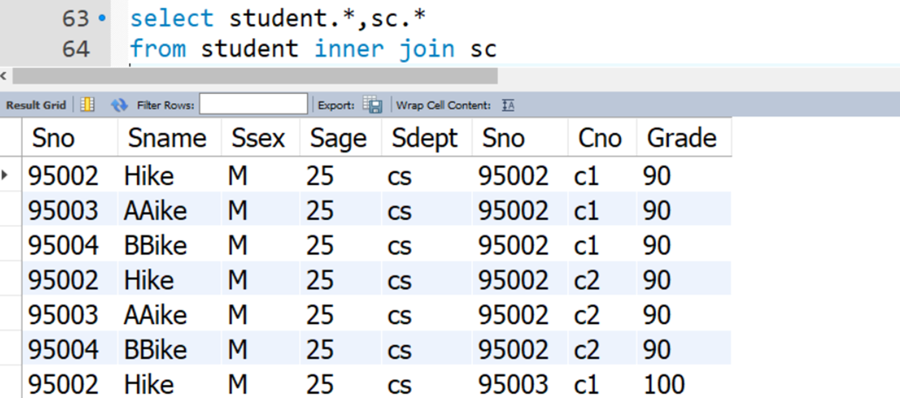
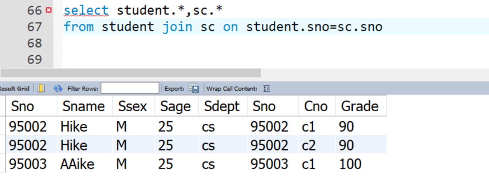
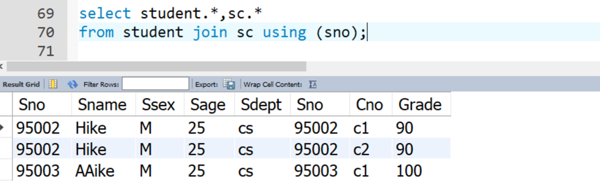

import { Callout } from "nextra/components";

## Select 语句

### 连接 JOIN

详见：[Chapter3@多关系（表）的连接查询](../03-data-def-lang#多关系表的连接查询)

在不使用 on 语法时，join、inner join、逗号、cross join 结果相同，都是取 2 个表的笛卡尔积。



on 语法：筛选连接后的结果，两表的对应列值相同才在结果集中，可以通过 and 连接多个列值的匹配要求，列名可以不同。如：

```sql
select * from tb_test1
inner join tb_student
on tb_test1.id=tb_student.id;
```

用 on 自然连接：



using 语法：筛选连接后的结果，两表的对应列值相同才在结果集中，括号内用多个列名要求用逗号连接，列名必须相同。如：

```sql
select * from tb_test1
cross join tb_student
using(id);
```

用 using 连接更简洁一些：



连接关键字：

- INNER JOIN（内连接或等值连接）：获取两个表中字段匹配关系的记录。
- LEFT JOIN（左连接）：获取左表所有记录，即使右表没有对应匹配的记录。
- RIGHT JOIN（右连接）：与 LEFT JOIN 相反，用于获取右表所有记录，即使左表没有对应匹配的记录。
- 全连接：MySQL 没有全外连接，用 `union` 将左右外连接合并。

<Callout type="info" emoji="ℹ️">

如果我们有一个包含名字和姓氏的表格，可以使用 CONCAT 函数将这两个字段连接起来形成一个完整的姓名字段。在 MySQL 中，使用 CONCAT 函数的语法如下：

    ```sql
    SELECT CONCAT(first_name, ' ', last_name) AS full_name
    # 有时也写成 SELECT CONCAT(last_name,', ',first_name) AS full_name
    FROM table_name;
    ```

这条语句将会返回一个名为 `full_name` 的新字段，其中包含了名字和姓氏的组合。

</Callout>

### 分组 GROUP BY

详见：[Chapter3@分组查询](../03-data-def-lang#分组查询)

细化聚集函数的作用对象：

- 未对查询结果分组，聚集函数将作用于整个查询结果
- 对查询结果分组后，聚集函数将分别作用于每个组
- 作用对象是查询的中间结果表
- 按指定的一列或多列值分组，值相等的为一组

如：求各个课程号及相应的选课人数。

```sql
SELECT Cno，COUNT(Sno) FROM SC
GROUP BY Cno;
```

| Cno | COUNT(Sno) |
| --- | ---------- |
| 1   | 22         |
| 2   | 34         |
| ​ 3 | 44         |
| 4   | 33         |
| ​ 5 | 48         |

HAVING 短语与 WHERE 子句的区别：

- 作用对象不同
- WHERE 子句作用于基表或视图，从中选择满足条件的元组
- HAVING 短语作用于组，从中选择满足条件的组。

## 动态 SQL 语句

动态 SQL 语句是一种在运行时构建的 SQL 语句，其结构和内容取决于程序的执行过程中的变量和条件。相比于静态 SQL 语句，动态 SQL 语句更灵活，可以根据实际情况生成不同的 SQL 语句，从而满足不同的查询需求。

在动态 SQL 语句中，可以使用变量、参数、条件和运算符等元素，通过这些元素可以构建出完整的 SQL 语句。通常情况下，动态 SQL 语句会由程序自动生成，然后将其发送到数据库进行解析和执行。

动态 SQL 语句的优点在于可以根据不同的条件生成不同的 SQL 语句，从而提高查询效率并且减少代码复杂性。但是，需要注意的是，在使用动态 SQL 语句时，应该避免**SQL 注入等安全问题**。因此，在构建动态 SQL 语句时，应该使用参数化查询来代替字符串拼接，以避免潜在的安全风险。

如：

```sql
-- For prepared statements, you can use placeholders. The following statements will return one row from the tbl table:
SET @a=1; # 将一个变量@a赋值为1，这里是为了在后面的语句中使用变量@a作为参数。
PREPARE STMT
FROM 'SELECT * FROM student LIMIT ?';
EXECUTE STMT USING @a;

-- The following statements will return the second to sixth row from the tbl table:
SET @skip=1;
SET @numrows=5;
PREPARE STMT
FROM 'SELECT * FROM tbl LIMIT ?, ?';
EXECUTE STMT
USING @skip, @numrows;
```

## 视图 VIEW

详见：[Chapter3@视图](../03-data-def-lang#视图)

视图（View）是一种虚拟存在的表。其内容与真实的表相似，包含一系列带有名称的列和行数据。但是视图并不在数据库中以存储的数据的形式存在。

行和列的数据来自定义视图时查询所引用的基本表，并且在具体引用视图时动态生成。
视图的特点如下：

1.  视图的列可以来自不同的表，是表的抽象和在逻辑意义上建立的新关系；
2.  视图是由基本表（实表）产生的表（虚表）；
3.  视图的建立和删除不影响基本表；
4.  对视图内容的更新（增删改）直接影响基本表；
5.  当视图来自多个基本表时，不允许添加和删除数据。

CREATE VIEW 语句创建一个新的视图，或者如果添加了 OR REPLACE 子句，则替换现有的视图。如果该视图不存在，则 CREATE OR REPLACE VIEW 与 CREATE VIEW 相同。如果该视图存在，则 CREATE OR REPLACE VIEW 将其替换。

可以使用 WITH CHECK OPTION 子句来限制对视图引用的表中行的插入或更新。这意味着只有符合限制条件的数据可以被插入或更新到视图中。

如：我们有一个名为 student 的表，其中包含学生的成绩和课程信息。我们可以创建一个视图，只显示英语课程的成绩，并使用 WITH CHECK OPTION 子句来限制只能插入或更新英语课程的成绩数据。这样，我们就可以确保只有符合条件的数据才会出现在视图中。

```sql
CREATE VIEW english_grades AS
SELECT student_name, grade
FROM student
WHERE course = 'English'
WITH CHECK OPTION;
```

这个视图只包含英语课程的成绩，而且当试图插入或更新不符合条件的数据时，会抛出错误。例如，如果我们尝试将数学课程的成绩插入到该视图中，就会收到一条错误消息：

```sql
INSERT INTO english_grades (student_name, grade)
VALUES ('Alice', 'B');
-- Error: new row violates check option for view "english_grades"
```

但如果我们尝试将英语课程的成绩插入到该视图中，则不会收到任何错误消息：

```sql
INSERT INTO english_grades (student_name, grade)
VALUES ('Bob', 'A');
-- 1 row inserted
```

SQL 视图的限制：

1. 不支持使用 ORDER BY 子句对视图进行排序，除非使用 TOP 或者 LIMIT 等限制语句。
2. 不能在视图中使用临时表或表变量。
3. 视图不支持插入、更新或删除操作，除非使用 INSTEAD OF 触发器来代替这些操作。
4. 视图中不能包含任何计算字段或聚合函数，例如 SUM 和 AVG。
5. 如果视图定义中包含联接操作，则该视图可能会变得很复杂，并且查询速度可能会受到影响。
6. 视图可以引用其他视图，但是如果一个视图引用了另一个视图，那么查询语句的性能可能会受到影响。
7. 视图的性能可能会受到数据库中数据量的影响。当数据量很大时，查询视图可能会变得很慢。
8. 视图的权限必须正确配置，以确保只有授权用户才能访问视图中的数据。

## Insert, Update, Delete

详见：

- [Chapter3@建](../03-data-def-lang#%E5%BB%BA)

- [Chapter3@数据表中数据的操纵](../03-data-def-lang#%E6%95%B0%E6%8D%AE%E8%A1%A8%E4%B8%AD%E6%95%B0%E6%8D%AE%E7%9A%84%E6%93%8D%E7%BA%B5)

### Insert

SQL 中的 INSERT 语句是用于向表中插入新行数据的命令。它可以将一条或多条记录插入到指定的表中，每个记录都由一个值列表表示。

INSERT 语句的语法如下：

```
INSERT INTO table_name (column1, column2, column3,...)
VALUES (value1, value2, value3,...);
```

其中，`table_name`是要插入数据的目标表名；`(column1, column2, column3,...)` 是要插入的列的名称列表； `(value1, value2, value3,...)` 是插入到相应列中的值列表。

例如，如果我们有一个名为`students`的表，其中包含`id`, `name`, `age`, `gender`四列，我们可以使用以下 INSERT 语句向表中插入一条新的学生记录：

```
INSERT INTO students (id, name, age, gender)
VALUES (1, '张三', 18, '男');
```

这个 INSERT 语句将在`students`表中插入一条`id=1`, `name='张三'`, `age=18`, `gender='男'`的新记录。如果我们想插入多条记录，只需要在 VALUES 后面提供多组值即可。

除了 VALUES 子句之外，还可以使用 SELECT 语句作为 INSERT 语句的数据来源，例如：

```
INSERT INTO students (id, name, age, gender)
SELECT id, name, age, gender FROM new_students;
```

此语句将从`new_students`表中选择所有行，并将其插入到`students`表中。

### Update

SQL 中的 UPDATE 语句用于修改表中现有行的数据。使用 UPDATE 语句，可以更新一个或多个列的值，并且可以根据指定的条件来更新表中的特定行。

UPDATE 语句的基本语法如下：

```
UPDATE table_name
SET column1 = value1, column2 = value2, ...
WHERE condition;
```

其中，`table_name`是要更新数据的目标表名；`column1 = value1, column2 = value2,...`是要更新的列和它们对应的新值列表；`WHERE condition`是一个可选的条件，满足该条件的行才会被更新。

例如，假设我们有一个名为`students`的表，其中包含`id`, `name`, `age`, `gender`四列，我们可以使用以下 UPDATE 语句将某个学生的年龄从 18 修改为 20:

```
UPDATE students
SET age = 20
WHERE id = 1;
```

此语句将在`students`表中找到`id=1`的行，并将其`age`列的值更新为 20。

除了单独更新某一行的数据之外，还可以使用 UPDATE 语句批量更新符合某个条件的所有行，例如：

```
UPDATE students
SET gender = '女'
WHERE age > 20;
```

此语句将在`students`表中找到所有`age > 20`的行，并将它们的`gender`列的值都更新为'女'。

总之，UPDATE 语句可以帮助我们轻松地修改表中的现有数据，以便满足我们的需求。

### Delete

SQL 中的 DELETE 语句用于从表中删除现有行。使用 DELETE 语句，可以删除特定行或满足特定条件的多行数据。

DELETE 语句的基本语法如下：

```
DELETE FROM table_name
WHERE condition;
```

其中，`table_name`是要删除数据的目标表名；`WHERE condition`是一个可选的条件，满足该条件的行才会被删除。

例如，假设我们有一个名为`students`的表，其中包含`id`, `name`, `age`, `gender`四列，我们可以使用以下 DELETE 语句删除某个学生的记录：

```
DELETE FROM students
WHERE id = 1;
```

此语句将在`students`表中找到`id=1`的行，并将其从表中删除。

除了单独删除某一行之外，还可以使用 DELETE 语句批量删除符合某个条件的所有行，例如：

```
DELETE FROM students
WHERE age > 20;
```

此语句将在`students`表中找到所有`age > 20`的行，并将它们从表中删除。

> DELETE 和 TRUNCATE 都可以用于删除表中的数据，但它们的实现方式和使用方法略有不同。
>
> DELETE 语句用于从表中删除特定行或满足特定条件的多行数据。它在执行时会逐行扫描表，并删除匹配条件的所有行，因此对于大型表而言，DELETE 语句可能会比较慢。
>
> TRUNCATE 语句用于快速删除整个表中的数据，它直接删除数据文件，然后重建一个空表。相比之下，TRUNCATE 语句执行速度更快，尤其是在处理大型表时。但需要注意的是，TRUNCATE 语句无法带有 WHERE 子句指定条件过滤，它总是删除整张表的数据。
>
> 除了速度方面的不同，DELETE 和 TRUNCATE 还有一些其他区别：
>
> 1. DELETE 语句执行后可以回滚，即在事务中执行 DELETE 语句后，如果回滚事务，则删除的数据会被恢复。而 TRUNCATE 语句执行后无法回滚。
> 2. DELETE 语句执行后会保留自增长列和标识列的当前值，而 TRUNCATE 语句则会将这些值重置为初始值。
> 3. DELETE 语句在执行时会触发表上的触发器（如 DELETE 触发器），而 TRUNCATE 语句不会触发任何触发器。
>
> 在实际使用中，我们需要根据具体的情况选择 DELETE 或 TRUNCATE 语句。如果只需要删除表中的一部分数据，并且需要执行回滚操作，则应该使用 DELETE 语句；如果需要快速删除整张表的数据，并且不需要执行回滚操作，则可以考虑使用 TRUNCATE 语句。

## 实践

用 SQL 语句完成图书管理系统 book 数据库相关数据录入，同时使用相关语句进行：

- 新表中插入数据（使用 into 子句）
- 从某表中查询结果，分组，排序（使用 select from，where，group by，having，order by 子句）
- 对数据库进行联合查询（使用 Union 子句）
- 进行多表查询（等值、不等值，自然，外连接，自连接等）
- 进行子查询（in，exists，having 中使用）
- 创建视图

针对 movies 数据库，做 lab1.pdf，lab2.pdf 上面的练习。

要求：实验报告中除文字描述外，必须提供每一操作对应的 SQL 语句 word 文档，并附上执行结果截图。

额外实验内容：

- 用 SQL 语句完成图书管理系统 book 数据库相关数据录入，同时使用 insert，update, delete 语句对 book 数据库进行操作。
- 每个语句至少练习 5 个以上的示例，请写出对应 SQL 语句所表达的意思。
- 实验报告中除文字描述外，必须提供每一操作对应的 SQL 语句文本文档，并附上执行结果截图。列出实验中所遇到的问题，及如何解决问题的。
