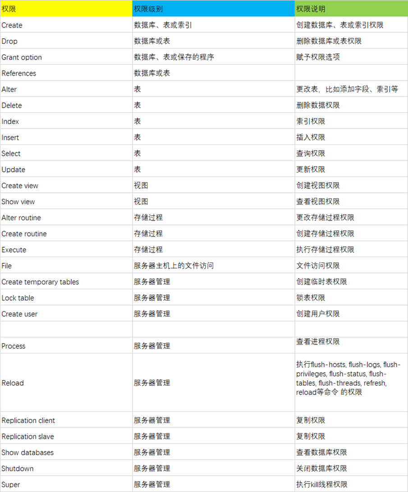
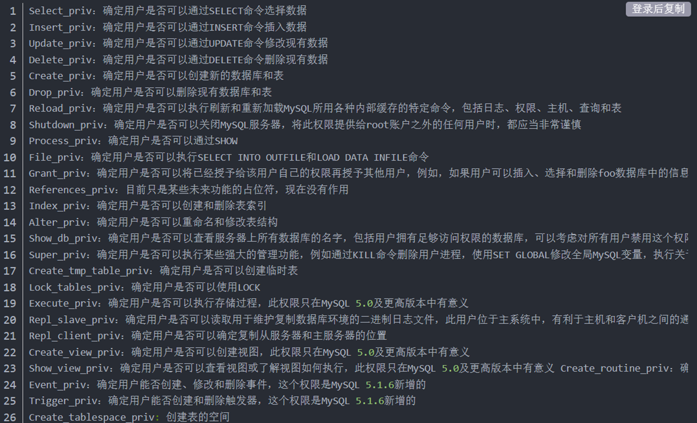

import { Callout } from "nextra/components";

## 用户管理

### 创建用户

格式：

```sql
CREATE USER [IF NOT EXISTS]
    user [auth_option] [, user [auth_option]] ...
    DEFAULT ROLE role [, role ] ...
    [REQUIRE {NONE | tls_option [[AND] tls_option] ...}]
    [WITH resource_option [resource_option] ...]
    [password_option | lock_option] ...
    [COMMENT 'comment_string' | ATTRIBUTE 'json_object']

user:
    (see Section 6.2.4, “Specifying Account Names”)

auth_option: {
    IDENTIFIED BY 'auth_string' [AND 2fa_auth_option]
  | IDENTIFIED BY RANDOM PASSWORD [AND 2fa_auth_option]
  | IDENTIFIED WITH auth_plugin [AND 2fa_auth_option]
  | IDENTIFIED WITH auth_plugin BY 'auth_string' [AND 2fa_auth_option]
  | IDENTIFIED WITH auth_plugin BY RANDOM PASSWORD [AND 2fa_auth_option]
  | IDENTIFIED WITH auth_plugin AS 'auth_string' [AND 2fa_auth_option]
  | IDENTIFIED WITH auth_plugin [initial_auth_option]
}

tls_option: {
   SSL
 | X509
 | CIPHER 'cipher'
 | ISSUER 'issuer'
 | SUBJECT 'subject'
}

resource_option: {
    MAX_QUERIES_PER_HOUR count
  | MAX_UPDATES_PER_HOUR count
  | MAX_CONNECTIONS_PER_HOUR count
  | MAX_USER_CONNECTIONS count
}

password_option: {
    PASSWORD EXPIRE [DEFAULT | NEVER | INTERVAL N DAY]
  | PASSWORD HISTORY {DEFAULT | N}
  | PASSWORD REUSE INTERVAL {DEFAULT | N DAY}
  | PASSWORD REQUIRE CURRENT [DEFAULT | OPTIONAL]
  | FAILED_LOGIN_ATTEMPTS N
  | PASSWORD_LOCK_TIME {N | UNBOUNDED}
}
```

如：：

```sql
create user 'user01' @'localhost' identified by 'user01';
```

<Callout type="warn" emoji="🛡️">
  注：用户的添加修改删除等操作都是在 root 权限下操作的！
</Callout>

其中：

- PASSWORD：用于指定散列口令，即若使用明文设置口令，则需忽略 PASSWORD 关键字；

  若不想以明文设置口令，且知道 PASSWORD() 函数返回给密码的散列值，则可以在口令设置语句中指定此散列值，但需要加上关键字 PASSWORD。

- 创建用户账号，格式为 'user_name'@'host_name’。

  user_name 是用户名，host_name 为主机名，即用户连接 MySQL 时所在主机的名字。
  若在创建的过程中，只给出了账户的用户名，而没指定主机名，则主机名默认为“%”，表示一组主机

此外需要注意：

- 如果使用 CREATE USER 语句时没有为用户指定口令，那么 MySQL 允许该用户可以不使用口令登录系统，然而从安全的角度而言，不推荐这种做法。
- 使用 CREATE USER 语句必须拥有 MySQL 中 mysql 数据库的 INSERT 权限或全局 CREATE USER 权限。
- 使用 CREATE USER 语句创建一个用户账号后，会在系统自身的 MySQL 数据库的 user 表中添加一条新记录。若创建的账户已经存在，则语句执行时会出现错误。
- 新创建的用户拥有的权限很少。他们可以登录 MySQL，只允许进行不需要权限的操作，如使用 SHOW 语句查询所有存储引擎和字符集的列表等。
- 如果两个用户具有相同的用户名和不同的主机名，MySQL 会将他们视为不同的用户，并允许为这两个用户分配不同的权限集合。

### 更改用户

更改用户信息主要包括重命名，改密码，锁定或解锁用户。下面将通过案例为大家展示这些用法：

```sql
# 重命名用户
RENAME USER 'test user'@'%'to 'test'@'%';
# 修改密码
ALTER USER 'test'@'%'identified by '123456789';
# 锁定或解锁用户
ALTER USER 'test'@'%'ACCOUNT LOCK;
ALTER USER 'test'@'%'ACCOUNT UNLOCK;
```

### 删除用户

**方法一**：使用 SQL 自带功能删除

格式：

```sql
DROP USER [IF EXISTS] user [, user] ...
```

如：

```sql
DROP USER jeffrey'@'localhost'
```

**方法二**：使用 DELETE 语句删除

```sql
DELETE FROM mysql.user
WHERE user='tom' AND host='localhost';
-- 注意还要更新授权表：
FLUSH PRIVILEGES;
```

## 权限管理

- 对登录到 MySQL 的用户进行权限验证。
- 所有用户的权限都存储在 MySQL 的权限表中，不合理的权限规划会给 MySQL 服务器带来安全隐患。
- MySQL 权限系统可验证连接到一台给定主机的用户，并且赋予该用户在各类权限。
- 账户权限信息被存储在 MySQL 数据库的   user、db、host、tables_priv、column_priv 和 procs_priv 表中。
- MySQL 启动时，服务器将这些数据库表中的权限信息的内容读入内存。

### 创建角色

[CREATE ROLE](https://dev.mysql.com/doc/refman/8.0/en/create-role.html) creates one or more roles, which are named collections of privileges.

格式：

```sql
CREATE ROLE [IF NOT EXISTS] role [, role] ...
```

如：

```sql
CREATE ROLE 'administrator','developer';
CREATE ROLE 'webapp'@'localhost';
```

### 删除角色

```sql
DROP ROLE [IF EXISTS] role [, role]...
```

### 权限



### 用户授权

授权用户：

```sql
GRANT priv_type [(column_list)]
[, priv_type [(column_list)]]
ON [object_type] priv_level
TO user_or_role [, user_or_role]
[WITH GRANT OPTION]
[AS user
	[WITH ROLE
         DEFAULT | NONE | ALL
         | ALL EXCEPT role [, role ] ...
         | role [, role ］...
    ]
]
```

授权角色：

```sql
GRANT role [role] ...
TO user_or_role [user_or_role]...
[WITH ADMIN OPTION]
```

如授权用户：

```sql
GRANT ALL ON db1.* TO 'jeffrey'@'localhost';
GRANT 'role1', 'role2'
TO 'user1'@'localhost', 'user2'@'localhost';
GRANT SELECT ON world.* TO 'role3';
```

如授权角色：

```sql
CREATE USER 'jeffrey'@'localhost' IDENTIFIED BY 'password';
GRANT ALL ON db1.* TO 'jeffrey'@'localhost';
GRANT SELECT ON db2.invoice To 'jeffrey'@'localhost';
ALTER USER 'jeffrey'@'localhost' WITH MAX_QUERIES_PER_HOUR 90;
```

### 权限分级

- 全局层级
- 数据库层级
- 表层级
- 列层级
- 子程序层级

#### 全局层级

Global privileges

Global privileges are administrative or apply to all databases on a given server. To assign global privileges,use on \*.syntax:

```sql
GRANT ALL ON *.TO someuser'@'somehost';
GRANT SELECT,INSERT ON *.TO 'someuser'@'somehost';
```

注：存储在 mysql.user 表中

#### 数据库层级

Database privileges

Database privileges apply to all objects in a given database.To assign database-level privileges,use on db_name.syntax:

```sql
GRANT ALL ON mydb.* TO someuser'@'somehost';
GRANT SELECT, INSERT ON mydb.* TO someuser'@'somehost';
```

注：存储在 mysql.db 和 mysql.host 表中

#### 列层级

Column privileges

Column privileges apply to single columns in a given table.Each privilege to be granted at the column level must be followed by the column or columns,enclosed within parentheses.

```sql
GRANT SELECT (col1), INSERT (col1,col2) ON mydb.mytbl TO someuser'@'somehost';
```

注：存储在 mysql.columns_priv 表中

#### 子程序层级

Stored Routine Privileges

The `ALTER ROUTINE`, `CREATE ROUTINE`, `EXECUTE` and `GRANT OPTION` privileges apply to stored routines (procedures and functions). They can be granted at the global and database levels. Except for `CREATE ROUTINE`, these privileges can be granted at the routine level for individual routines.

GRANT CREA

```sql
GRANT CREATE ROUTINE ON mydb.* TO 'someuser'@'somehost';
GRANT EXECUTE ON PROCEDURE mydb.myproc TO someuser'@'somehost';
```

注：存储在 mysql.procs_priv 表中

MySQL 权限表的验证过程为：

1. 先从 user 表中的 Host, User, Password 这 3 个字段中判断连接的 ip、用户名、密码否存在，存在则通过验证。

2. 通过身份认证后，进行权限分配，按照 user，db，tables_priv，columns_priv， mysql.procs_priv 的顺序进行验证。

   即先检查全局权限表 user，如果 user 中对应的权限为 Y，则此用户对所有数据库的权限都为 Y，将不再检查 db, tables_priv,columns_priv；

   如果为 N，则到 db 表中检查此用户对应的具体数据库，并得到 db 中为 Y 的权限；

   如果 db 中为 N，则检查 tables_priv 中此数据库对应的具体表，取得表中的权限 Y，以此类推。

### 查看用户权限

查看所有用户：

```sql
SELECT user,host FROM mysql.user;
```

查看单个用户所有情况：

```sql
SELECT * FROM mysql.user WHERE user='root'\G
-- \g 相当于 ’;’
-- \G 使每个字段打印到单独的行，也有 ’;’ 的作用
```

一共有这些：



看自己的权限：

```sql
SHOW GRANTS\G
```

看别人的权限：

```sql
SHOW GRANTS FOR tom@'localhost'\G
```

## 角色、用户授权

授权：

```sql
GRANT 'role1','role2' TO 'user1'@'localhost','user2'@'localhost';
```

收回权限：

```sql
REVOKE
	priv_type [(column_list)]
		[priv_type [(column_list)]] ...
	ON [object_type]priv_level
	FROM user_or_role [user_or_role] ...

REVOKE ALL [PRIVILEGES],GRANT OPTION
	FROM user_or_role [user_or_role] ...
```

如：

```sql
REVOKE INSERT ON *FROM 'jeffrey'@'localhost';
REVOKE 'role1','role2' FROM 'user1'@'localhost', 'user2'@'localhost';
REVOKE SELECT ON world.FROM 'role3';
```

### 查询权限

```sql
SHOW GRANTS
	[FOR user_or_role [USING role [role] ... ]]

user_or_role: {
	user (see Section 6.2.4,"Specifying Account Names")
	| role (see Section 6.2.5,"Specifying Role Names"
}
```

如：

```sql
SHOW GRANTS FOR jeffrey'@'localhost';
```
