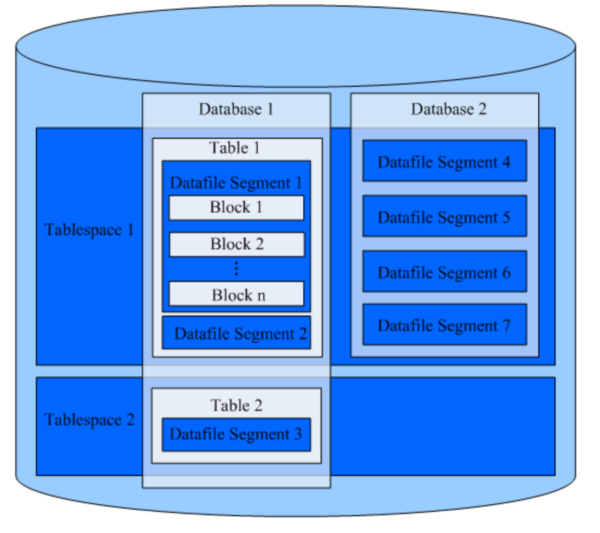
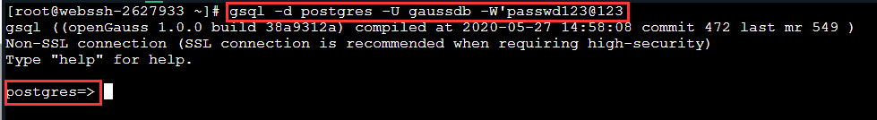

## 创建数据库

数据库其实就是可以存放大量数据的仓库，学习数据库我们就从创建一个数据库开始吧。

### 数据库逻辑结构图

openGauss 的数据库节点负责存储数据，其存储介质也是磁盘，下面主要从逻辑视角介绍数据库节点都有哪些对象，以及这些对象之间的关系。数据库逻辑结构如下图。



**说明**：

- Tablespace，即表空间，是一个目录，可以存在多个，里面存储的是它所包含的数据库的各种物理文件。每个表空间可以对应多个 Database。
- Database，即数据库，用于管理各类数据对象，各数据库间相互隔离。数据库管理的对象可分布在多个 Tablespace 上。
- Datafile Segment，即数据文件，通常每张表只对应一个数据文件。如果某张表的数据大于 1GB，则会分为多个数据文件存储。
- Table，即表，每张表只能属于一个数据库，也只能对应到一个 Tablespace。每张表对应的数据文件必须在同一个 Tablespace 中。
- Block，即数据块，是数据库管理的基本单位，默认大小为 8KB。

### OpenGauss 数据库的特征

以下是 OpenGauss 数据库特征：

1. 用户必须拥有数据库创建的权限或者是数据库的系统管理员权限才能创建数据库；

2. openGauss 默认包含两个模板数据库 template0、template1，以及一个默认的用户数据库 postgres。如图所示：

   

3. 用户创建数据库时实际上就是通过拷贝模板数据库（默认 template1)来创建新的数据库，同时，要避免使用客户端或其他手段连接及操作两个模板数据库；

4. openGauss 允许创建的数据库总数目上限为 128 个。数据库系统中会有多个数据库，但是客户端程序一次只能连接一个数据库。也不能在不同的数据库之间相互查询。

### 如何连接数据库

gsql 是 openGauss 提供的在命令行下运行的数据库连接工具。平台连接数据库的语句如下：

```sqlsql
gsql -d postgres -U gaussdb -W'passwd123@123';
```

其中 -d 参数代表数据库，-U 参数代表用户名，-W 参数代表密码； 连接成功后，系统会显示“DBNAME=>”。



退出连接使用以下语句：

```sqlsql
postgres=> \q
```

openGauss 常用操作语句：

切换数据库：

```sqlsql
\c test
```

上述语句代表从当前数据库切换到 test 数据库。

查看数据库列表：

```sqlsql
\l
```

查看表列表及表信息：

```sqlsql
\d
```

### 如何创建数据库

创建数据库： 创建一个新的数据库。缺省情况下新数据库将通过复制标准系统数据库 template0 来创建，且仅支持使用 template0 来创建。另外需要注意的是，在创建数据库过程中，若出现类似“could not initialize database directory”的错误提示，可能是由于文件系统上数据目录的权限不足或磁盘满等原因引起。

创库语法格式：

```sqlsql
CREATE DATABASE database_name
    [ [ WITH ] { [ OWNER [=] user_name ] |
               [ TEMPLATE [=] template ] |
               [ ENCODING [=] encoding ] |
               [ LC_COLLATE [=] lc_collate ] |
               [ LC_CTYPE [=] lc_ctype ] |
               [ DBCOMPATIBILITY [=] compatibilty_type ] |
               [ TABLESPACE [=] tablespace_name ] |
               [ CONNECTION LIMIT [=] connlimit ]}[...] ];
```

上述建表语句中，OWNER 参数可用于指定表的所属用户，TEMPLATE 参数可用于指定模板数据库，ENCODING 参数可用于编码格式，TABLESPACE 参数可用于指定表空间。

创建数据库示例：

```sqlsql
--创建一个GBK编码的数据库music（本地环境的编码格式必须也为GBK）。
postgres=# CREATE DATABASE music ENCODING 'GBK' template = template0;

--创建数据库music2，并指定所有者为jim。
postgres=# CREATE DATABASE music2 OWNER jim;
--用模板template0创建数据库music3，并指定所有者为jim。
postgres=# CREATE DATABASE music3 OWNER jim TEMPLATE template0;
```

## 创建表

我们知道数据库就是存储数据的地方，那数据库中的数据到底存放在哪里呢？数据库中的数据是存放在一张一张的表中的。 你可以想象数据库就像一个文件夹，而表你可以理解为一个 excel 表格，其实他们本来就挺像。

### 如何在指定数据库中创建表

我们先来了解一下在数据库中创建表的规则：

```sqlsql
CREATE TABLE 表名(
    字段名,数据类型,
    字段名,数据类型,
    .....
)
```

首先创建数据库，如下：

```sqlsql
create database mydb;
```

然后选择数据库：

```sqlsql
\c mydb;
```

最后创建 tb1 表:

```sqlsql
CREATE TABLE tb1(
    c_sk             integer,
    c_id             char(5),
    c_name              char(6),
    c_sex               char(8)
);
```

上述建表语句中， c_sk 、c_id、c_name 和 c_sex 代表表的字段名，integer、char(5)、char(6) 和 char(8) 分别是这四字段名称的数据类型。

当结果显示如下信息时，表示表创建成功：

```sqlsql
CREATE TABLE
```

也可以输入 \d 命令查看数据库下的表列表；


\d+ 可以查看表的具体信息。


## 使用主键约束

主键，是表中一列或者多列的组合，主键约束（Primary Key Constraint）要求主键列的数据唯一，并且不允许为空，主键能够唯一的标识表中的每一条记录，可以结合外键来定义与不同数据表之间的关系。 怎么理解主键呢？我们知道数据库中的表可以存放很多数据，如果把表中的每一个数据比作一个人的话，那么表的主键就可以看做是人的身份证。

为了完成本关任务，你需要掌握：怎么给表中的字段添加主键约束。

### 添加主键约束

有两种方式可以添加主键约束：

1. 在定义列的同时指定主键：

   ```sql
   CREATE TABLE tb1(
       id int PRIMARY KEY,
       name varchar(32),
       deptId int,
       salary float
   );
   ```

   指定 id 列为主键。

2. 在定义完所有列之后指定主键：

   ```sql
   CREATE TABLE tb1(
       id int,
       name varchar(32),
       deptId int,
       salary float,
       PRIMARY KEY(id)
   );
   ```

### 多字段联合主键

在开发中还有一种情况很常见，就是将几个字段联合在一起作为主键，那这个在代码中怎么实现呢？ 举个例子，我们将员工的名字和部门 ID 联合起来作为主键：

```sql
CREATE TABLE tb1(
    id int,
    name varchar(32),
    deptId int,
    salary float,
    PRIMARY KEY(id,name)
);
```

语句执行后，会将 name 和 id 字段组合成为表 tb1 的多字段组合主键。

## 添加常用约束

在数据库的使用过程中我们经常要限制字段的取值，比如有些字我们不能让它为空，我们就需要添加非空约束，本关我们就来学习如何添加这些常用的约束。

为了完成本关任务，你需要掌握：

1. 怎么添加唯一约束；
2. 怎么添加非空约束；
3. 怎么添加默认约束；
4. 怎么设置字段的值自动增加。

### 怎么添加唯一约束

唯一约束（Unique Constraint）要求该列唯一，允许为空，但是只能有一个空值。唯一约束可以确保一列或者几列不出现重复值。

定义部门表的部门名称唯一，SQL 语句如下：关键词 UNIQUE。

```sql
CREATE TABLE t_dept(
    id INT PRIMARY KEY,
    name VARCHAR(22) UNIQUE,
    location VARCHAR(50));
```

### 怎么添加非空约束

关键词：NOT NULL；

例如：

```sql
CREATE TABLE t_dept(
    id INT PRIMARY KEY,
    name VARCHAR(22) NOT NULL,
    location VARCHAR(50));
```

### 怎么使用默认约束

默认约束：即给字段一个默认值。 关键词：DEFAULT；

例如：

```sql
CREATE TABLE t_emp(
    id INT PRIMARY KEY,
    name VARCHAR(22),
    sex VARCHAR(2) DEFAULT '男') ;
```

注意：

如果是添加字符串型默认值要使用单引号，如果是整型则不需要加任何符号；

### 设置表的属性值自动增加

在数据库应用中，经常有个需求就是，在每次插入新纪录时，系统自动生成字段的主键值，即：


关键词：serial，默认情况下初始值和增量都为 1。

例如：

```sql
CREATE TABLE T1(
    id    serial,
    name  text,
    primary key(id));
```
