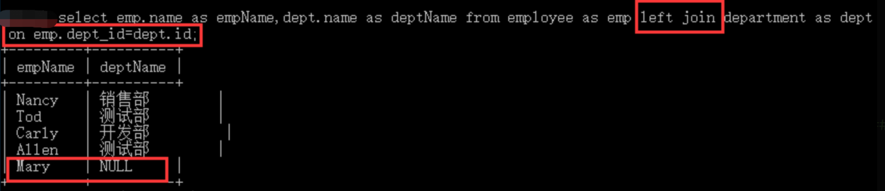
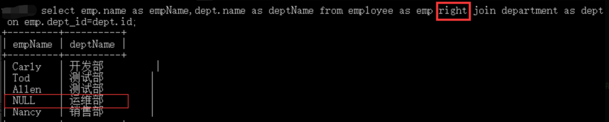
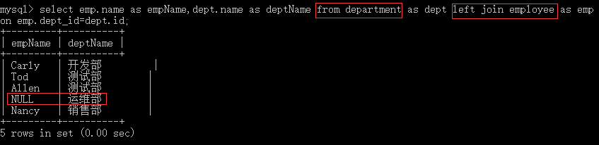
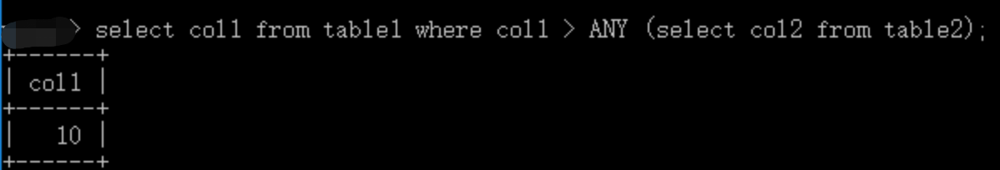

## 内连接查询

为了完成本关任务，你需要掌握：

1.什么是内连接查询； 2.如何使用内连接查询。

### 内连接查询

- 仅将两个表中满足连接条件的行组合起来作为结果集，称为内连接；
- 关键字：`[inner] join ...  on`。

语法：

```sql
表1 [inner] join 表2 on 表1.字段=表2.字段
```

语法解释：

从表 1 中取出每一条记录，去表 2 中与所有的记录进行匹配，匹配必须是某个条件在表 1 中与表 2 中相同，最终才会保留结果，否则不保留。inner 关键字可省略不写；on 表示连接条件：条件字段就是代表相同的业务含义（如下面两张表中的 employee.dept_id 和 department.id），大多数情况下为两张表中的主外键关系。

### 内连接查询的使用

现在我们有两张表，数据如下： `employee`表数据：

| id  | name  | dept_id |
| --- | ----- | ------- |
| 1   | Nancy | 4       |
| 2   | Tod   | 2       |
| 3   | Carly | 1       |
| 4   | Allen | 2       |
| 5   | Mary  | (null)  |

`department`表数据：

| id  | name   |
| --- | ------ |
| 1   | 开发部 |
| 2   | 测试部 |
| 3   | 运维部 |
| 4   | 销售部 |

现在想要查询出员工姓名以及其对应的部门名称，我们就使用内连接来进行查询。

- 我们可以将关联查询思路分为三步：

1. 确定所连接的表
2. 确定所要查询的字段，
3. 确定连接条件与连接方式。

示例：

```sql
select emp.name as empname,dept.name as deptname
from department as dept
join employee as amp on dept.id=emp.dept_id;

```

结果：

| empname | deptname |
| ------- | -------- |
| Carly   | 开发部   |
| Tod     | 测试部   |
| Allen   | 测试部   |
| Nancy   | 销售部   |

其中，没有部门的员工和部门没有员工的部门都没有被查出来，这就是内连接的特点，只查询在连接表中有对应的记录，其中 `dept.id=emp.dept_id` 是连接条件。

## 外连接查询

为了完成本关任务，你需要掌握：

1.什么是外连接查询； 2.如何使用外连接查询。

### 外连接查询

- 以某张表为主，取出里面的所有记录，然后每条与另外一张表进行连接，不管能不能匹配上条件，最终都会保留。能匹配，正确保留；不能匹配，其它表的字段都置空（`null`），称为外连接。
- 外连接查询分为左外连接查询和右外连接查询；
- 关键字：`left/right [outer] join ... on`。

语法：

```sql
表1 left/right [outer]  join 表2 on 表1.字段=表2.字段
```

语法解释：

左外连接：在内连接的基础上，还包含表 1 中所有不符合条件的数据行，并在其中的表 2 列填写 NULL；右外连接：在内连接的基础上，还包含表 2 中所有不符合条件的数据行，并在其中的表 1 列填写 NULL。

### 外连接查询的使用

我们仍使用如下两张数据表：

`employee`表数据：

| id  | name  | dept_id |
| --- | ----- | ------- |
| 1   | Nancy | 4       |
| 2   | Tod   | 2       |
| 3   | Carly | 1       |
| 4   | Allen | 2       |
| 5   | Mary  | (null)  |

`department`表数据：

| id  | name   |
| --- | ------ |
| 1   | 开发部 |
| 2   | 测试部 |
| 3   | 运维部 |
| 4   | 销售部 |

例如查询所有员工姓名以及他所在部门，在**内连接**中 `Mary` 没有被查出，因为他没有对应的部门，现在想把 `Mary` 也查出来，就要使用**左外连接**。



此查询语句以 `employee` 为主表查询，因此最终记录至少不少于主表已有的记录数。

> 右外连接是同理的，只是基准表的位置变化了而已。



我们在这里只是将 `left` 修改成了 `right` ,但是基准表变化了，是以 `department` 表的数据去匹配 `employee` 表，所以左外连接能做到的查询，右外连接也能做到，仅展现的效果有所不同。

虽然左外连接和右外连接有主表差异，但左外连接和右外连接可以互转，如上面的右外连接也等效于如下查询语句，只需将基准表换一下：



## 关键字子查询

由于列子查询返回的结果集是 `N` 行一列，因此不能直接使用 `=` 、`>`、`<`、`>=`、`<=`、`<>`这些比较标量结果的操作符。在列子查询中可以使用 `ALL`、`ANY`、`SOME` 和 `IN`关键字操作符。

为了完成本关任务，你需要掌握：如何在子查询中使用关键字进行查询。

### `ALL` 关键字

`ALL`必须接在一个比较运算符的后面，表示与子查询返回的**所有值**比较都为 `TRUE` 则返回 `TRUE`。

`table1` 表数据：

| col1 |
| ---- |
| 2    |
| 10   |

`table2` 表数据：

| col2 |
| ---- |
| 5    |
| 12   |
| 20   |

举个例子：

```sql
SELECT col1 FROM table1 WHERE col1 > ALL (SELECT col2 FROM table2)
```

该查询语句不会返回任何结果，因为 `col1` 中没有比 `col2` 所有值都大的值。

### `ANY` 和 `SOME` 关键字

`ANY` 与比较操作符联合使用，表示与子查询返回的**任何值**比较为 `TRUE `，则返回 `TRUE`。 `SOME` 是 `ANY` 的别名，一般用的比较少。

仍使用上面二张表的数据：



在子查询中，返回的是 `table2` 的所有 `col2`列的结果 `（5,12,20）`，然后将 `table1` 中 `col1` 的值与之进行比较，只要大于`col2`的任何值则为`TRUE`，因此查询结果为`10`。

### `IN` 关键字

- `IN` 的意思就是指定的一个值是否在这个集合中，如果在就返回 `TRUE`；否则就返回 `FALSE` 了，同 `IN` (项 `1`，项 `2`，...)；
- `IN` 是 `= ANY` 的别名，二者相同，但 `NOT IN` 的别名却不是 `<> ANY` 而是 `<> SOME`。

## 分页子查询

1. 如何根据页数和每页数据量进行分页查询；
2. 大数据量级进行优化分页查询。

### 什么是分页查询

当一个表中有很多符合查询条件的数据的时候，我们往往不需要把他们全部一次性取出来，那样对查询效率或者服务器性能来说都会是一个极大的挑战:例如最简单的商城，假设商城中有一万个数据，但我们在前端可能只会每次看到一页 `10` 个左右的数据，当我们浏览完这十个商品后，点击下一页浏览其他的商品，这样的分页浏览，对实际存储商品数据的 `MySQL` 数据库来说，实际上就是使用了 `MySQL` 的分页查询功能。

那么我们该怎么实现分页查询呢？

### limit 和 offset 实现的分页查询

`limit` 在之前的学习中应该有学习到，它可以返回符合条件的 `limit` 条数据：

```sql
select * from table where xxx="xxx" limit 10;

```

输出： 检索记录行符合条件的10条数据

那么我们也可以利用 `limit` 和 `offset` 来进行分页查询:

```sql
select * from table where xxx="xxx" limit 10 offset 10;

```

输出：检索记录行符合条件的 `11-20` 条数据

`limit` 之后的数字代表偏移量，`offset` 代表返回记录的最大值，可以通俗的理解为，从 `table` 中取出第 `limit+1` 行到 `limit+offset+1` 行数据(`MySQL` 偏移值从 `0` 开始计算)。

在实际使用中，我们可以直接把 `offset` 直接省略掉：

```sql
select * from table where xxx="xxx" limit 10,10;

```

该语句效果与带 `offset` 实际上是一模一样的。

通过分页查询，我们可以精确的定位到行数直接取出符合条件的多条数据，但是这也同样存在着性能问题。

### 大数据量下分页查询优化

```sql
select * from table where xxx="xxx" limit 100,100;
select * from table where xxx="xxx" limit 1000,100;
select * from table where xxx="xxx" limit 10000,100;
select * from table where xxx="xxx" limit 100000,100;
select * from table where xxx="xxx" limit 1000000,100;
```

以上语句在实际使用中实际上查询速度会是越来越慢的，这是因为分页查询方式会从数据库第一条记录开始扫描，所以越往后，查询速度越慢，而且查询的数据越多，也会拖慢总查询速度。

如果可以直接定位到偏移量所在记录，那么查询速度肯定能得到一个巨大的提升，所以可以考虑添加一个嵌套子查询，先查询到偏移量位置，再进行分页：

```sql
select * from table where xxx="xxx" and id>=(select id from table where xxx="xxx"limit 100000,1)limit 100;
```
