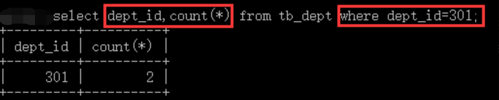
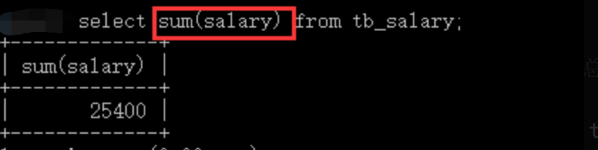
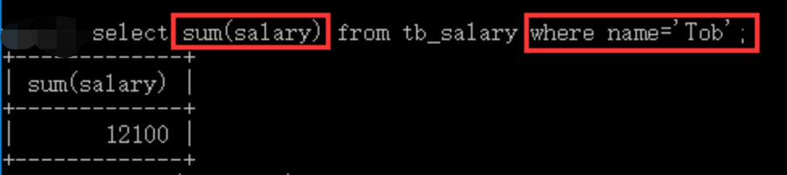
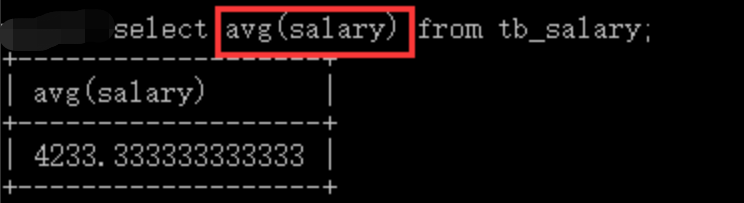
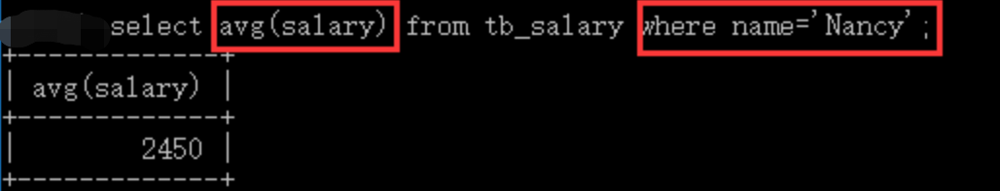
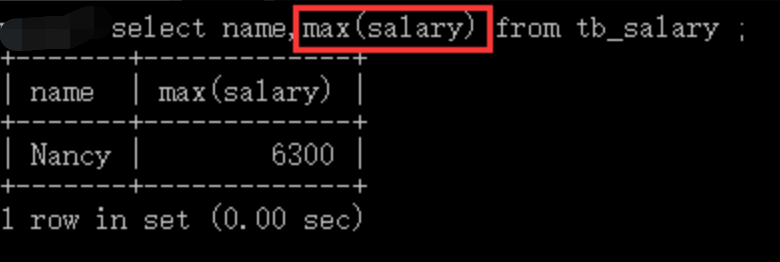
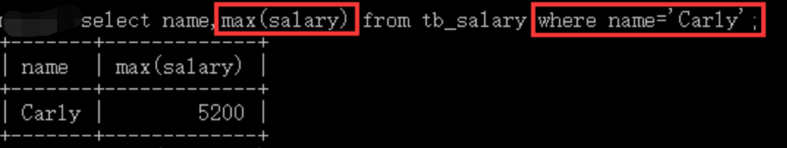
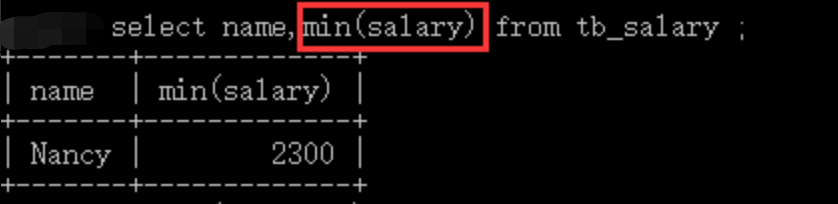
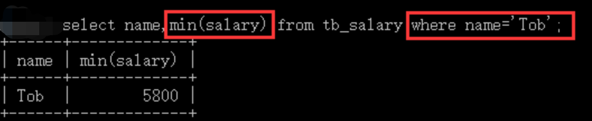

## COUNT() 函数

`COUNT()` 函数是用来统计记录的总条数。

```sql
select count(*/字段名) from 数据表;
```

例子说明： 假设我们现在有一张表 `tb_dept`；内容如下：

| id  | name  | dept_id |
| --- | ----- | ------- |
| 1   | Nancy | 301     |
| 2   | Tob   | 303     |
| 3   | Carly | 301     |

我们需要获取整张表有多少条数据，那么我们就可以使用 `COUNT(*)` 来查询了。


那么，现在同样是这张表，我假若想知道 `301` 部门一共有少人，我们可以思考该怎么查询？

相信大家都想到了，我们可以使用 `where` 条件进行查询：



## SUM() 函数

`SUM()` 函数是对数据表的某列进行求和操作。

```sql
select sum(字段名) from 数据表;
```

例子说明： 现在有一张 `tb_Salary` 表,内容如下：

| id  | name  | Salary | Month |
| --- | ----- | ------ | ----- |
| 1   | Nancy | 2300   | 11    |
| 2   | Tob   | 5800   | 11    |
| 3   | Carly | 3200   | 11    |
| 4   | Nancy | 2600   | 12    |
| 5   | Tob   | 6300   | 12    |
| 6   | Carly | 5200   | 12    |

假设场景公司老板想知道公司总共给员工开了多少工资，则可以使用 `SUM()` 函数来进行统计了。



若想得知 `Tob` 同事在 `11月` 和 `12月` 的薪水一共有多少，加上 `where` 条件即可。



## AVG() 函数

`AVG()` 函数是对数据表的某列进行求平均值操作。

```sql
select avg(字段名) from 数据表;
```

例子说明： 现在有一张 `tb_Salary` 表,内容如下：

| id  | name  | Salary | Month |
| --- | ----- | ------ | ----- |
| 1   | Nancy | 2300   | 11    |
| 2   | Tob   | 5800   | 11    |
| 3   | Carly | 3200   | 11    |
| 4   | Nancy | 2600   | 12    |
| 5   | Tob   | 6300   | 12    |
| 6   | Carly | 5200   | 12    |

假设场景，老板想知道公司发给员工的薪水的平均值为多少，此时就可使用 `AVG()` 函数来计算了。



现在又想知道 `Nancy` 在 `11-12月份` 的薪水平均有多少，则可进行如下查询：



## MAX() 函数

`MAX()` 函数是求某列的最大数值。

```sql
select max(字段名) from 数据表;
```

例子说明： 现在有一张 `tb_Salary` 表,内容如下：

| id  | name  | Salary | Month |
| --- | ----- | ------ | ----- |
| 1   | Nancy | 2300   | 11    |
| 2   | Tob   | 5800   | 11    |
| 3   | Carly | 3200   | 11    |
| 4   | Nancy | 2600   | 12    |
| 5   | Tob   | 6300   | 12    |
| 6   | Carly | 5200   | 12    |

假设场景，老板想知道公司在 `11-12月份` 中月薪最高的是多少，此时就可使用 `MAX()` 函数来统计了。



这样就可以看到公司中月薪最高是多少了。我们也可查询 `Carly` 在 `11-12月份` 中月薪最高是多少：



`MIN()`函数是求某列的最小数值。

```
select min(字段名) from 数据表
```

例子说明： 现在有一张`tb_Salary`表,内容如下：

| id  | name  | Salary | Month |
| --- | ----- | ------ | ----- |
| 1   | Nancy | 2300   | 11    |
| 2   | Tob   | 5800   | 11    |
| 3   | Carly | 3200   | 11    |
| 4   | Nancy | 2600   | 12    |
| 5   | Tob   | 6300   | 12    |
| 6   | Carly | 5200   | 12    |

假设场景，老板想知道公司`11-12月份`中月薪最低的是多少，此时就可使用`MIN()`函数来统计了。



我们仍可以快速查出`Tob`在`11-12月份`中月薪最低时是多少：


## MIN() 函数

`MIN()` 函数是求某列的最小数值。

```
select min(字段名) from 数据表
```

例子说明： 现在有一张 `tb_Salary` 表,内容如下：

| id  | name  | Salary | Month |
| --- | ----- | ------ | ----- |
| 1   | Nancy | 2300   | 11    |
| 2   | Tob   | 5800   | 11    |
| 3   | Carly | 3200   | 11    |
| 4   | Nancy | 2600   | 12    |
| 5   | Tob   | 6300   | 12    |
| 6   | Carly | 5200   | 12    |

假设场景，老板想知道公司 `11-12月份` 中月薪最低的是多少，此时就可使用 `MIN()` 函数来统计了。


我们仍可以快速查出 `Tob` 在 `11-12月份` 中月薪最低时是多少：


