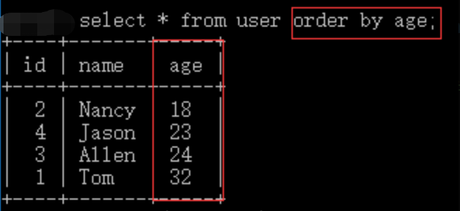

## 对查询结果进行排序

### 对查询结果排序

我们知道在 `OpenGauss` 中从数据表中读取数据都是使用 `SELECT` 语句。 如果我们需要对读取的语句进行排序，我们就可以使用 `Order By` 子句来设定你想要按照的字段进行排序并返回结果。

语法：

```sql
SELECT 字段名 FROM 表名 ORDER BY 字段名 [ASC[DESC]];
```

你还可以根据自己的需求添加 `WHERE`、`LIKE` 子句来设置条件，再对结果过进行排序显示。

现有 `user` 表数据如下：

| id  | name  | age |
| --- | ----- | --- |
| 1   | Tom   | 32  |
| 2   | Nancy | 18  |
| 3   | Allen | 24  |
| 4   | Jason | 23  |

我们需要查询表中信息，要求按照年龄的**升序**进行排序：



### 指定排序方向

从上面的查询语句中我们并未看到有任何表示**排序方向**的关键字，在默认情况下，它是按**升序**排列的。

- `ASC` 升序关键字
- `DESC` 降序关键字


## 分组查询

但是在实际开发中一般不会用到，本章节只作为对分组查询的了解。往后继续学习，我们会介绍分组查询与其他查询一起结合使用。

##### 分组查询的单独使用

分组查询的关键字是 `Group By`，查询的是每个分组中 **首次出现的一条记录**。

语法：

```sql
SELECT 字段名 FROM 表名 GROUP BY 字段名;
```

例如： 现有 `user` 表数据：

| id  | name  | sex  |
| --- | ----- | ---- |
| 1   | Tom   | 男   |
| 2   | Nancy | 女   |
| 3   | Allen | Null |
| 4   | Jason | 男   |

我们对表中数据的性别进行分组查询：


可以看出，返回了 `3` 条记录，分别是 `sex` 字段值为 `Null`、女、男的记录，查询结果按照 `sex` 字段中不同的值进行了**分类**，**只显示每个分组中的一条记录**，意义不大，一般情况下，`GROUP BY` 都和聚合函数一起使用。

## GROUP BY 与 聚合函数

在之前的实训中我们简单的提到过 `GROUP BY` 关键字，本实训让我们进一步了解 `GROUP BY` 与聚合函数的使用。

为了完成本关任务，你需要掌握：

1. `GROUP BY`与聚合函数的结合使用；
2. `GROUP BY`中`SELECT`指定的字段限制。

### `GROUP BY` 与聚合函数的使用

基本格式：

```sql
select [聚合函数] 字段名 from 表名
[where 查询条件]
[group by 字段名]
```

先提供表 `Info` 结构如下：

| category | count | digest |
| -------- | ----- | ------ |
| a        | 5     | a2002  |
| a        | 2     | a2001  |
| a        | 11    | a2001  |
| b        | 10    | b2003  |
| b        | 6     | b2002  |
| b        | 3     | b2001  |
| c        | 9     | c2005  |
| c        | 9     | c2004  |
| c        | 8     | c2003  |
| c        | 7     | c2002  |
| c        | 4     | c2001  |

示例：将表中数据分类并汇总


### `GROUP BY` 中 `SELECT` 指定的字段限制

示例：

```sql
select category,sum(count),disgest from info
group by category;
```

执行后会提示下错误。这就是需要注意的一点，在 `select` 指定的字段**要么就要包含在 `Group By` 语句的后面，作为分组的依据；要么就要被包含在聚合函数中**。

## 使用 HAVING 与 ORDER BY

##### 使用`having`子句进行分组筛选

简单来说，`having` 子句用来对**分组后**的数据进行筛选，即 `having` 针对查询结果中的列发挥筛选数据作用。因此 `having` 通常与 `Group by` 连用。

基本格式：

```sql
select [聚合函数] 字段名 from 表名 [where 查询条件]　[group by 字段名] [having 字段名 筛选条件]
```

表 `Info` 的数据信息仍如下：

| category | count | digest |
| -------- | ----- | ------ |
| a        | 5     | a2002  |
| a        | 2     | a2001  |
| a        | 11    | a2001  |
| b        | 20    | b2003  |
| b        | 15    | b2002  |
| b        | 3     | b2001  |
| c        | 9     | c2005  |
| c        | 9     | c2004  |
| c        | 8     | c2003  |
| c        | 7     | c2002  |
| c        | 4     | c2001  |

示例：查询将表中数据分类后数量大于`20`的类别信息


`select` 语句中，`where`、`group by`、`having` 子句和聚合函数的执行次序如下：

1.`where` 子句从数据源中去除不符合条件的数据；

2.然后 `group by` 子句搜集数据行到各个组中；

3.接着统计函数为各个组计算统计值；

4.最后 `having` 子句去掉不符合其组搜索条件的各组数据行。

##### `Having` 与 `Where` 的区别

`where` 子句都可以用 `having` 代替，区别在于 `where` 过滤行，`having` 过滤分组；

- `where` 子句的作用是在对查询结果进行分组前，将不符合 `where` 条件的**行**去掉，即在分组之前过滤数据，`where` 条件中**不能包含聚组函数**，使用 `where` 条件过滤出特定的行；
- `having` 子句的作用是筛选满足条件的**组**，即在分组之后过滤数据，条件中**经常包含聚组函数**，使用 `having` 条件过滤出特定的组，也可以使用多个分组标准进行分组。

`having` 结合 `where` 示例：


##### `Group By` 和 `Order By`

基本格式

```
select [聚合函数] 字段名 from 表名 [where 查询条件]　[group by 字段名] [order by 字段名 排序方向]
```

示例：（以降序方式输出数据分类的汇总）


若分组字段和排序字段一样时，可不需要 `order by` 关键字，则只需告知排序方向，即可简写成：


