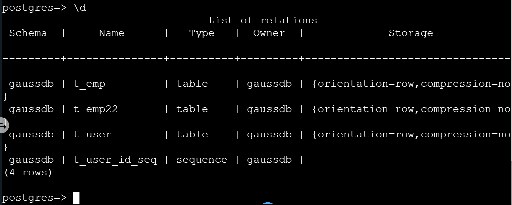
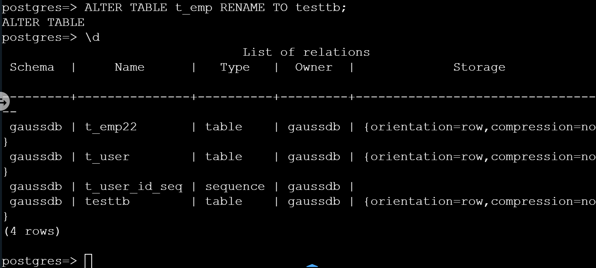

## 查看表结构与修改表名

### 查看数据表基本结构

有强迫症或健忘症的小伙伴们在建好数据库和表以后，通常会怀疑自己刚才是不是敲错了，怎么办？如果不是使用图形界面是不是就没法查看啦？

不存在的，这就告诉你查看口令；\d+ 语法规则为：

```sql
\d+ 表名;
```

比如本岛主新建了一个名叫 `t_emp22` 的表，结构如下：

```sql
CREATE TABLE t_emp22(
    id INT PRIMARY KEY,
    id1 INT DEFAULT 2,
    name VARCHAR(22),
    sex VARCHAR(2) DEFAULT '男');
```

现在来看看“现场”，用 \d+ 查表的结构是这样的。

```sql
\d+ t_emp22;
# 			Table "gaussdb.t_emp22"
# | Column | Type                  | Modifiers                       | Storage  | Stats target | Description |
# | ------ | --------------------- | ------------------------------- | -------- | ------------ | ----------- |
# | id     | integer               | not null                        | plain    |              |             |
# | id1    | integer               | default 2                       | plain    |              |             |
# | name   | character varying(22) |                                 | extended |              |             |
# | sex    | character varying(2)  | default '男'::character varying | extended |              |             |
#
# Indexes: "t_emp22_pkey" PRIMARY KEY, btree (id) TABLESPACE pg_defaultHas
# OIDs: no
# Options: orientation=row, compression=no
```

\d+ 可以查看表的字段信息，包括：字段名、字段数据类型、是否为主键、是否有默认值等。

### 修改表名

随着表越来越多，有时候你会后悔之前的数据表的名字根本没有认真斟酌过，想要重新命名一下，可以做到吗？

答案是：可以！OpenGauss 是通过 `ALTER TABLE` 语句来修改表名的。

语法规则为：

```sql
ALTER TABLE 旧表名 RENAME to 新表名;
```

举个例子，我们先用 \d 看看我们的数据库中有什么表吧。 

接下来，我们使用 `ALTER TABLE` 将 `t_emp` 改名 为 `testtb`。

```sql
ALTER TABLE t_emp RENAME TO testtb;
```



改名成功！`t_emp` 成功变成了 `testtb`。

## 修改字段数据类型

有时，在我们建好一张表后会突然发现，哎呀！数据貌似写错了！怎么办？要删了表再重新建一个新表吗？还是要删了这个字段再新建一个新的字段？都不用，OpenGauss 中修改字段类型也有专门的语句。

语法规则为：

```sql
ALTER TABLE 表名 ALTER column_name TYPE data_type;
```

举个例子： 现在我们要把表 `t_emp22` 中的字段 `name` 的数据类型改名为 `varchar(25)`。 表 `t_emp22` 结构如下：

```sql
CREATE TABLE t_emp22(
    id INT PRIMARY KEY,
    name VARCHAR(22),
    sex VARCHAR(2) DEFAULT '男'
);
```

输入命令：

```sql
ALTER TABLE t_emp22 ALTER name TYPE varchar(25);
```

> 列存表只支持：
>
> - 添加字段 ADD COLUMN
> - 修改字段的数据类型 ALTER TYPE
> - 设置单个字段的收集目标 SET STATISTICS
> - 更改表名称
> - 更改表空间
> - 删除字段 DROP COLUMN

## 添加与删除字段

#### 添加字段

因为甲方的业务需求是不停变化的，所以在数据库操作中，添加字段可是常有的事。一个完整的字段包括：字段名、数据类型和完整性约束。

    增加单列语法规则为：

```sql
alter table table_name ADD [ COLUMN ] column_name
data_type [ compress_mode ] [ COLLATE collation ] [ column_constraint [ … ] ]
```

增加多列语法规则为：

```sql
alter table table_name ADD ( { column_name data_type [ compress_mode ] } [, …] )
```

其中列约束 column_constraint 为：

```sql
[CONSTRAINT constraint_name]
{ NOT NULL | NULL | CHECK(expression) | DEFAULT default_expr |
    UNIQUE index_parameters | PRIMARY KEY index_parameters }
[ DEFERRABLE | NOT DEFERRABLE | INITIALLY DEFERRED |
    INITIALLY IMMEDIATE ]
```

常用约束含义：

- NOT NULL 约束：确保某列不能有 NULL 值。
- DEFAULT 约束：当某列没有指定值时，为该列提供默认值。
- UNIQUE 约束：确保某列中的所有值是不同的。
- PRIMARY Key 约束：唯一标识数据库表中的各行/记录。

其中列的压缩可选项 compress_mode 为：

```sql
[ DELTA | PREFIX | DICTIONARY | NUMSTR | NOCOMPRESS ]
```

举个例子： 现在我们要在表 t_emp22 中增加字段 addr varchar(100)。 表 t_emp22 结构如下：

```sql
CREATE TABLE t_emp22(    id INT PRIMARY KEY,    name VARCHAR(22),    sex VARCHAR(2) DEFAULT '男') ;
```

输入命令：

```sql
ALTER TABLE t_emp22 ADD  COLUMN  addr varchar(25);
```

#### 删除字段

有添加的需求就会有删除的需求。删除一个字段就是将数据表中的某个字段从表中移除。

语法规则为：

```sql
ALTER TABLE table_name DROP [ COLUMN ] [ IF EXISTS ] column_name
[ RESTRICT | CASCADE ]
```

从表中删除一个字段，和这个字段相关的索引和表约束也会被自动删除。如果任何表之外的对象依赖于这个字段，必须声明 CASCADE ，比如视图。 DROP COLUMN 命令并不是物理上把字段删除，而只是简单地把它标记为对 SQL 操作不可见。随后对该表的插入和更新将在该字段存储一个 NULL。因此，删除一个字段是很快的，但是它不会立即释放表在磁盘上的空间，因为被删除了的字段占据的空间还没有回收。这些空间将在执行 VACUUM 时而得到回收。

举个例子： 现在我们要把字段 name 从上表 t_emp22 中删除。

```sql
ALTER TABLE t_emp22  DROP COLUMN IF EXISTS name
```

## 插入数据

向表中插入数据最简单的方法就是使用 INSERT 语句。 INSERT 语句需要你声明要插入内容的表(table)名和内容(values)。

语法规则为：

```sql
INSERT INTO 表名 (字段名) VALUES (内容);
```

使用以下 insert into 语句即可向表 tb1 中插入一条数据;

```sql
INSERT INTO tb1(c_sk, c_id, c_name，c_sex) VALUES (3769, 'a', 'Grace'，'women'); INSERT INTO tb1(c_sk, c_id, c_name，c_sex) VALUES (3769, 'a', 'Grace'，'women');
```

以上语句中，数据值是按照这些字段在表中出现的顺序列出的，并且用逗号分隔。

如果我们已经知道表中字段的顺序，也可无需列出表中的字段。例如以下命令与上面的命令效果一样。

```sql
INSERT INTO tb1 VALUES (3769, 'a', 'Grace'，'women');
```

如果用户不知道所有字段的数值，可以忽略其中的一些。没有数值的字段将被填充为字段的缺省值。例如：

```sql
INSERT INTO tb1 (c_sk, c_name) VALUES (3769, 'Grace');
```

用户也可以对独立的字段或者整个行明确缺省值：

```sql
INSERT INTO tb1(c_sk, c_id, c_name，c_sex) VALUES (3769, 'a', 'Grace'，DEFAULT);
INSERT INTO tb1 DEFAULT VALUES;
```

在表中插入多行，可以使用以下命令：

```sql
INSERT INTO tb1(c_sk, c_id, c_name，c_sex) VALUES (3769, 'a', 'Grace'，'women'),(3777, 'b', 'bob'，'women');
INSERT INTO tb1(c_sk, c_id, c_name，c_sex) VALUES (3769, 'a', 'Grace'，'women'),(3777, 'b', 'bob'，'women');
```

## 更新数据

修改已经存储在数据库中数据的行为叫做更新。用户可以更新单独一行，所有行或者指定的部分行。还可以独立更新每个字段，而其他字段则不受影响。

使用 UPDATE 命令更新现有行，需要提供以下三种信息：

- 表的名称和要更新的字段名；
- 字段的新值；
- 要更新哪些行。

语法规则为：

```sql
UPDATE 表名 SET 字段名1 = 内容1, 字段名2 = 内容2, 字段名3 = 内容3 WHERE 过滤条件;
```

更新数据示例：

```sql
UPDATE mytb SET c__sk = 9876 WHERE c_sk = 9527;
```

上述语句中，我们更新的是 mytb 表中的 c\_\_sk 字段，把该字段中等于“9527”的行更新成“9876”。新的字段值不仅可以是常量，也可以是变量表达式。 比如我们可以把 c_sk 列的所有数值增加 8，sql 语句如下：

```sql
UPDATE mytb SET c__sk = c_sk+8;
```

另外，我们还可以在 UPDATE 语句中同时更新多个字段。

```sql
UPDATE mytb SET c__sk = 9876, c_name='july' WHERE c_sk = 9527;
```

## 删除数据

### 删除表中的指定行

从数据表中删除数据内容需要使用 DELETE 语句，它需要 WHERE 语句来配合它来指定我们究竟应该删除哪些数据内容。

语法规则为：

```sql
DELETE FROM 表名 WHERE 条件语句;
```

我们可以指定删除某一行的数据内容，当然，我们还可以指定删除很多行的数据内容，区别就在于条件语句。那么在接下来的例子里，我们来看看很多行内容是怎么删除的。

删除 mytb 表中所有 c_sk 为 9527 的行示例：

```sql
DELETE FROM mytb WHERE c_sk = 9527;
```

### 删除表中的所有行

删除表中的所有行就更简单了。如果需要删除表中所有的行，只需要省略 WHERE 语句即可。

语法规则为：

```sql
DELETE/TRUNCATE FROM 表名;
```

小提示：建议使用 truncate，与 DELETE 不同的是，TRUNCATE TABLE 语句直接删除的是表，而不是表中的内容，删除结束后还会重新创建一个表。所以它的执行速度会比 DELETE 语句快。。

删除 mytb 表所有数据命令：

```sql
truncate TABLE mytb;
```
