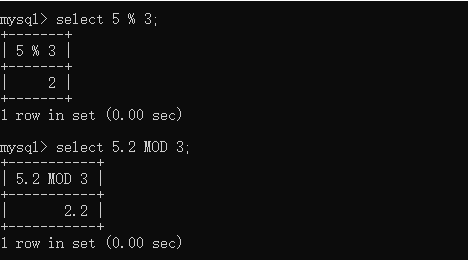

## 字符函数

下面为字符串的常用函数：

| 函数                | 作用                               |
| ------------------- | ---------------------------------- |
| `CONCAT()`          | 字符串的拼接                       |
| `CONCAT_WS()`       | 使用指定的字符将目标字符串进行拼接 |
| `FORMAT()`          | 数字格式化                         |
| `LOWER()`           | 字符串全部转换为小写               |
| `UPPER()`           | 字符串全部转换为大写               |
| `LEFT()`            | 获取左侧的字符串                   |
| `RIGHT()`           | 获取右侧的字符串                   |
| `LENGTH()`          | 计算字符串的长度                   |
| `LTRIM()`           | 删除前导的空格                     |
| `RTRIM()`           | 删除后续的空格                     |
| `TRIM()`            | 删除前导和后续的空格               |
| `SUBSTRING()`       | 字符串截取                         |
| `SUBSTRING_INDEX()` | 分隔字符串                         |
| `REPLACE()`         | 字符串替换                         |
| `[NOT] LIKE`        | 模式匹配                           |

### CONCAT() 与 CONCAT_WS()

他们的作用都是将字符进行连接，但是他们之间也有一点小区别。下面是使用 `CONCAT()` 将 `My` 和 `SQL` 字符进行连接：


`CONCAT_WS()` 代表使用**指定字符**进行连接，最少需要三个参数，第一个参数为指定连接符：


### LEFT() 与 RIGHT()

他们是进行左右侧的字符获取，需要两个参数，第一个参数告诉他从哪个字符串中获取，第二个参数是获取的长度：


### LTRIM()、RTRIM() 与 TRIM()

这三个函数都是可以去掉字符串中含有的空格，我们先使用 `LENGTH()` 函数来统计含有空格的字符串的长度，分别去掉其中字符**前导、后导和全部**的空格，下面我们来看一下他们的区别：


另外 `TRIM()` 函数出除了能删除空格以外，还能删除字符串中自定字符：


上面操作就是将 `??MySQL???` 中的前导 `?` 删除，若要删除后导的 `?`，只需将`LEADING` 替换成 `TRAILING`，若要将其中的 `?` 都删掉，替换成 `BOTH` 关键字即可。

### SUBSTRING()、SUBSTRING_INDEX() 与 REPLACE()

#### REPLACE() 函数

> 思考：那如果在 `MySQL` 中间也出现了 `?` 号，还能使用上面的函数进行删除吗？
>
> 答疑：很显然使用之前学到过的函数是不能将中间部分的 `?` 删除，那么我们如何将中间的 `?` 去掉呢？就是使用 `REPLACE()` 函数进行字符串的替换。


表示将字符串中的 `?` 全部替换成 `''`，但使用时并不表示只能一个字符替换一个字符，可以一对多形式或多对一形式：


#### SUBSTRING() 函数

`SUBSTRING()` 函数是用于字符串的截取：


表示从第一位（注意第一位为 `1` 而非 `0`）开始截取 `MySQL` 的二位字符。

#### SUBSTRING_INDEX() 函数

`SUBSTRING_INDEX()` 函数是用于通过特殊符号将字符串分隔的：


表示将字符串 `www.educoder.net` 通过 `.` 进行分隔，可从前后取字符串。

## 数学函数

### 数值运算符

我们常说的“加减乘除”就是数值运算符，例如：


下面是常与数值结合使用的函数：

| 函数         | 说明              |
| ------------ | ----------------- |
| `CEIL()`     | 进一（向上）取整  |
| `FLOOR()`    | 舍一（向下）取整  |
| `POWER()`    | 幂运算            |
| `SQRT()`     | 平方根运算        |
| `ROUND()`    | 四舍五入          |
| `ABS()`      | 绝对值计算        |
| `RAND()`     | 生产`0-1`的随机数 |
| `TRUNCATE()` | 数字截取          |
| `DIV`        | 整数除法          |
| `MOD`        | 取余数(取模)      |

#### CEIL()和 FLOOR()

这两个函数都是对值进行取整，`CEIL()` 函数是**向上取整**，`FLOOR()` 是**向下取整**：


#### DIV 和 MOD

我们可以直接对数值使用 `/`（除法）或 `%`（取余），但仅此是计算远远不及我们的需求。

因此还提供了 `DIV` 整数除法函数：


但 `MOD` 取模函数与 `%` 计算是 **等价** 的：



#### ROUND()、POWER()、SQRT()和 TRUNCATE()

- `ROUND()` 函数：四舍五入， 下面示例为：


- `POWER()` 函数：幂运算， 下面示例为 `2^3=8`：


- `SQRT()` 函数：平方根运算， 下面示例为：


### 比较运算符

除了数值运算符，`MySQL` 中还有比较运算符：

| 函数                     | 说明               |
| ------------------------ | ------------------ |
| `[NOT] BETWEEN...AND...` | [不]在范围内       |
| `[NOT] IN()`             | [不]在列出值范围内 |
| `IS [NOT] NULL`          | [不]为空           |

- `BETWEEN...AND...`：指定一个范围，只要选择的数字在这个范围内则为 `1` 否则为 `0`；


- `IN()`：指定列出值，只要选择的数字存在其中则为 `1` 否则为 `0`；


- `IS NULL`：判断字段是否为空。


## 日期时间函数和流程控制类函数

### 时间日期操作符

用户在使用时间和日期操作符时，对应的操作数请使用明确的类型前缀修饰，以确保数据库在解析操作数的时候能够与用户预期一致，不会产生用户非预期的结果。 比如下面示例没有明确数据类型就会出现异常错误。

```sql
SELECT date '2001-10-01' - '7' AS RESULT;
```

OpenGauss 的操作符共有四种，分别是： +、-、\*、/。

“+”使用示例：

```sql
SELECT date '2001-09-28' + integer '7' AS RESULT;
# result
# 2001-10-05 00:00:00
# (1 row)

SELECT date '2001-09-28' + interval '1 hour' AS RESULT;
# result
# 2001-09-28 01:00:00
# (1 row)
```

“-”使用示例：

```sql
SELECT date '2001-10-01' - date '2001-09-28' AS RESULT;
# result
# 3 days
# (1 row)
```

“\*”使用示例：

```sql
SELECT 900 * interval '1 second' AS RESULT;
# result
# 00:15:00
# (1 row)
```

“/”使用示例：

```sql
SELECT interval '1 hour' / double precision '1.5' AS RESULT;
# result
# 00:40:00
# (1 row)
```

### 日期函数

#### age 函数

第一种：

```sql
age(timestamp, timestamp)
```

描述：将两个参数相减，并以年、月、日作为返回值。若相减值为负，则函数返回亦为负。

返回值类型：interval

示例：

```sql
SELECT age(timestamp '2001-04-10', timestamp '1957-06-13');
#            age
# -------------------------
#  43 years 9 mons 27 days
# (1 row)
```

第二种：

```sql
age(timestamp)
```

描述：当前时间和参数相减。

返回值类型：interval

示例：

```sql
SELECT age(timestamp '1957-06-13');
#            age
# -------------------------
#  60 years 2 mons 18 days
# (1 row)
```

#### clock_timestamp()

描述：实时时钟的当前时间戳。

返回值类型：timestamp with time zone

示例：

```sql
SELECT clock_timestamp();
#         clock_timestamp
# -------------------------------
#  2017-09-01 16:57:36.636205+08
# (1 row)
```

#### current_date/current_timestamp/current_time

**current_date**

描述：当前日期。

返回值类型：date

示例：

```sql
SELECT current_date;
#     date
# ------------
#  2017-09-01
# (1 row)
```

**current_time**

描述：当前时间。

返回值类型：time with time zone

示例：

```sql
SELECT current_time;
#        timetz
# --------------------
#  16:58:07.086215+08
# (1 row)
```

-- current_timestamp

描述：当前日期及时间。

返回值类型：timestamp with time zone

示例：

```sql
SELECT current_timestamp;
#        pg_systimestamp
# ------------------------------
#  2017-09-01 16:58:19.22173+08
# (1 row)
```

### 流程控制类函数

| 函数       | 说明           |
| ---------- | -------------- |
| `IF()`     | 判断，流程控制 |
| `IFNULL()` | 字段值是否为空 |
| `CASE`     | 搜索语句       |

- `IF()`函数：`IF(a,b,c)` 如果`a`为真返回`b`，否则返回`c`；


- `IFNULL()`函数：`IFNULL(a,b)` 如果`a`不为`null`返回`a`，否则返回`b`；


- `CASE`：`CASE WHEN a then b end` 判断如果`a`为真返回`b`。


